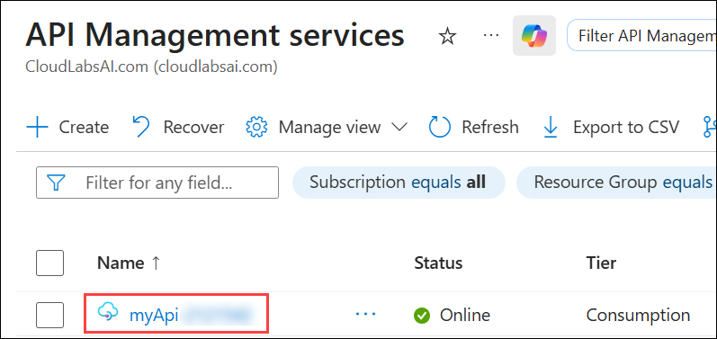
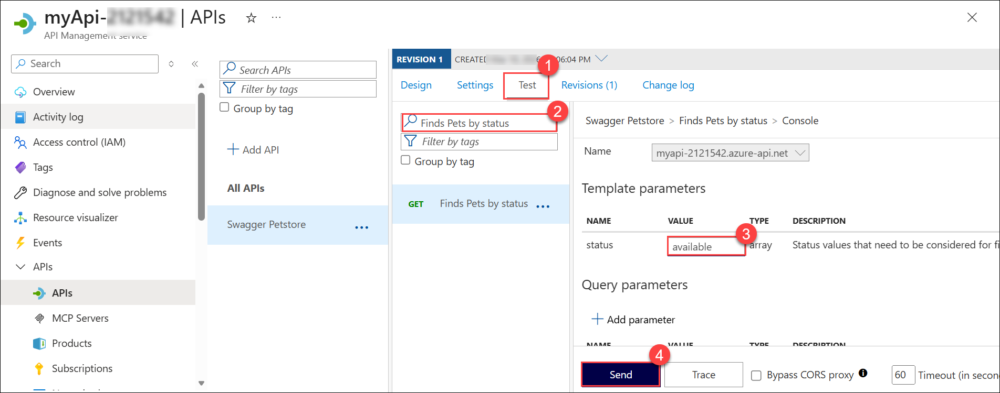
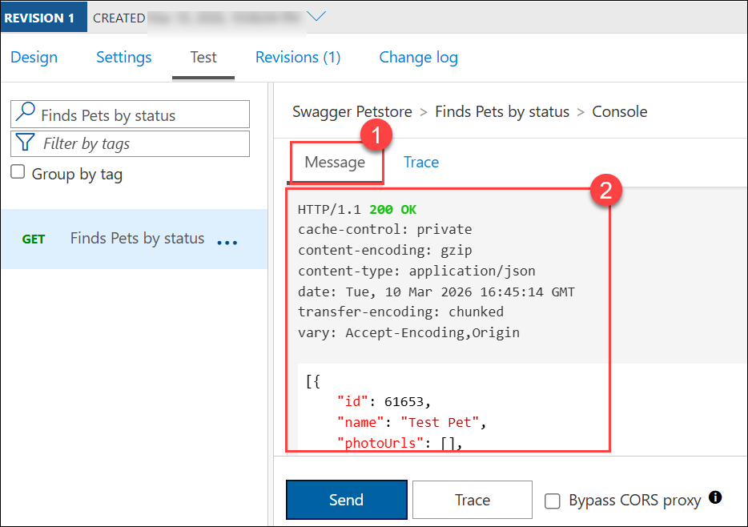

# Lab 1: Import and configure an API with Azure API Management

## Lab Scenario

In this exercise, you create an Azure API Management instance, import an OpenAPI specification backend API, configure the API settings including the web service URL and subscription requirements, and test the API operations to verify they work correctly.

## Lab Objectives
In this lab, you will perform:

- Exercise 1: Create an API Management instance
- Exercise 2: Import a Backend API
- Exercise 3: Test the APIs

# Exercise 1: Create an API Management instance

In this section of the exercise, you create a resource group and an Azure Storage account. You also record the endpoint and access key for the account.

1. Use the **[>_] (1)** button to the right of the search bar at the top of the page to create a new Cloud Shell in the Azure portal, selecting a **Bash (2)** environment.

     

     

2.  If you are prompted to select a storage account to persist your files, select **No storage account required (1)**, select the default **subscription (2)**, and then select **Apply (3)**.

    

4. Now create variables using the code below. Copy the code and then run it in the Bash terminal:

    ```bash
    myApiName=myApi-<inject key="DeploymentID" enableCopy="false"/>
    myLocation=<inject key="Region" enableCopy="false"/>
    myEmail=odl-user-<inject key="DeploymentID" enableCopy="false"/>@cloudlabsai
    myResourceGroup=ApiService-<inject key="DeploymentID" enableCopy="false"/>
    ```
     

5. Create an APIM instance:

    ```bash
    az apim create -n $myApiName \
        --location $myLocation \
        --publisher-email $myEmail  \
        --resource-group $myResourceGroup \
        --publisher-name Import-API-Exercise \
        --sku-name Consumption 
    ```
     

    > **Note:** The operation should complete within approximately five minutes.


> **Congratulations** on completing the task! Now, it's time to validate it.
<validation step="025b0fde-7447-43a3-ba91-95512da20179" />

# Exercise 2: Import a Backend API

1. In the Azure portal, search for and select **API Management services**. and select your instance **myApi-<inject key="DeploymentID" enableCopy="false"/>**.

     

     

1. In the **API management service** navigation pane, select  **> APIs (1)** and then select **APIs (2)**.

    

1. Select **OpenAPI (3)** in the **Create from definition** section, and set the **Basic/Full** toggle to **Full (1)** in the pop-up that appears.

1. Use the values from the following table to fill out the form. You can leave any fields not mentioned to their default value.

    | Setting | Value | Description |
    |--|--|--|
    | **OpenAPI Specification** | `https://petstore.swagger.io/v2/swagger.json` (2) | References the service implementing the API, requests are forwarded to this address. Most of the necessary information in the form is automatically populated after you enter this value. |
    | **URL scheme** | Ensure **HTTPS** (3) is selected. | Defines the security level of the HTTP protocol accepted by the API. |

1. Select **Create (4)**.

    

# Exercise 3: Test the API

1. Select **Test (1)** in the menu bar. This will display all of the operations available in the API.

1. Search for, and select the **Finds Pets by status.(2)** operation.

1. In the **Template parameters** section, enter `available`(3) as the value in the **status** field.

    

1. Select **Send (4)**. You may need to scroll down on the page to view the HTTP response.

    Backend responds with **200 OK** and some data.

    

1. If you want to try different results you can enter a different **status** in the **Template parameters** section. Enter `pending` or `sold` as the value, and then select **Send** to see the new results.

# Summary

## You have completed:

- Creating APIM instance  
- Importing API  
- Configuring backend settings  
- Testing API operations  

## **You have successfully completed the lab.**
