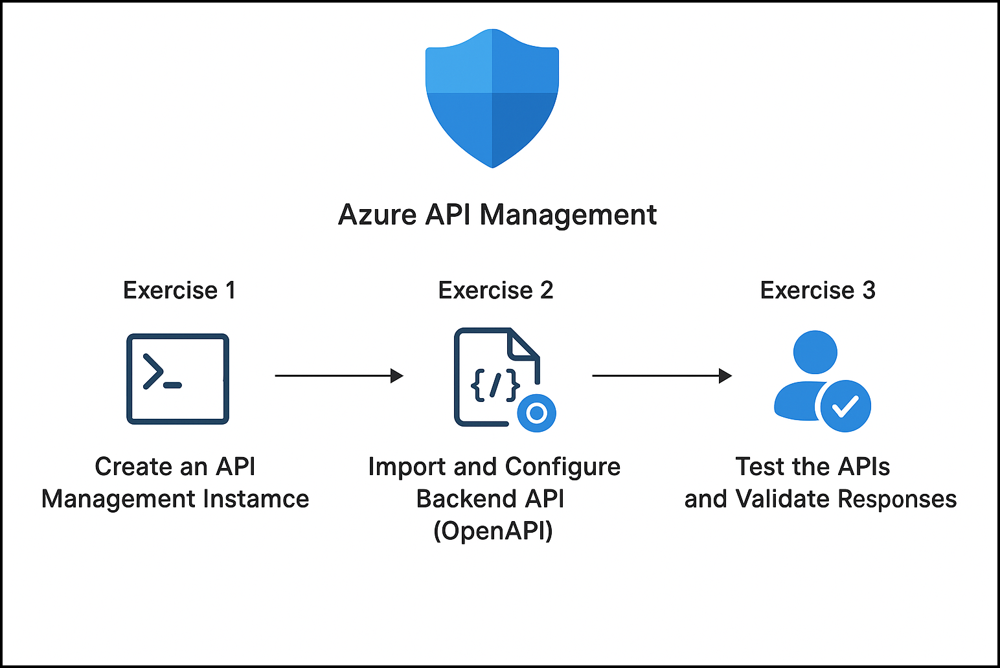

# Getting Started with Lab 1: Import and Configure an API with Azure API Management

### Overall Estimated Duration: 45 Minutes

## Overview

This lab is intended for developers, cloud engineers, and API practitioners who want to understand how to publish, manage, and test APIs using **Azure API Management (APIM)**. Participants will gain hands-on experience in creating an APIM instance, importing an API using an OpenAPI specification, configuring backend settings, and validating API operations through the Azure Portal.

## Objective 

This lab is designed to equip participants with hands-on experience in working with Azure API Management. By completing this lab, participants will learn to:

- **Understanding the API Management Lifecycle:**  
  This lab provides a clear understanding of how APIs are published and managed using Azure API Management. It covers the end-to-end lifecycle including APIM instance creation, API import, backend configuration, policy application, and API testing.

- **Importing and Configuring APIs:**  
  In this lab, you will gain practical experience importing an API using an OpenAPI specification. You will configure backend settings and understand how APIM exposes backend services securely to consumers.

- **Testing and Validating API Operations:**  
  This lab focuses on testing API operations directly from the Azure Portal. You will execute API calls, review responses, and validate that the API is functioning correctly through APIM.

- **Managing APIs through Azure Portal:**  
  You will learn how to navigate the Azure Portal to manage APIs, review API operations, and understand how APIM acts as a centralized API gateway.

## Prerequisites 

Participants should have:  
Basic knowledge and understanding of the following:

- Azure Portal  
- REST APIs and OpenAPI concepts  

## Architecture

This architecture demonstrates how Azure API Management acts as a gateway between API consumers and backend services. Requests from clients are routed through APIM, where policies and logging are applied before forwarding requests to the backend API. Responses are then returned to clients through APIM.

## Architecture Diagram: 

## Explanation of Components

The architecture for this lab involves the following key components:

- **Azure API Management (APIM):**  
  A managed service that enables publishing, securing, transforming, maintaining, and monitoring APIs.

- **API Consumer (Client):**  
  Represents applications or users sending requests to the API through APIM.

- **OpenAPI Specification:**  
  A standardized definition used to automatically generate API operations in APIM.

- **Backend API (Petstore API):**  
  The backend service that processes API requests and returns responses.

- **APIM Gateway:**  
  Routes incoming requests, applies policies, and forwards them to the backend API.

## Getting Started with the Lab

Welcome to **Lab 1: Import and Configure an API with Azure API Management**.  
We’ve prepared a guided lab environment to help you understand how APIs are published and tested using APIM. You will work within a virtual machine, access the Azure Portal, and perform all required tasks step by step.

## Accessing Your Lab Environment

Once you're ready to begin, your virtual machine and **Guide** will be available directly within your web browser.

## Virtual Machine & Lab Guide

Your virtual machine will be used to access the Azure Portal and perform lab tasks.  
The lab guide will remain visible throughout the lab to guide you through each step.

## Exploring Your Lab Resources

To view your available resources and credentials, navigate to the **Environment** tab.

## Utilizing the Split Window Feature

For ease of use, you can open the lab guide in a separate window by selecting the **Split Window** button from the top-right corner.

## Managing Your Virtual Machine

You can **Start, Stop, or Restart** your virtual machine at any time from the **Resources** tab.

## Lab Guide Zoom In/Zoom Out

To adjust the zoom level of the lab environment, use the **A↕ : 100%** icon located next to the timer.

## Lab Validation

After completing each exercise, select the **Validate** button under the Validation tab.  
A success message confirms completion, while errors provide guidance for retrying the task.

## Let's Get Started with Azure Portal

1. On your virtual machine, click the **Azure Portal** icon:

   

1. On the **Sign in to Microsoft Azure** page, enter:

   - **Email/Username:** <inject key="AzureAdUserEmail"></inject>

     

1. Enter your password:

   - **Password:** <inject key="AzureAdUserPassword"></inject>

     

1. When prompted with **Stay signed in?**, select **No**.

   

---

## Support

CloudLabs support is available **24/7**.

- **Email:** cloudlabs-support@spektrasystems.com  
- **Live Chat:** https://cloudlabs.ai/labs-support  

Now, click on **Next** from the lower right corner to move on to the next page.

## You’re all set! Enjoy your lab experience.
