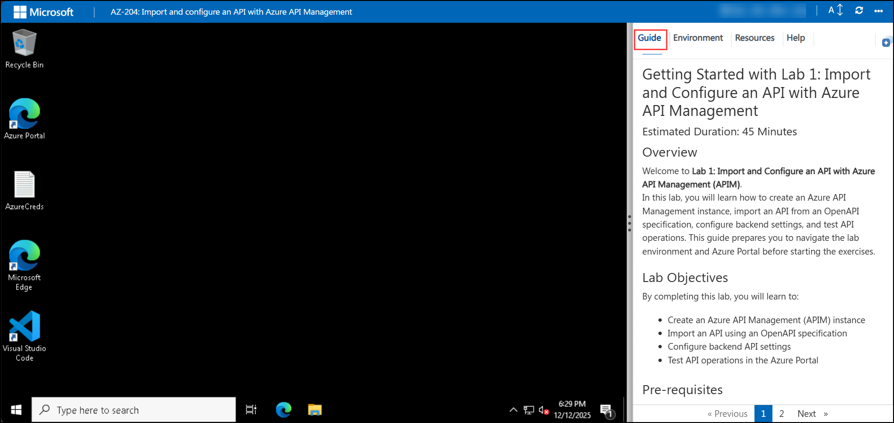

# Getting Started with Lab 1: Import and Configure an API with Azure API Management

### Estimated Duration: 45 Minutes

## Overview

Welcome to **Lab 1: Import and Configure an API with Azure API Management (APIM)**.  
In this lab, you will learn how to create an Azure API Management instance, import an API from an OpenAPI specification, configure backend settings, and test API operations. This guide prepares you to navigate the lab environment and Azure Portal before starting the exercises.

## Lab Objectives

By completing this lab, you will learn to:

- Create an Azure API Management (APIM) instance  
- Import an API using an OpenAPI specification  
- Configure backend API settings  
- Test API operations in the Azure Portal  

## Pre-requisites

Participants should have:

- **Azure Account Access:** Access to the lab-provided Azure environment.  
- **Basic API Understanding:** Familiarity with REST APIs and OpenAPI concepts.  
- **Azure Portal Knowledge:** Ability to navigate Azure services.  
- **Cloud Shell / CLI Skills:** Basic experience running commands in Azure Cloud Shell (Bash).  
- **Browser & Editor:** A modern browser and simple text editor (Notepad/VS Code).  

## Architecture

This lab follows a simple API Management architecture where APIM serves as a gateway to expose and manage backend APIs securely.

**Architecture Flow:**

1. A client sends a request to the APIM endpoint.  
2. APIM processes the request, applies policies, logs telemetry, and forwards the request.  
3. The backend API (Petstore OpenAPI) responds.  
4. APIM relays the response to the client with optional transformations.

**Key Components in Flow:**  
Client → APIM Gateway → Backend API → Response via APIM

## Explanation of Components

1. **Azure API Management (APIM)**  
   Centralized API gateway that secures, publishes, and monitors APIs.

2. **OpenAPI Specification**  
   A standardized API description used to auto-create API operations inside APIM.

3. **Backend API (Petstore API)**  
   The actual service responding to API requests defined by the imported OpenAPI file.

4. **APIM Gateway**  
   Enforces policies, logs traffic, and routes requests to backend APIs.

5. **Azure Cloud Shell (Bash)**  
   Browser-based CLI used in this lab to create APIM resources via Azure CLI commands.

---

## Accessing Your Lab Environment

Your virtual machine (VM) and lab guide are available within your browser.

### Virtual Machine Access

### Lab Guide Access

The lab guide appears on the right side of the interface for reference during exercises.

## Exploring Your Lab Resources

## Using Split-Window Mode

## Managing Your Virtual Machine

## Adjusting Zoom

---

## Getting Started with Azure Portal

1. Click the **Azure Portal** icon:  

   

2. Enter your username:  
   `<inject key="AzureAdUserEmail"></inject>`  

   

3. Enter your password:  
   `<inject key="AzureAdUserPassword"></inject>`  

   

4. When prompted with **Stay signed in?**, select **No**:  

   

---

## Support

CloudLabs support is available **24/7**.

- **Email:** cloudlabs-support@spektrasystems.com  
- **Live Chat:** https://cloudlabs.ai/labs-support  

---

## Proceed to the Lab

Click **Next** to begin **Exercise 1: Create an API Management Instance**.

---

## You’re all set! Enjoy your lab experience.
