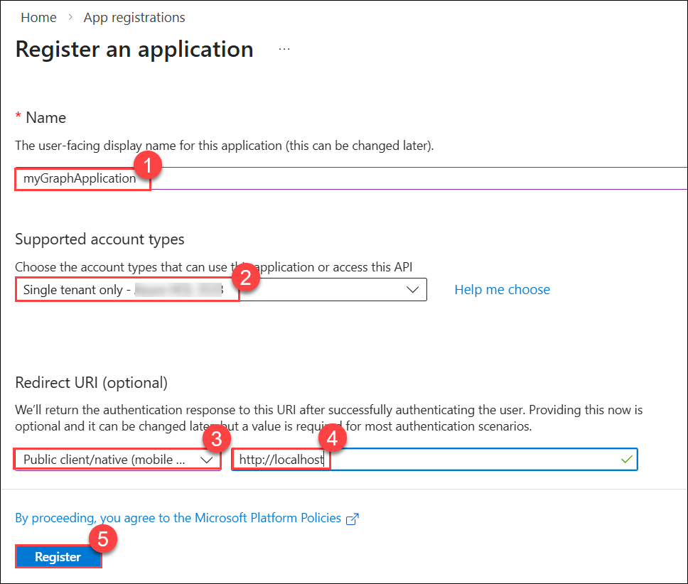
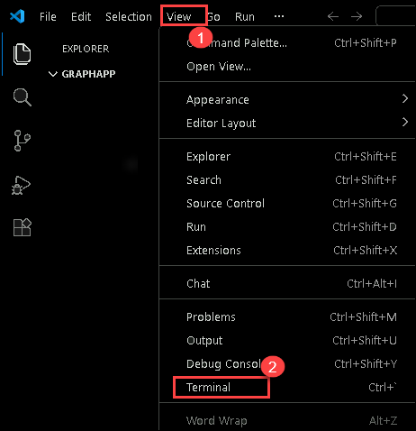

# Lab 02 - Module 2: Retrieve user profile information with the Microsoft Graph SDK

## Lab Scenario

In this exercise, you create a .NET app to authenticate with Microsoft Entra ID and request an access token, then call the Microsoft Graph API to retrieve and display your user profile information. You learn how to configure permissions and interact with Microsoft Graph from your application.

## Lab Objectives
In this lab, you will perform:

- Task 1: Register a new application
- Task 2: Create a .NET console app to send and receive messages
- Task 3: Configure the console application
- Task 4: Add the starter code for the project
- Task 5: Run the application

## Estimated Timing: 5 Minutes

### Task 1: Register a new application

In this task, you will register a new application in Microsoft Entra ID and record the identifiers required for accessing Microsoft Graph.

1. In the portal, search for **App registrations (1)** and select **App registrations (2)**. 

     

1. Select **+ New registration**, and when the **Register an application** page appears, enter your application's registration information:

    | Field | Value |
    |--|--|
    | **Name** | Enter `myGraphApplication` **(1)** |
    | **Supported account types** | Select **Single tenant only - xxxx (2)** |
    | **Redirect URI (optional)** | Select **Public client/native (mobile & desktop) (3)** and enter `http://localhost` **(4)** in the box to the right. |

1. Select **Register (5)**. Microsoft Entra ID assigns a unique application (client) ID to your app, and you're taken to your application's **Overview** page. 

     

1. In the **Essentials** section of the **Overview** page record the **Application (client) ID (1)** and the **Directory (tenant) ID (2)**. The information is needed for the application.

    

> **Congratulations** on completing the task! Now, it's time to validate it.
<validation step="53f4f621-04d5-4b8e-bcbe-2ba92f7e63ff" />
 
### Task 2: Create a .NET console app to send and receive messages

In this task, you will set up the .NET console project and prepare the development environment for building the Microsoft Graph application.

1. In Lab VM, open **File Explorer**, navigate to the **Downloads** folder, and create a new folder named **graphapp** for the project.

     

1. In Lab VM type **Visual Studio Code (1)** in the search bar and select **Visual Studio Code (2)** from the results to open.

     

1. In Visual Studio Code, select **File (1)** and choose **Open Folder (2)**

     

1. In the Open Folder window, navigate to the **Downloads (1)** directory, select the **graphapp (2)** folder, and then choose **Select Folder (3)** to open it in Visual Studio Code.

     

1. In Visual Studio Code, on the top menu, select **View (1) > Terminal (2)** to open a new terminal window.

     

1. Run the following command in the VS Code terminal to create the .NET console application.

    ```
    dotnet new console
    ```

     

1. Run the following commands to add the **Azure.Identity**,  **Microsoft.Graph**, and the **dotenv.net** packages to the project.

    ```
    dotnet add package Azure.Identity
    dotnet add package Microsoft.Graph
    dotnet add package dotenv.net
    ```

### Task 3: Configure the console application

In this task, you will create and configure the .env file to store the application settings needed for authentication.

1. Select **New file...** and create a file named **.env** in the project folder.

     

1. Open the **.env (1)** file and add the following code. Replace **YOUR_CLIENT_ID**, and **YOUR_TENANT_ID** with the values you recorded earlier **(2)**.

    ```
    CLIENT_ID="YOUR_CLIENT_ID"
    TENANT_ID="YOUR_TENANT_ID"
    ```

     

1. Press **ctrl+s** to save the file.

### Task 4: Add the starter code for the project

In this task, you will add the starter code and implement the authentication and Microsoft Graph client configuration required to retrieve user profile data.

1. Open the *Program.cs* file **(1)** and replace any existing contents with the following code **(2)**. Be sure to review the comments in the code.

    ```csharp
    using Microsoft.Graph;
    using Azure.Identity;
    using dotenv.net;
    
    // Load environment variables from .env file (if present)
    DotEnv.Load();
    var envVars = DotEnv.Read();
    
    // Read Azure AD app registration values from environment
    string clientId = envVars["CLIENT_ID"];
    string tenantId = envVars["TENANT_ID"];
    
    // Validate that required environment variables are set
    if (string.IsNullOrEmpty(clientId) || string.IsNullOrEmpty(tenantId))
    {
        Console.WriteLine("Please set CLIENT_ID and TENANT_ID environment variables.");
        return;
    }
    
    // ADD CODE TO DEFINE SCOPE AND CONFIGURE AUTHENTICATION
    
    
    
    // ADD CODE TO CREATE GRAPH CLIENT AND RETRIEVE USER PROFILE
    
    
    ```

     

1. Press **ctrl+s** to save your changes.

### Add code to complete the application

1. Locate the **// ADD CODE TO DEFINE SCOPE AND CONFIGURE AUTHENTICATION** comment and add the following code directly after the comment. Be sure to review the comments in the code.

    ```csharp
    // Define the Microsoft Graph permission scopes required by this app
    var scopes = new[] { "User.Read" };
    
    // Configure interactive browser authentication for the user
    var options = new InteractiveBrowserCredentialOptions
    {
        ClientId = clientId, // Azure AD app client ID
        TenantId = tenantId, // Azure AD tenant ID
        RedirectUri = new Uri("http://localhost") // Redirect URI for auth flow
    };
    var credential = new InteractiveBrowserCredential(options);
    ```

     

1. Locate the **// ADD CODE TO CREATE GRAPH CLIENT AND RETRIEVE USER PROFILE** comment and add the following code directly after the comment. Be sure to review the comments in the code.

    ```csharp
    // Create a Microsoft Graph client using the credential
    var graphClient = new GraphServiceClient(credential);
    
    // Retrieve and display the user's profile information
    Console.WriteLine("Retrieving user profile...");
    await GetUserProfile(graphClient);
    
    // Function to get and print the signed-in user's profile
    async Task GetUserProfile(GraphServiceClient graphClient)
    {
        try
        {
            // Call Microsoft Graph /me endpoint to get user info
            var me = await graphClient.Me.GetAsync();
            Console.WriteLine($"Display Name: {me?.DisplayName}");
            Console.WriteLine($"Principal Name: {me?.UserPrincipalName}");
            Console.WriteLine($"User Id: {me?.Id}");
        }
        catch (Exception ex)
        {
            // Print any errors encountered during the call
            Console.WriteLine($"Error retrieving profile: {ex.Message}");
        }
    }
    ```

     

1. Press **ctrl+s** to save the file.

### Task 5: Run the application

In this task, you will run the application, complete the interactive authentication flow, and view your user profile information retrieved from Microsoft Graph.

1. Start the application by running the following command:

    ```
    dotnet run
    ```

1. The app opens the default browser and displays the **Pick an account** prompt. Select your **ODL_User** account to continue with authentication.

     

1. If this is the first time you've authenticated to the registered app you receive a **Permissions requested** notification asking you to approve the app to sign you in and read your profile, and maintain access to data you have given it access to. Select **Accept**.

    

1. You should see the results similar to the example below in the console.

    ```
    Retrieving user profile...
    Display Name: <Your account display name>
    Principal Name: <Your principal name>
    User Id: 9f5...
    ```

    

1. Start the application a second time and notice you no longer receive the **Permissions requested** notification. The permission you granted earlier was cached.

## Summary

In this lab, you:

- Registered an application in Microsoft Entra ID for Microsoft Graph access

- Created and configured a .NET console project

- Added environment variables and implemented authentication using the Microsoft Graph SDK

- Retrieved and displayed your user profile information through the Microsoft Graph API

## You have successfully completed the lab.


