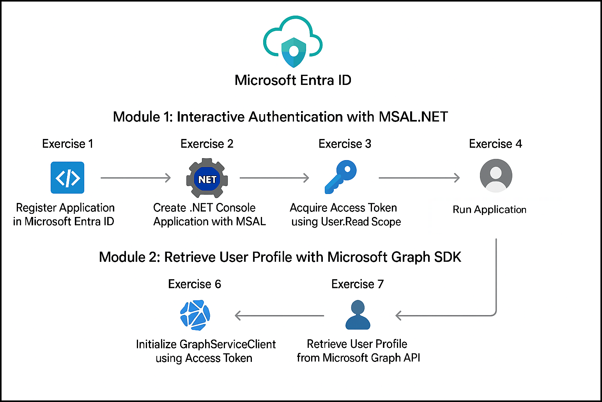

# Getting Started with Lab 02: Implement Interactive Authentication & Microsoft Graph Integration

### Estimated Duration: 50–60 Minutes

## Overview

Welcome to **Lab 02: Implement Interactive Authentication & Microsoft Graph Integration**.  
In this lab, you will learn how to perform interactive authentication using MSAL.NET and integrate Microsoft Graph to retrieve user profile information from Microsoft Entra ID.

This Getting Started page provides environment setup steps, navigation instructions, and support information before beginning the exercises.

---

## Lab Objectives

By completing this lab, you will learn to:

- Configure and register applications in Microsoft Entra ID  
- Implement interactive authentication in a .NET console application  
- Acquire delegated access tokens using MSAL.NET  
- Integrate the Microsoft Graph SDK  
- Retrieve user profile information programmatically  

---

## Pre-requisites

Participants should have:

- **Basic C# / .NET Knowledge:** Ability to create console apps and install NuGet packages.  
- **Microsoft Entra ID Awareness:** Understanding of app registration and permissions basics.  
- **Authentication Concepts:** Familiarity with OAuth 2.0 and delegated permissions.  
- **Microsoft Graph Fundamentals:** Knowledge of permissions such as `User.Read`.  
- **Azure Portal Navigation Skills:** Ability to navigate Entra ID and related settings.  

---

## Architecture

**Architecture Flow:**

In this lab, a .NET console application uses MSAL.NET to authenticate a user interactively against Microsoft Entra ID. Upon successful authentication, MSAL acquires a delegated access token with Microsoft Graph permissions. The application then uses the Microsoft Graph SDK to call Microsoft Graph and retrieve user profile information, which is displayed and validated by the user.

---

## Explanation of Components

1. **MSAL.NET (Microsoft Authentication Library)**  
   Handles interactive authentication and token acquisition.

2. **Microsoft Entra ID (Azure AD)**  
   Provides identity and access management and issues tokens for Microsoft Graph.

3. **Microsoft Graph API**  
   Unified endpoint used to access Microsoft 365 user data.

4. **GraphServiceClient (.NET SDK)**  
   Strongly typed client used to make Microsoft Graph API calls.

5. **.NET Console Application**  
   Executes authentication and retrieves user profile information.

---

## Accessing Your Lab Environment

Your virtual machine (VM) and lab guide are available directly in your browser.

### Virtual Machine Access  
Once you're ready to dive in, your virtual machine will load on the left side of the lab environment.

### Lab Guide Access  
The lab guide appears on the right panel and will assist you throughout the exercises.

---

## Exploring Lab Resources

Navigate to the **Environment** tab to view your lab credentials and resource details:

---

## Split-Window Feature

To open the lab guide in a separate window, select **Split Window**:

---

## Managing Your Virtual Machine

Start, stop, or restart your virtual machine at any time using the **Resources** tab:

---

## Adjusting Zoom

To adjust the zoom level of the lab environment, use the **A↕ 100%** button located near the timer:

---

## Accessing Azure Portal

Follow these steps to begin working in Azure:

1. On the VM desktop, select the **Azure Portal** icon:

   

2. Enter your credentials:
 
   - **Email/Username:** <inject key="AzureAdUserEmail"></inject>

     

3. Enter your password:
 
   - **Password:** <inject key="AzureAdUserPassword"></inject>

     

4. If prompted with **Stay signed in**, select **No**.

   

---

## Support

CloudLabs provides **24/7 dedicated support** to all learners.

**Learner Support Contacts:**  
- Email: cloudlabs-support@spektrasystems.com  
- Live Chat: https://cloudlabs.ai/labs-support  

Now, click on **Next** from the lower right corner to move on to the next page.

---

## Happy Learning!