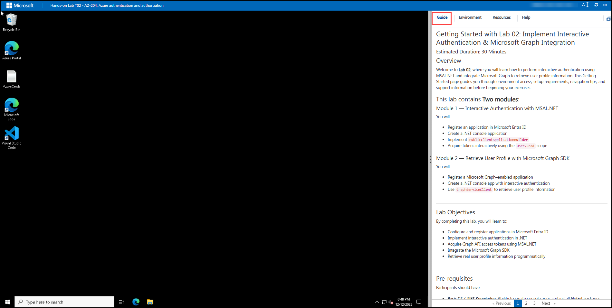

# Getting Started with Lab 02: Implement Interactive Authentication & Microsoft Graph Integration

### Estimated Duration: 50-60 Minutes

## Overview

Welcome to **Lab 02**, where you will learn how to perform interactive authentication using MSAL.NET and integrate Microsoft Graph to retrieve user profile information. This Getting Started page guides you through environment access, setup requirements, navigation tips, and support information before beginning your exercises.

## This lab contains **Two modules**:

### Module 1 — Interactive Authentication with MSAL.NET
You will:
- Register an application in Microsoft Entra ID  
- Create a .NET console application  
- Implement `PublicClientApplicationBuilder`  
- Acquire tokens interactively using the `User.Read` scope  

### Module 2 — Retrieve User Profile with Microsoft Graph SDK
You will:
- Register a Microsoft Graph–enabled application  
- Create a .NET console app with interactive authentication  
- Use `GraphServiceClient` to retrieve user profile information  

---

## Lab Objectives

By completing this lab, you will learn to:

- Configure and register applications in Microsoft Entra ID  
- Implement interactive authentication in .NET  
- Acquire Graph API access tokens using MSAL.NET  
- Integrate the Microsoft Graph SDK  
- Retrieve real user profile information programmatically  

---

## Pre-requisites

Participants should have:

- **Basic C# / .NET Knowledge:** Ability to create console apps and install NuGet packages.  
- **Microsoft Entra ID Awareness:** Understand app registration and permissions basics.  
- **Authentication Concepts:** Familiarity with OAuth 2.0 & delegated permissions.  
- **Microsoft Graph Fundamentals:** Understanding of API permissions like `User.Read`.  
- **Azure Portal Navigation Skills:** Ability to navigate Entra ID and resource settings.  

---

## Architecture

This lab uses a lightweight authentication and Microsoft Graph integration architecture.

**Architecture Flow:**

1. The .NET console application initializes MSAL's `PublicClientApplication`.  
2. The user authenticates interactively using Microsoft Entra ID.  
3. MSAL obtains a delegated access token with permissions such as `User.Read`.  
4. The application initializes the `GraphServiceClient` using the acquired token.  
5. Microsoft Graph processes the request and returns user profile details.

**Key Components in Flow:**  
Client App → MSAL.NET → Microsoft Entra ID → Access Token → Microsoft Graph API → Response to Application  

---

## Explanation of Components

1. **MSAL.NET (Microsoft Authentication Library)**  
   Handles token acquisition using interactive authentication.

2. **Microsoft Entra ID (Azure AD)**  
   Provides identity and access management, issuing tokens for Graph API.

3. **Microsoft Graph API**  
   Unified endpoint (`graph.microsoft.com`) used to retrieve Microsoft 365 user data.

4. **GraphServiceClient (.NET SDK)**  
   Strongly typed SDK for making Microsoft Graph calls easily.

5. **.NET Console Application**  
   The client app where authentication and API calls are executed.

---

## Accessing Your Lab Environment

Your virtual machine (VM) and lab guide are available directly in your browser.

### Virtual Machine Access
Once you're ready to dive in, your virtual machine and **lab guide** will be right at your fingertips within your web browser.

### Lab Guide Access
The lab guide appears on the right panel and will assist you throughout the exercises.

---

## Exploring Lab Resources

Navigate to the **Environment** tab to view your lab credentials and resource details:

---

## Split-Window Feature

To open the lab guide in a separate window, select **Split Window**:

---

## Managing Your Virtual Machine

Start, stop, or restart your virtual machine at any time using the **Resources** tab:

---

## Adjusting Zoom

To adjust the zoom level of the lab environment, use the **A↕ 100%** button located near the timer:

---

## Accessing Azure Portal

Follow these steps to begin working in Azure:

1. On the VM desktop, select the **Azure Portal** icon:

   

2. You will see the **Sign in to the Microsoft Azure** tab. Here, enter your credentials:
 
   - **Email/Username:** <inject key="AzureAdUserEmail"></inject>

      

3. Next, provide your password:
 
   - **Password:** <inject key="AzureAdUserPassword"></inject>

     

4. If prompted with **Stay signed in**, select **No**.

   

---

## Support

CloudLabs provides **24/7 dedicated support** to all learners.

**Learner Support Contacts:**
- Email: cloudlabs-support@spektrasystems.com  
- Live Chat: https://cloudlabs.ai/labs-support  

---

## Move to the Next Page

Select **Next** at the bottom-right corner to begin **Module 1**.

---

## Happy Learning!
