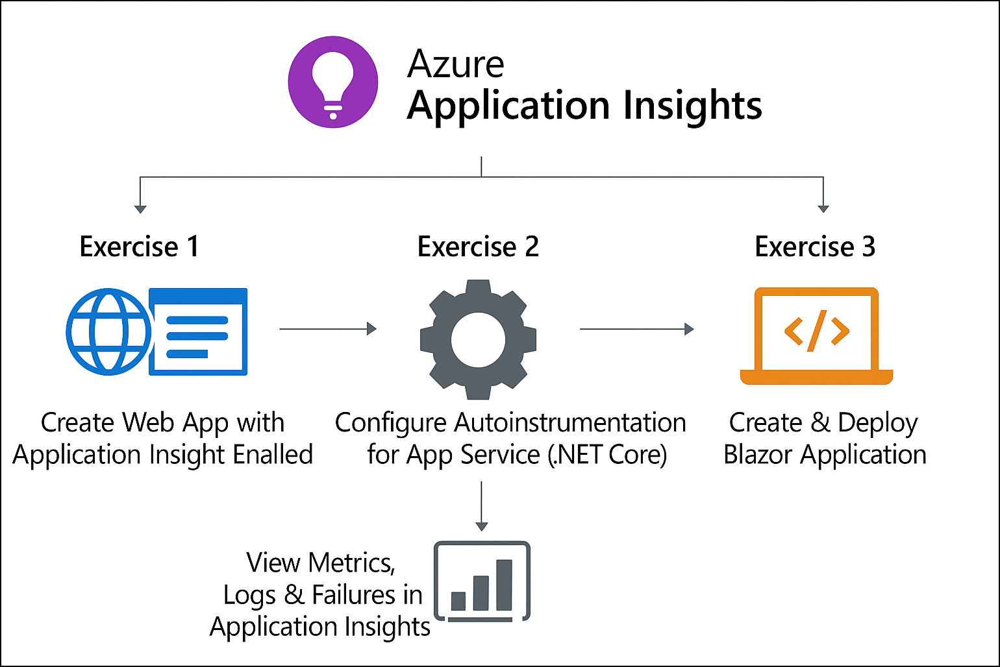
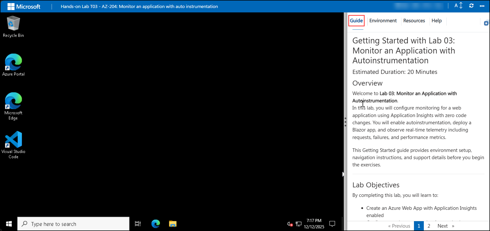

# Getting Started with Lab 03: Monitor an Application with Autoinstrumentation

### Estimated Duration: 30-40 Minutes

## Overview

Welcome to **Lab 03: Monitor an Application with Autoinstrumentation**.  
In this lab, you will configure monitoring for a web application using Application Insights with zero code changes. You will enable autoinstrumentation, deploy a Blazor app, and observe real-time telemetry including requests, failures, and performance metrics.

This Getting Started guide provides environment setup, navigation instructions, and support details before you begin the exercises.

---

## Lab Objectives

By completing this lab, you will learn to:

- Create an Azure Web App with Application Insights enabled  
- Configure autoinstrumentation for monitoring  
- Deploy a Blazor web application  
- Analyze telemetry and application activity in Application Insights  

---

## Pre-requisites

Participants should have:

- **Basic Web App Knowledge:** Understanding of creating and deploying web applications.  
- **Azure Portal Experience:** Ability to navigate Azure services like Web Apps and Application Insights.  
- **Monitoring Concepts:** Awareness of APM tools, metrics, and logs.  
- **.NET Application Experience:** Basic familiarity with building and running a Blazor application.  
- **Browser & Editor:** Access to a modern web browser and optional editor if making changes to the Blazor app.  

---

## Architecture

This architecture flow demonstrates monitoring an application using Azure Application Insights with autoinstrumentation. A Blazor application is deployed to an Azure Web App, where autoinstrumentation is enabled at the App Service level without any code changes. The application automatically emits telemetry such as requests, failures, and traces. Application Insights collects and processes this data, allowing you to analyze logs and metrics through Azure Monitor and Application Insights dashboards.

---

## Explanation of Components

The architecture for this lab involves the following key components:

1. **Azure Web App**  
   Hosts the Blazor application and provides built-in integration with Application Insights.

2. **Application Insights**  
   Collects telemetry such as requests, dependencies, exceptions, and performance metrics.

3. **Autoinstrumentation**  
   Enables monitoring without modifying application code—configured directly at App Service level.

4. **Blazor Application**  
   The sample web application deployed for observing telemetry during this lab.

5. **Azure Monitor**  
   Provides dashboards, logs, metrics, and end-to-end observability for applications.

---

## Accessing Your Lab Environment

Your virtual machine and lab guide are available within the CloudLabs interface.

### Virtual Machine Access
You will see your VM loading on the left side of the lab environment:

### Lab Guide Access
The lab guide appears on the right-hand panel.

---

## Exploring Lab Resources

Navigate to the **Environment** tab to view credentials and resource details:

---

## Split-Window Feature

To view the lab guide in a separate window, select **Split Window**:

---

## Managing Your Virtual Machine

Start, stop, or restart your virtual machine using the **Resources** tab:

---

## Adjusting Zoom

Modify the zoom level using the **A↕ 100%** control near the timer:

---

## Accessing Azure Portal

Follow these steps to begin working in Azure:

1. From the VM desktop, select the **Azure Portal** icon:

   

2. You will see the **Sign in to the Microsoft Azure** tab. Here, enter your credentials:
 
   - **Email/Username:** <inject key="AzureAdUserEmail"></inject>

      

3. Next, provide your password:
 
   - **Password:** <inject key="AzureAdUserPassword"></inject>
     

4. If prompted to **Stay signed in**, choose **No**.  
   

---

## Support

CloudLabs provides **24/7 support** for all learners.

**Learner Support Contacts:**  
- Email: cloudlabs-support@spektrasystems.com  
- Live Chat: https://cloudlabs.ai/labs-support  

Now, click on **Next** from the lower right corner to move on to the next page.

---

## Happy Learning!