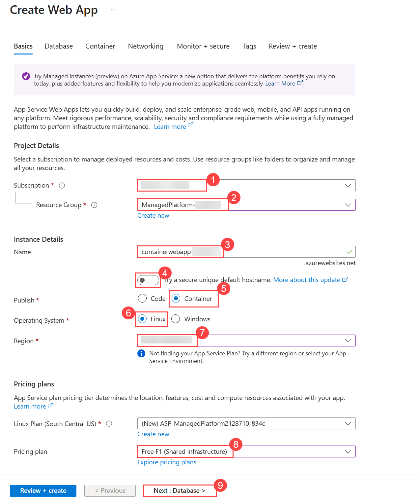
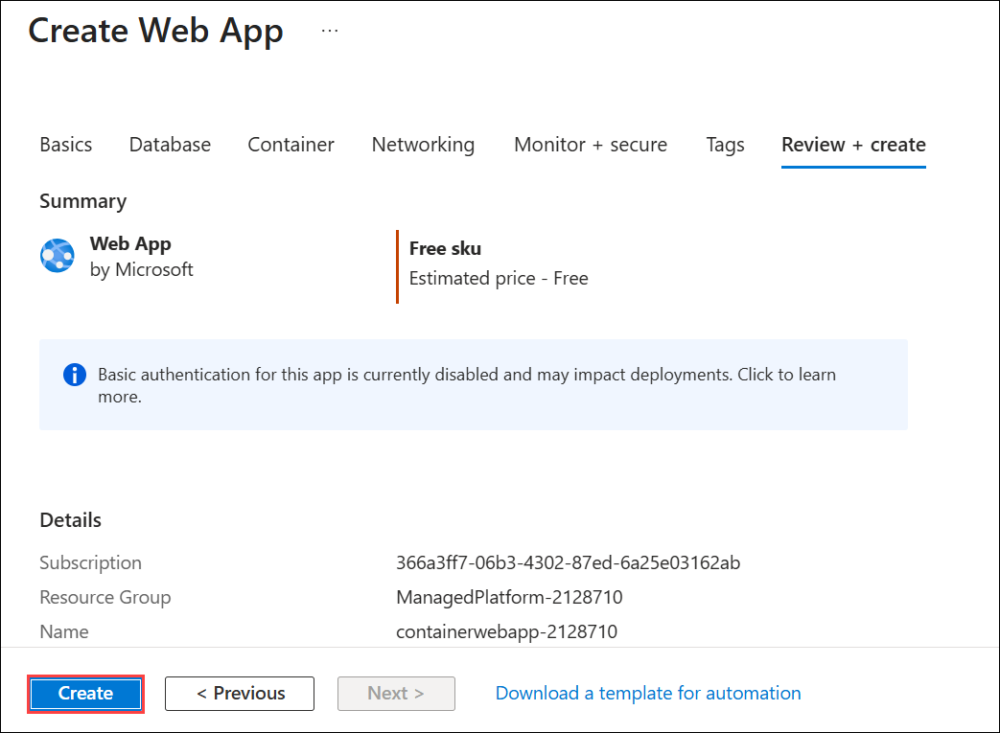
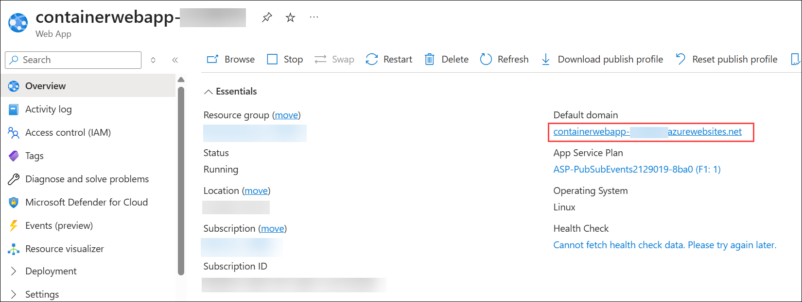
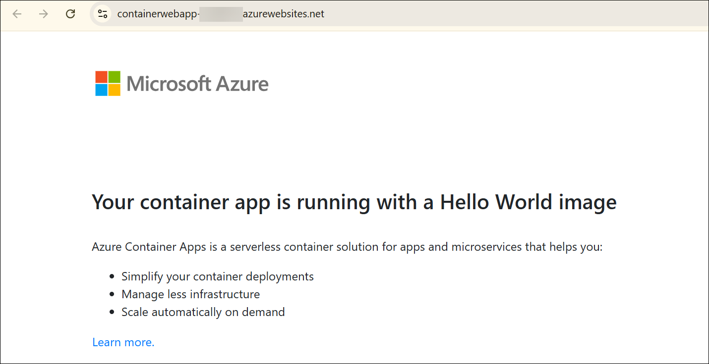

# Lab 04: Module 1: Deploy a Containerized App to Azure App Service

## Lab Scenario

In this exercise, you create an Azure App Service web app configured to run a containerized application by specifying a container image from Microsoft Container Registry. You learn how to configure container settings, deploy the app, and verify that the containerized application is running successfully in Azure App Service.

## Lab Objectives

In this lab, you will perform:

- Task 1: Create the Web App
- Task 2: View the Web App

# Exercise 1: Create a web app resource

## Task 1: Create the Web App

In this task, you willcreate an Azure App Service web app configured for container deployment.

1. In the Azure portal, select the **+ Create a resource** located in the **Azure Services** heading near the top of the homepage. 

    

1. In the **Search the Marketplace** search bar, enter **web app (1)** and press **Enter** to start searching.

1. In the Web App tile, select the **Create (2)** drop-down and then select **Web App (3)**.

    

1. Fill out the **Basics** tab with the information in the following table and navigate to the **Database page (9)**:

    | Setting | Action |
    |--------|--------|
    | **Subscription** | Retain the default value **(1)**. |
    | **Resource group** | Select **ManagedPlatform-<inject key="DeploymentID" enableCopy="false"/> (2)** |
    | **Name** | **containerwebapp-<inject key="DeploymentID" enableCopy="false"/> (3)** |
    | **Slider under Name** | Select the slider to turn it off **(4)**. |
    | **Publish** | Select **Container (5)**. |
    | **Operating System** | Ensure **Linux (6)** is selected. |
    | **Region** | **South Central US (7)** |
    | **Linux Plan** | Retain the default value. |
    | **Pricing plan** | Select the drop-down and choose **Free F1 (8)**. |

    

6. In **Database page** leave it as default and navigate to **Container page** 

6. Once in the **Container** page, enter the required details, and then select **Review + create (6)**.

    | Setting | Action |
    |--------|--------|
    | **Sidecar support** | Off **(1)**|
    | **Image Source** | Other container registries **(2)**|
    | **Access Type** | Public **(3)**|
    | **Registry server URL** | `mcr.microsoft.com/k8se` **(4)**|
    | **Image and Tag** | `quickstart:latest` **(5)** |
    | **Startup Command** | Leave blank |

    

1. Verify your selections, and then select **Create** to deploy the web app.

    

    > **Note:** If the deployment fails due to quota issue use diffent regions 
      like West US / North Europe / East US / Southeast Asia.

2. Wait until deployment completes and select **Go to resource**.

    

## Task 2: View the Web App

In this task, you will verify the deployed web app by opening the default domain in a browser.

1. In the App Service overview page, select the link next to **Default domain**.  

    

2. A new browser tab will open showing your deployed containerized app.

    

    > **Note:** It may take a few minutes for the container to fully load.

> **Congratulations** on completing the task! Now, it's time to validate it. Here are the steps:
>
> - Hit the Validate button for the corresponding task. If you receive a success message, you can proceed to the next task.
> - If not, carefully read the error message and retry the step, following the instructions in the lab guide.
> - If you need any assistance, please contact us at cloudlabs-support@spektrasystems.com. We are available 24/7 to help.
 
<validation step="74d7f8c8-43e6-4abf-a577-cbb980fe9ab2" />

# Summary

In this lab, you completed the following tasks:

- Created an Azure App Service configured for container deployment  
- Configured the container settings using an image from Microsoft Container Registry  
- Deployed and validated the containerized application  

## You have successfully completed the lab. Click on Next >>

