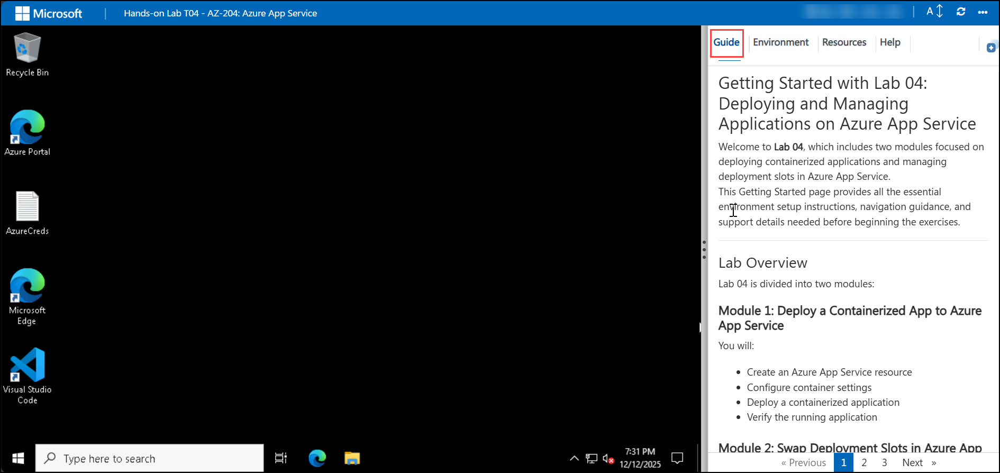

# Getting Started with Lab 04: Deploying and Managing Applications on Azure App Service

### Estimated Total Duration: 45 Minutes

## Overview

Welcome to **Lab 04**, which focuses on deploying containerized applications and managing deployment slots in Azure App Service.  
This Getting Started guide provides environment setup steps, portal access instructions, navigation details, and support information to prepare you for the hands‑on lab.

Lab 04 includes **two modules**:

### **Module 1: Deploy a Containerized App to Azure App Service**
You will:
- Create an Azure App Service resource  
- Configure container settings  
- Deploy a containerized application  
- Verify the running application  

### **Module 2: Swap Deployment Slots in Azure App Service**
You will:
- Deploy a static HTML website  
- Create a staging deployment slot  
- Deploy updated code to the staging slot  
- Perform a slot swap to promote changes to production  

---

## Lab Objectives

By completing this lab, you will learn to:

- Deploy containerized applications to Azure App Service  
- Configure application container settings  
- Create and manage deployment slots  
- Perform slot swaps for zero‑downtime deployment  
- Validate application behavior across staging and production environments  

---

## Pre-requisites

Participants should have:

- **Basic Web Deployment Knowledge:** Familiarity with web hosting concepts.  
- **Azure Portal Experience:** Ability to navigate Azure services such as App Service and Resource Groups.  
- **Containers Understanding:** Basic awareness of containerized applications and images.  
- **Deployment Concepts:** Knowledge of staging environments, production environments, and promotion workflows.  
- **Browser Access:** A modern web browser for working within the CloudLabs environment.  

---

## Architecture

This lab demonstrates how containerized applications and deployment slots function within Azure App Service.

**Architecture Flow:**

1. A containerized app image is deployed to Azure App Service.  
2. App Service runs the container and exposes a public endpoint.  
3. A staging slot is created to host updated code without affecting production.  
4. Changes are validated in the staging slot.  
5. A **slot swap** promotes the staging version to production with zero downtime.

**Key Components in Flow:**  
Client → Azure App Service (Production Slot) → Container Runtime → Staging Slot → Slot Swap → Updated Production App

---

## Explanation of Components

1. **Azure App Service**  
   A fully managed platform for hosting web apps, APIs, and containerized applications.

2. **App Service Plan**  
   Defines compute resources such as CPU, RAM, and scaling capabilities for hosted apps.

3. **Deployment Slots**  
   Separate runtime environments (e.g., staging, production) used for safe testing and controlled promotion.

4. **Container Settings**  
   Configuration parameters such as image source, startup commands, and registry credentials.

5. **Slot Swap**  
   A deployment mechanism that promotes changes from staging to production with zero downtime.

---

## Accessing Your Lab Environment

Your CloudLabs environment includes a virtual machine and a built‑in lab guide.

### Virtual Machine Access
   Your VM loads on the left side of the CloudLabs interface:

### Lab Guide Access
The lab instructions appear on the right-hand panel.

   

---

## Exploring Lab Resources

Navigate to the **Environment** tab to view:
- Credentials  
- Resource details  
- Deployment information  

   

---

## Split-Window Feature

To open the lab guide in a separate browser window for better visibility, use the **Split Window** option:

   

---

## Managing Your Virtual Machine

You can start, stop, and restart your VM anytime from the **Resources** tab:

   

---

## Adjusting Zoom

Control the zoom level of the lab environment using the **A↕ 100%** button located near the session timer:

   

---

## Accessing Azure Portal

Follow these steps to begin working with Azure resources:

1. Select the **Azure Portal** icon from the VM desktop:

   

2. Sign in using the credentials provided in your lab environment:
   - **Email/Username:** `<inject key="AzureAdUserEmail"></inject>`  

     

3. Enter your password:
   - **Password:** `<inject key="AzureAdUserPassword"></inject>`  

     

4. When asked **Stay signed in?**, choose **No**.  

   

---

## Support

CloudLabs offers dedicated **24/7 learner support** for any issues encountered, including:
- VM not loading  
- Azure access issues  
- CLI authentication problems  
- Deployment failures  

**Contact Information:**  
- Email: cloudlabs-support@spektrasystems.com  
- Live Chat: https://cloudlabs.ai/labs-support  

---

## Move to the Next Page

After completing your environment setup, click **Next** at the bottom-right corner to begin the lab exercises.

   

---

## Happy Learning!