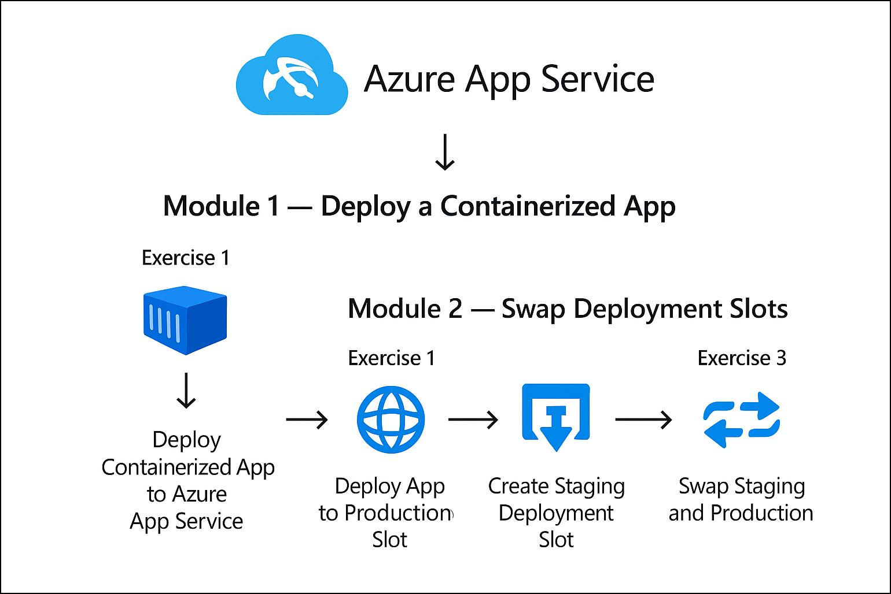

# Getting Started with Lab 04: Azure App Service

### Overall Estimated Duration: 45-60 Minutes

## Overview

This lab is intended for developers and cloud engineers who want to deploy and manage applications using **Azure App Service**. Participants will gain hands-on experience deploying a containerized application, configuring application settings, creating deployment slots, and safely promoting changes to production using slot swaps.

This Getting Started page prepares you to navigate the lab environment and Azure Portal before beginning the exercises.

## Objective 

This lab is designed to equip participants with hands-on experience in deploying and managing applications on Azure App Service. By completing this lab, participants will learn to:

- **Deploying Containerized Applications:**  
  Learn how to deploy a container-based application to Azure App Service and configure container settings required to run the application successfully.

- **Managing Deployment Slots:**  
  Understand how to create and manage deployment slots to safely test application updates without impacting production traffic.

- **Performing Slot Swaps:**  
  Perform a slot swap operation to promote changes from staging to production with zero downtime.

- **Validating Application Behavior:**  
  Verify application behavior across staging and production environments after deployment and swap.

## Prerequisites 

Participants should have:  
Basic knowledge and understanding of the following:

- Azure Portal  
- Azure App Service fundamentals  
- Web application deployment concepts  

## Architecture

This architecture demonstrates how Azure App Service hosts containerized applications and uses deployment slots to support safe application updates and zero-downtime releases.

## Architecture Diagram: 

## Explanation of Components

The architecture for this lab involves the following key components:

- **Azure App Service:**  
  A fully managed platform used to host web applications and containerized workloads.

- **App Service Plan:**  
  Defines the compute resources such as CPU, memory, and scaling options.

- **Container Image:**  
  The application image deployed to Azure App Service.

- **Deployment Slots:**  
  Separate runtime environments (staging and production) used to validate changes safely.

- **Slot Swap:**  
  A mechanism that exchanges environments between slots to promote changes with zero downtime.

## Getting Started with the Lab

Welcome to **Lab 04: Deploying and Managing Applications on Azure App Service**.  
We’ve prepared a guided lab environment where you will deploy applications, configure slots, and perform slot swaps using Azure App Service.

## Accessing Your Lab Environment

Once you're ready to begin, your virtual machine and **Guide** will be available directly within your web browser.

## Virtual Machine & Lab Guide

Your virtual machine is used to access the Azure Portal and perform all deployment tasks.  
The lab guide remains visible throughout the lab to guide you step by step.

## Exploring Your Lab Resources

To review your credentials and lab details, navigate to the **Environment** tab.

## Utilizing the Split Window Feature

For convenience, you can open the lab guide in a separate window using the **Split Window** option.

## Managing Your Virtual Machine

You can **Start, Stop, or Restart** your virtual machine at any time from the **Resources** tab.

## Lab Guide Zoom In/Zoom Out

To adjust the zoom level of the lab environment, use the **A↕ : 100%** icon located next to the timer.

## Lab Validation

After completing each exercise, select the **Validate** button under the Validation tab.  
If validation fails, review the error message and retry the steps as instructed.

## Let's Get Started with Azure Portal

1. On your virtual machine, click on the **Azure Portal** icon:

   

1. On the **Sign into Microsoft Azure** page, enter:

   - **Email/Username:** <inject key="AzureAdUserEmail"></inject>

     

1. Enter your password:

   - **Password:** <inject key="AzureAdUserPassword"></inject>

     

1. When prompted with **Stay signed in?**, select **No**.

   

## Support

The CloudLabs support team is available **24/7**.

- **Email:** cloudlabs-support@spektrasystems.com  
- **Live Chat:** https://cloudlabs.ai/labs-support  

Now, click on **Next** from the lower right corner to move on to the next page.

### Happy Learning!!