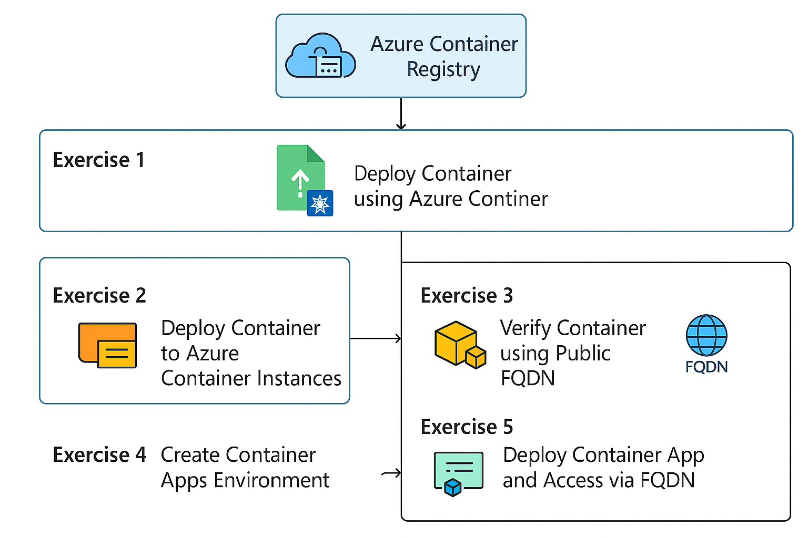
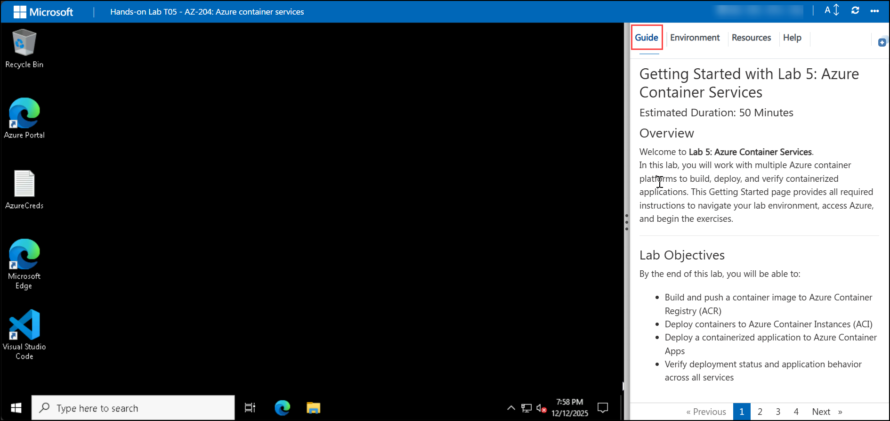
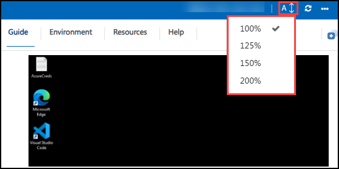

# Getting Started with Lab 5: Azure Container Services

### Estimated Duration: 60 Minutes

## Overview

Welcome to **Lab 5: Azure Container Services**.  
In this lab, you will work with multiple Azure container platforms to build, deploy, and verify containerized applications using Azure Container Registry, Azure Container Instances, and Azure Container Apps.

This Getting Started guide provides environment setup, navigation instructions, and support details before you begin the exercises.

---

## Lab Objectives

By completing this lab, you will learn to:

- Build and push container images to Azure Container Registry (ACR)  
- Deploy containers to Azure Container Instances (ACI)  
- Deploy a containerized application to Azure Container Apps  
- Verify deployments and application behavior across container services  

---

## Pre-requisites

Participants should have:

- **Basic Understanding of Containers:** Familiarity with Docker images and containerized workloads.  
- **Azure Portal Skills:** Ability to navigate Azure services such as ACR, ACI, and Container Apps.  
- **Container Deployment Concepts:** Awareness of registries, images, and runtime environments.  
- **Command-Line Experience:** Basic usage of Azure CLI or terminal commands.  
- **Browser Access:** A modern web browser.  

---

## Architecture

**Architecture Flow:**

In this lab, a container image is built and pushed to Azure Container Registry (ACR). The same image is then deployed to Azure Container Instances (ACI) for quick execution and validation. After verification, the container image is deployed to Azure Container Apps to run as a scalable application. Each deployment exposes an endpoint that allows you to test and validate application behavior across Azure container services.

---

## Explanation of Components

1. **Azure Container Registry (ACR)**  
   A private registry used to store and manage container images.

2. **Azure Container Instances (ACI)**  
   Provides serverless container execution without managing infrastructure.

3. **Azure Container Apps**  
   A fully managed service for running containerized microservices.

4. **Docker / Container CLI**  
   Used to build and push container images.

5. **Azure CLI**  
   Command-line tool for managing Azure container resources.

---

## Accessing Your Lab Environment

Your virtual machine and lab guide are available within the CloudLabs interface.

### Virtual Machine Access
You will see your VM loading on the left side of the lab environment:

### Lab Guide Access
The lab guide appears on the right-hand panel.

---

## Exploring Lab Resources

Navigate to the **Environment** tab to view credentials and resource details:

---

## Split-Window Feature

To view the lab guide in a separate window, select **Split Window**:

---

## Managing Your Virtual Machine

Start, stop, or restart your virtual machine using the **Resources** tab:

---

## Adjusting Zoom

Modify the zoom level using the **A↕ 100%** control near the timer:

---

## Accessing Azure Portal

Follow these steps to begin working in Azure:

1. From the VM desktop, select the **Azure Portal** icon:

   

2. You will see the **Sign in to the Microsoft Azure** tab. Here, enter your credentials:
 
   - **Email/Username:** <inject key="AzureAdUserEmail"></inject>

     

3. Next, provide your password:
 
   - **Password:** <inject key="AzureAdUserPassword"></inject>
     

4. If prompted to **Stay signed in**, choose **No**.  
   

---

## Support

CloudLabs provides **24/7 support** for all learners.

**Learner Support Contacts:**  
- Email: cloudlabs-support@spektrasystems.com  
- Live Chat: https://cloudlabs.ai/labs-support  

Now, click on **Next** from the lower right corner to move on to the next page.

---

## Happy Learning!