# Lab 06: Create resources in Azure Cosmos DB for NoSQL using .NET

## Lab Overview

In this exercise, you create an Azure Cosmos DB account and build a .NET console application that uses the Microsoft Azure Cosmos DB SDK to create a database, container, and sample item. You learn how to configure authentication, perform database operations programmatically, and verify your results in the Azure portal.

## Lab Objectives

In this lab, you will perform:

- **Exercise 1:** Create Azure Cosmos DB resources  
- **Exercise 2:** Build a .NET console application to interact with Cosmos DB  
- **Exercise 3:** Run the application and verify results  

## Estimated Timing: 30 Minutes

## Exercise 1: Create resources in Azure Cosmos DB for NoSQL using .NET

### Task 1: Create an Azure Cosmos DB account

1. Open Cloud Shell using the **[\>_]** button at the top of the Azure portal, and choose a **Bash** environment.  

     

     

1. If prompted to choose storage, select **No storage account required (2)**, choose your **Subscription (2)**, and select **Apply (3)**.

     

1. In the Cloud Shell toolbar, open the **Settings (1)** menu and choose **Go to Classic version (2)** from the drop-down.

   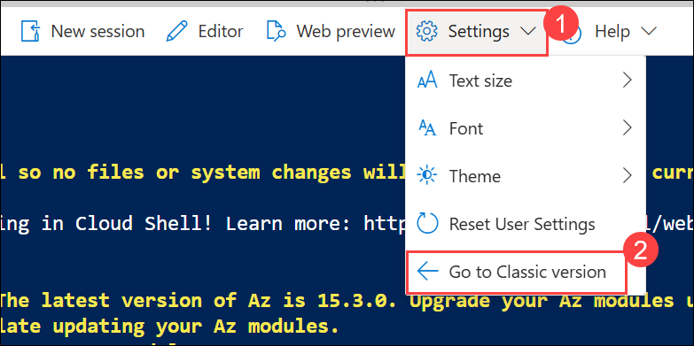

3. Create variables to store the resource group name and a unique Cosmos DB account name.

    ```bash
    resourceGroup=CosmosDB-<inject key="DeploymentID" enableCopy="false"/>
    accountName=cosmosexercise$RANDOM
    ```

4. Create the Azure Cosmos DB account.

    ```bash
    az cosmosdb create --name $accountName --resource-group $resourceGroup
    ```

    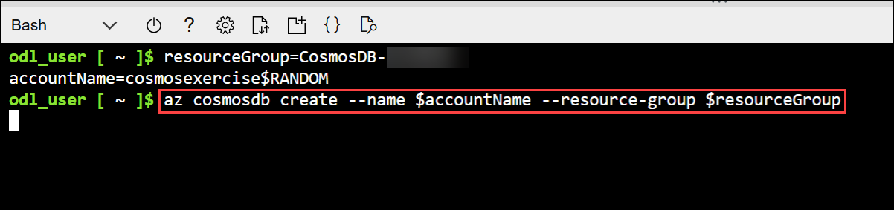

5. Run the following command to retrieve the documentEndpoint for the Azure Cosmos DB account and copy the **Azure Cosmos DB account endpoint** displayed in the output and paste it into a text editor (such as Notepad), as it will be required in the upcoming steps.

    ```bash
    az cosmosdb show --name $accountName --resource-group $resourceGroup   --query "documentEndpoint" --output tsv
    ```

6. Retrieve the **primary access key** for the Azure Cosmos DB account, as it will be used in the upcoming steps.

    ```bash
    az cosmosdb keys list --name $accountName --resource-group $resourceGroup   --query "primaryMasterKey" --output tsv
    ```    
    
    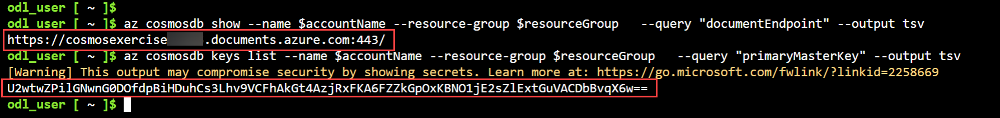

## Exercise 2: Build a .NET console application to interact with Cosmos DB

### Task 1: Create the .NET console application

1. Create a project folder and navigate into it.

    ```bash
    mkdir cosmosdb
    cd cosmosdb
    ```

2. Create a new .NET console application.

    ```bash
    dotnet new console
    ```

3. Run the following commands to add the **Microsoft.Azure.Cosmos, Newtonsoft.Json**, and **dotenv.net** packages to the project.

    ```bash
    dotnet add package Microsoft.Azure.Cosmos --version 3.*
    dotnet add package Newtonsoft.Json --version 13.*
    dotnet add package dotenv.net
    ```
### Task 2: Configure environment variables and application code

1. Run the following command to create the `.env` file to hold the secrets, and then open it in the code editor.

    ```bash
    touch .env
    code .env
    ```

2. Add the following code to the **.env** file and Add the **Azure Cosmos DB account endpoint** and **account key** that were copied in the previous tasks to the application configuration.

    ```text
    DOCUMENT_ENDPOINT="YOUR_DOCUMENT_ENDPOINT"
    ACCOUNT_KEY="YOUR_ACCOUNT_KEY"
    ```
    
    

3. Press **ctrl+s** to save the file, then **ctrl+q** to exit the editor.

### Task 3 Add required implementation code

> **Tip:** As you add code, be sure to maintain the correct indentation. Use the comment indentation levels as a guide.

1. Run the following command in the cloud shell to begin editing the application.

    ```bash
    code Program.cs
    ```

1. Replace any existing code with the following code snippet. The code provides the overall structure of the app. Review the comments in the code to get an understanding of how it works. To complete the application, you add code in specified areas later in the exercise. 

    ```csharp
    using Microsoft.Azure.Cosmos;
    using dotenv.net;
    
    string databaseName = "myDatabase"; // Name of the database to create or use
    string containerName = "myContainer"; // Name of the container to create or use
    
    // Load environment variables from .env file
    DotEnv.Load();
    var envVars = DotEnv.Read();
    string cosmosDbAccountUrl = envVars["DOCUMENT_ENDPOINT"];
    string accountKey = envVars["ACCOUNT_KEY"];
    
    if (string.IsNullOrEmpty(cosmosDbAccountUrl) || string.IsNullOrEmpty(accountKey))
    {
        Console.WriteLine("Please set the DOCUMENT_ENDPOINT and ACCOUNT_KEY environment variables.");
        return;
    }
    
    // CREATE THE COSMOS DB CLIENT USING THE ACCOUNT URL AND KEY
    
    
    try
    {
        // CREATE A DATABASE IF IT DOESN'T ALREADY EXIST
    
    
        // CREATE A CONTAINER WITH A SPECIFIED PARTITION KEY
    
    
        // DEFINE A TYPED ITEM (PRODUCT) TO ADD TO THE CONTAINER
    
    
        // ADD THE ITEM TO THE CONTAINER
    
    
    }
    catch (CosmosException ex)
    {
        // Handle Cosmos DB-specific exceptions
        // Log the status code and error message for debugging
        Console.WriteLine($"Cosmos DB Error: {ex.StatusCode} - {ex.Message}");
    }
    catch (Exception ex)
    {
        // Handle general exceptions
        // Log the error message for debugging
        Console.WriteLine($"Error: {ex.Message}");
    }
    
    // This class represents a product in the Cosmos DB container
    public class Product
    {
        public string? id { get; set; }
        public string? name { get; set; }
        public string? description { get; set; }
    }
    ```

    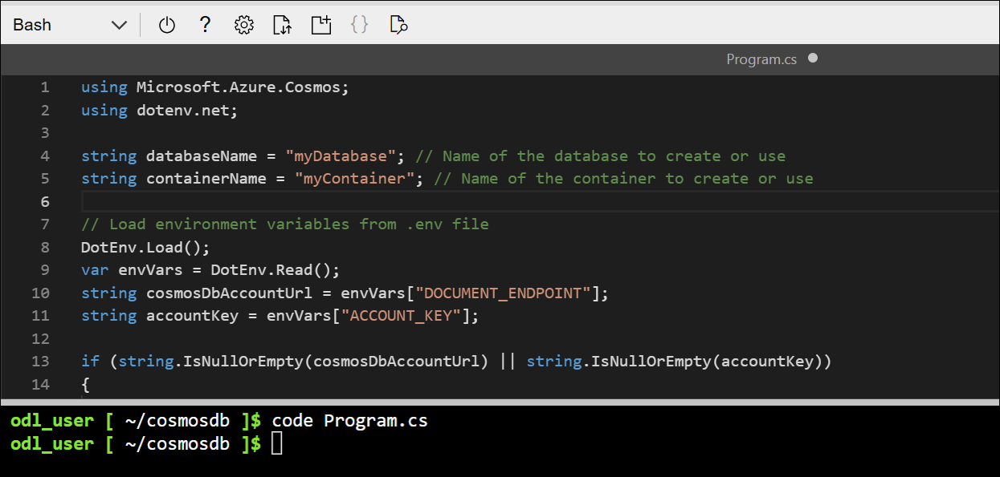

    - Next, you add code in specified areas of the projects to create the: client, database, container, and add a sample item to the container.

1. Add the following code in the space after the **// CREATE THE COSMOS DB CLIENT USING THE ACCOUNT URL AND KEY** comment. This code defines the client used to connect to your Azure Cosmos DB account.

   ```csharp
   CosmosClient client = new(
      accountEndpoint: cosmosDbAccountUrl,
      authKeyOrResourceToken: accountKey
   );
   ```

   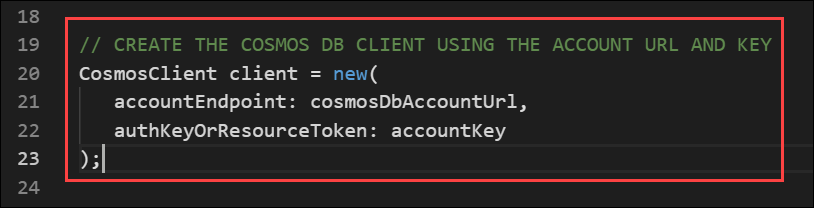

1. Add the following code in the space after the **// CREATE A DATABASE IF IT DOESN'T ALREADY EXIST** comment.

   ```csharp
   Database database = await client.CreateDatabaseIfNotExistsAsync(databaseName);
   Console.WriteLine($"Created or retrieved database: {database.Id}");
   ```

   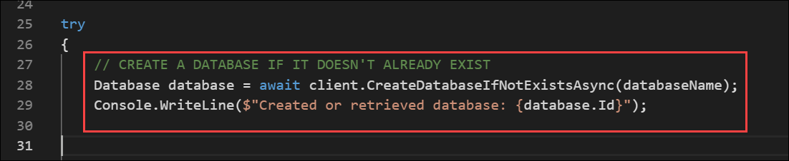

1. Add the following code in the space after the **// CREATE A CONTAINER WITH A SPECIFIED PARTITION KEY** comment.

   ```csharp
   Container container = await database.CreateContainerIfNotExistsAsync(
      id: containerName,
      partitionKeyPath: "/id"
   );
   Console.WriteLine($"Created or retrieved container: {container.Id}");
   ```

   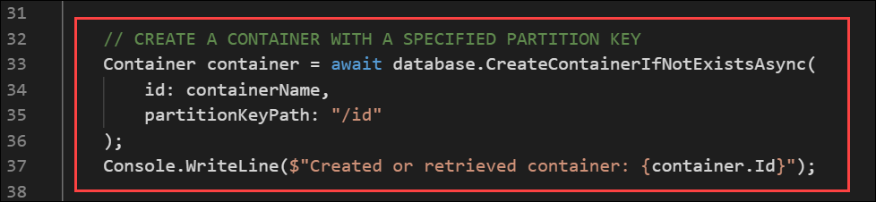

1. Add the following code in the space after the **// DEFINE A TYPED ITEM (PRODUCT) TO ADD TO THE CONTAINER** comment. This defines the item that's added to the container.

   ```csharp
   Product newItem = new Product
    {
        id = Guid.NewGuid().ToString(), // Generate a unique ID for the product
        name = "Sample Item",
        description = "This is a sample item in my Azure Cosmos DB exercise."
    };
   ```

   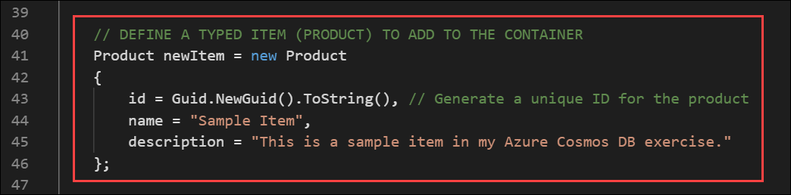

1. Add the following code in the space after the **// ADD THE ITEM TO THE CONTAINER** comment.

   ```csharp
   ItemResponse<Product> createResponse = await container.CreateItemAsync(
      item: newItem,
      partitionKey: new PartitionKey(newItem.id)
   );

   Console.WriteLine($"Created item with ID: {createResponse.Resource.id}");
   Console.WriteLine($"Request charge: {createResponse.RequestCharge} RUs");
   ```

    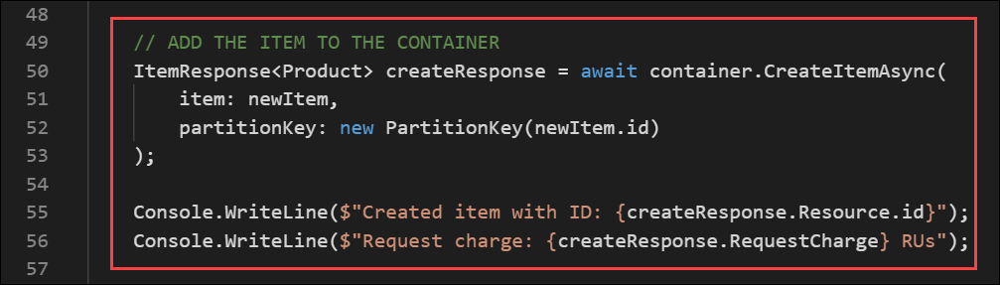

### Task 4 Verify the complete Program.cs code

1. Now that the code is complete. Verify it with below code, save your progress use **ctrl + s** to save the file, and **ctrl + q** to exit the editor.

    ```
    using Microsoft.Azure.Cosmos;
    using dotenv.net;

    string databaseName = "myDatabase"; // Name of the database to create or use
    string containerName = "myContainer"; // Name of the container to create or use

    // Load environment variables from .env file
    DotEnv.Load();
    var envVars = DotEnv.Read();
    string cosmosDbAccountUrl = envVars["DOCUMENT_ENDPOINT"];
    string accountKey = envVars["ACCOUNT_KEY"];

    if (string.IsNullOrEmpty(cosmosDbAccountUrl) || string.IsNullOrEmpty(accountKey))
    {
        Console.WriteLine("Please set the DOCUMENT_ENDPOINT and ACCOUNT_KEY environment variables.");
        return;
    }

    // CREATE THE COSMOS DB CLIENT USING THE ACCOUNT URL AND KEY
    CosmosClient client = new(
        accountEndpoint: cosmosDbAccountUrl,
        authKeyOrResourceToken: accountKey
    );

    try
    {
        // CREATE A DATABASE IF IT DOESN'T ALREADY EXIST
        Database database = await client.CreateDatabaseIfNotExistsAsync(databaseName);
        Console.WriteLine($"Created or retrieved database: {database.Id}");

        // CREATE A CONTAINER WITH A SPECIFIED PARTITION KEY
        Container container = await database.CreateContainerIfNotExistsAsync(
            id: containerName,
            partitionKeyPath: "/id"
        );
        Console.WriteLine($"Created or retrieved container: {container.Id}");

        // DEFINE A TYPED ITEM (PRODUCT) TO ADD TO THE CONTAINER
        Product newItem = new Product
        {
            id = Guid.NewGuid().ToString(), // Generate a unique ID for the product
            name = "Sample Item",
            description = "This is a sample item in my Azure Cosmos DB exercise."
        };

        // ADD THE ITEM TO THE CONTAINER
        ItemResponse<Product> createResponse = await container.CreateItemAsync(
            item: newItem,
            partitionKey: new PartitionKey(newItem.id)
        );

        Console.WriteLine($"Created item with ID: {createResponse.Resource.id}");
        Console.WriteLine($"Request charge: {createResponse.RequestCharge} RUs");

    }
    catch (CosmosException ex)
    {
        // Handle Cosmos DB-specific exceptions
        // Log the status code and error message for debugging
        Console.WriteLine($"Cosmos DB Error: {ex.StatusCode} - {ex.Message}");
    }
    catch (Exception ex)
    {
        // Handle general exceptions
        // Log the error message for debugging
        Console.WriteLine($"Error: {ex.Message}");
    }

    // This class represents a product in the Cosmos DB container
    public class Product
    {
        public string? id { get; set; }
        public string? name { get; set; }
        public string? description { get; set; }
    }
    ```

    

## Exercise 3: Run the application and verify results

### Task 1 : Run the application and verify results

1. Run the following command in the cloud shell to test for any errors in the project. If you do see errors, open the *Program.cs* file in the editor and check for missing code or pasting errors.

   ```bash
   dotnet build
   ```

    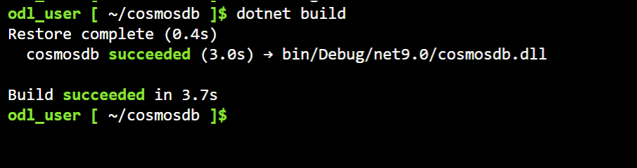

1. Run the `dotnet run` command in the cloud shell. The output should be something similar to the following example.

   ```bash
   dotnet run
   ```

    

### Task 2 Verify the item in Azure Cosmos DB

1. In the **Azure portal**, select **Resource groups**, and then open the **CosmosDB-<inject key="DeploymentID" enableCopy="false"/>** resource group.

   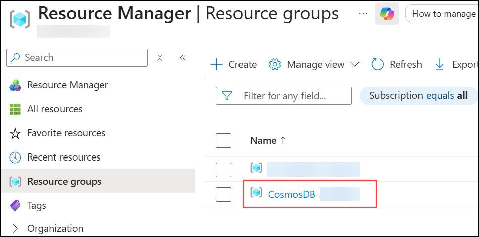

1. In the **CosmosDB-<inject key="DeploymentID" enableCopy="false"/>** resource group, select the **cosmosexercisexxxxx** Azure Cosmos DB account.

   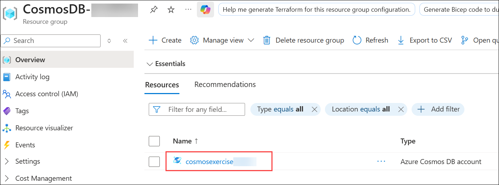

1. On the **Overview** page of the **cosmosexercisexxxxx** Azure Cosmos DB account, select **Data Explorer**.

   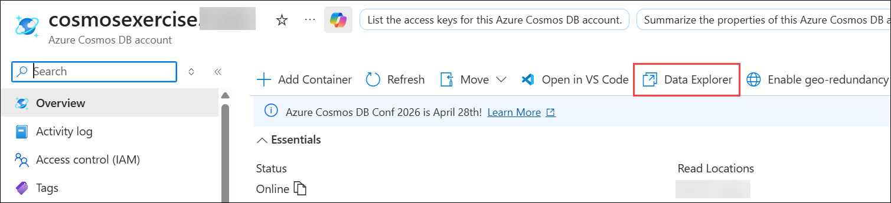

1. In **Data Explorer**, expand **myContainer (1)**, select **Items (2)**, and then view the created item.

   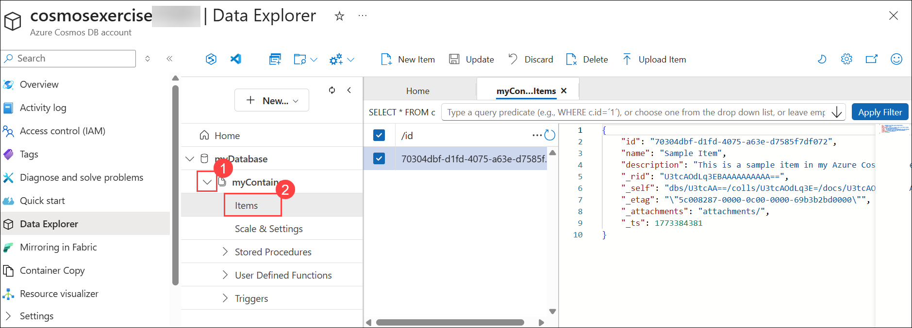

   > **Note:** If a **Welcome** pop-up appears in **Data Explorer**, close it to continue.

> **Congratulations** on completing the task! Now, it's time to validate it. Here are the steps:
>
> - Hit the Validate button for the corresponding task. If you receive a success message, you can proceed to the next task.
> - If not, carefully read the error message and retry the step, following the instructions in the lab guide.
> - If you need any assistance, please contact us at cloudlabs-support@spektrasystems.com. We are available 24/7 to help.

<validation step="6035a827-10fe-4abe-9c5f-af88966b9ba3" />

## Summary

In this lab, you:

- Created an Azure Cosmos DB account  
- Built a .NET application that interacts with Azure Cosmos DB  
- Inserted and verified data programmatically using the Azure portal  

## You have successfully completed this lab.
