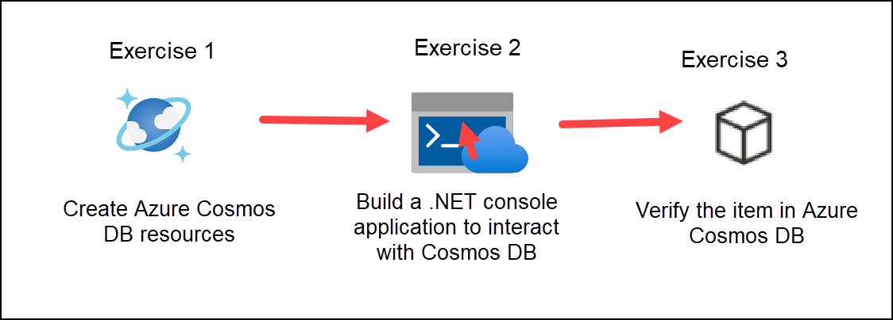
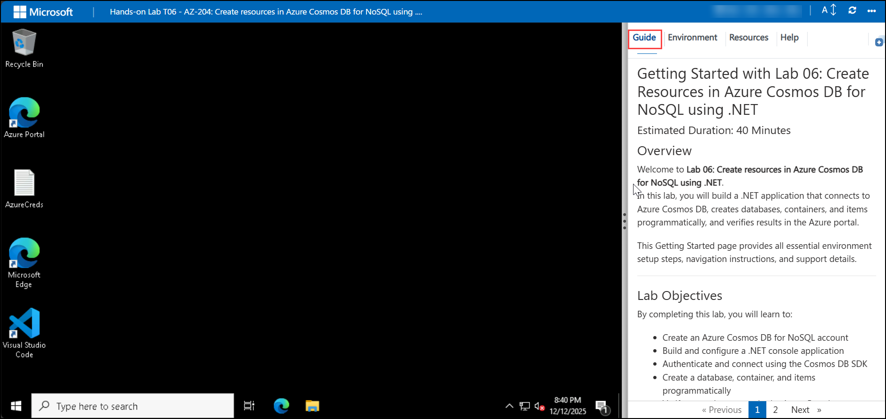

# Getting Started with Lab 06: Create Resources in Azure Cosmos DB for NoSQL using .NET

### Estimated Duration: 40 Minutes

## Overview

Welcome to **Lab 06: Create Resources in Azure Cosmos DB for NoSQL using .NET**.  
In this lab, you will build a .NET console application that connects to Azure Cosmos DB, creates databases, containers, and items programmatically, and verifies the results in the Azure Portal.

This Getting Started page provides environment setup steps, navigation instructions, and support details before you begin the exercises.

---

## Lab Objectives

By completing this lab, you will learn to:

- Create an Azure Cosmos DB for NoSQL account  
- Build and configure a .NET console application  
- Authenticate and connect using the Cosmos DB .NET SDK  
- Create a database, container, and items programmatically  
- Verify created resources in the Azure Portal  

---

## Pre-requisites

Participants should have:

- **Basic C# / .NET Knowledge:** Ability to build console applications and manage NuGet packages.  
- **Azure Portal Experience:** Familiarity with navigating Azure services like Cosmos DB.  
- **NoSQL Concepts:** Understanding of databases, containers, partitions, and JSON documents.  
- **Azure SDK Basics:** Awareness of connecting to Azure services programmatically.  
- **Browser Access:** A modern browser to work in CloudLabs and Azure Portal.  

---

## Architecture

This architecture flow demonstrates how a .NET application initializes a Cosmos DB client using the account endpoint and access key. The application creates a database and container if they do not already exist and then inserts JSON items programmatically. Azure Cosmos DB automatically stores and indexes the data, which is later verified by the user through the Azure Portal.

---

## Explanation of Components

The architecture for this lab involves the following key components:

1. **Azure Cosmos DB for NoSQL**  
   A globally distributed, high-performance NoSQL database service optimized for JSON data.

2. **CosmosClient (.NET SDK)**  
   The .NET client used to connect to Cosmos DB and perform database and container operations.

3. **Database & Container**  
   Logical resources used to organize and store JSON items in Cosmos DB.

4. **Partition Key**  
   A value used to distribute data for scalability and performance.

5. **Azure Portal**  
   Used to view, validate, and monitor Cosmos DB resources created by the application.

---

## Accessing Your Lab Environment

Your virtual machine and lab guide are available directly within your browser.

### Virtual Machine Access
You will see your VM loading on the left side of the screen:

### Lab Guide Access
The lab guide appears on the right panel and will be your reference throughout the exercises.

---

## Exploring Lab Resources

Navigate to the **Environment** tab to view credentials and resource details:

---

## Split-Window Feature

To open the lab guide in a separate window, select **Split Window**:

---

## Managing Your Virtual Machine

You can Start, Stop, or Restart your virtual machine at any time via the **Resources** tab:

---

## Adjusting Zoom

To zoom in or out of the environment view, use the **A↕ 100%** button near the timer:

---

## Accessing Azure Portal

Follow these steps to begin working in Azure:

1. On your VM desktop, click the **Azure Portal** icon:

   

2. Enter your credentials:

   - **Email/Username:** <inject key="AzureAdUserEmail"></inject>

     

3. Enter your password:

   - **Password:** <inject key="AzureAdUserPassword"></inject>

     

4. If prompted to **Stay signed in**, select **No**.

   

---

## Support

CloudLabs offers **24/7 support** for all learners.

**Learner Support Contacts:**  
- Email: cloudlabs-support@spektrasystems.com  
- Live Chat: https://cloudlabs.ai/labs-support  

If you face login, VM, or Azure issues, reach out anytime.

Now, click on **Next** from the lower right corner to move on to the next page.

---

## Happy Learning!