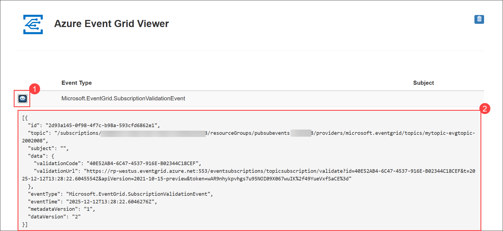

# Lab 7: Azure events and messaging

## Lab Scenario

In this exercise, you create an Azure Event Grid topic and a web app endpoint, then build a .NET console application that sends custom events to the Event Grid topic. You learn how to configure event subscriptions, authenticate with Event Grid, and verify that your events are successfully routed to the endpoint by viewing them in the web app.

## Lab Objectives
In this lab, you will perform:

* Task 1: Create Azure Event Grid resources
* Task 2: Create a message endpoint
* Task 3: Subscribe to the topic
* Task 4: Send an event with a .NET console application
* Task 5: Configure the console application
* Task 6: Add the code for the project
* Task 7: Sign into Azure and run the app

## Estimated Timing: 30 Minutes

## Exercise 1: Route events to a custom endpoint with Azure Event Grid

### Task 1: Create Azure Event Grid resources

In this task, you will create the required Azure Event Grid resources, including a custom topic, using the Azure CLI.

1. In the lab VM, click on the **Azure Portal icon** as shown below:

    

    - On the **Sign in to Microsoft Azure** tab, you will see the login screen. Enter your credentials:
      
        * **Email/Username:** <inject key="AzureAdUserEmail"></inject>
    
    - Next, provide your password:

        * **Temporary Access Pass:** <inject key="AzureAdUserPassword"></inject>

1. On the Azure portal homepage, click the **\[>\_] Cloud Shell (1)** button located to the right of the **Copilot** tab at the top. This opens a new Cloud Shell session. In the **Welcome to Azure Cloud Shell** window, choose **Bash**.

    

    

1. In the **Getting started** window, ensure **No storage account required (1)** is selected. From the **Subscription** drop-down, choose **Default subscription (2)**, then click **Apply (3)**.
   
    

1. In the cloud shell toolbar, in the **Settings** menu, select **Go to Classic version** (this is required to use the code editor).

     

1. Many of the commands require unique names and use the same parameters. Creating some variables will reduce the changes needed to the commands that create resources. Run the following commands to create the needed variables. 

    ```bash
    let rNum=<inject key="DeploymentID" enableCopy="false"/>
    resourceGroup=PubSubEvents-<inject key="DeploymentID" enableCopy="false"/>
    location=<inject key="Region" enableCopy="false"/>
    topicName="mytopic-evgtopic-${rNum}"
    siteName="evgsite-${rNum}"
    siteURL="https://${siteName}.azurewebsites.net"
    ```

     

1. Create a topic by using the **az eventgrid topic create** command. The name must be unique because it's part of the DNS entry.  

    ```bash
    az eventgrid topic create --name $topicName \
        --location $location \
        --resource-group $resourceGroup
    ```

    

<validation step="e6e94df0-6484-4c30-a392-ea0be9f4c4a4" />

### Task 2: Create a message endpoint

In this task, you will deploy a message endpoint using a prebuilt web app that will receive and display events sent to your Event Grid topic.

1. Run the following commands to create a message endpoint. The **echo** command will display the site URL for the endpoint.

    ```bash
    az deployment group create \
        --resource-group $resourceGroup \
        --template-uri "https://raw.githubusercontent.com/CloudLabs-MOC/mslearn-azure-developer/prod/instructions/azure-events-messages/azuredeploy.json" \
        --parameters siteName=$siteName hostingPlanName=viewerhost
    
    echo "Your web app URL: ${siteURL}"
    ```

     

    > **Note:** This command may take a 2-3 minutes to complete.

1. Open a new tab in your browser and navigate to the URL generated at the end of the previous script to ensure the web app is running. You should see the site with no messages currently displayed.

    

    

    > **Tip:** Leave the browser running, it is used to show updates.

<validation step="0ea1c9e6-969d-474a-9ca9-f23e538e88e1" />

### Task 3: Subscribe to the topic

In this task, you will subscribe the web app endpoint to your Event Grid topic so it can receive validation and custom events. 

1. Subscribe to a topic using the **az eventgrid event-subscription create** command. The following script retrieves the subscription ID from your account and uses it in the creation of the event subscription.

    ```bash
    endpoint="${siteURL}/api/updates"
    topicId=$(az eventgrid topic show --resource-group $resourceGroup \
        --name $topicName --query "id" --output tsv)
    
    az eventgrid event-subscription create \
        --source-resource-id $topicId \
        --name TopicSubscription \
        --endpoint $endpoint
    ```

     

1. View your web app again, and notice that a subscription validation event has been sent to it. Select the eye icon to expand the event data. Event Grid sends the validation event so the endpoint can verify that it wants to receive event data. The web app includes code to validate the subscription.

     

### Task 4: Send an event with a .NET console application

In this task, you will create a .NET console application that will be used to send custom events to your Event Grid topic.

>**Tip:** Resize the cloud shell to display more information, and code, by dragging the top border. You can also use the minimize and maximize buttons to switch between the cloud shell and the main portal interface.

1. Run the following commands to create a directory to contain the project and change into the project directory.

    ```bash
    mkdir eventgrid
    cd eventgrid
    ```

1. Create the .NET console application.

    ```bash
    dotnet new console
    ```

     

1. Run the following commands to add the **Azure.Messaging.EventGrid** and **dotenv.net** packages to the project.

    ```bash
    dotnet add package Azure.Messaging.EventGrid
    dotnet add package dotenv.net
    ```

     

### Task 5: Configure the console application

In this task, you will configure the console application by retrieving the topic endpoint and access key, and storing them in a .env file.

1. Run the following commands to retrieve the URL and access key for the topic you created earlier. Be sure to record these values.

    ```bash
    az eventgrid topic show --name $topicName -g $resourceGroup --query "endpoint" --output tsv
    az eventgrid topic key list --name $topicName -g $resourceGroup --query "key1" --output tsv
    ```

     

     >**Note:** Copy the **endpoint URL** and **access key** values into a Notepad file.

1. Run the following command to create the **.env** file to hold the secrets, and then open it in the code editor.

    ```bash
    touch .env
    code .env
    ```

1. Add the following code to the **.env** file. Replace **YOUR_TOPIC_ENDPOINT** and **YOUR_TOPIC_ACCESS_KEY** with the values you recorded earlier.

    ```
    TOPIC_ENDPOINT="YOUR_TOPIC_ENDPOINT"
    TOPIC_ACCESS_KEY="YOUR_TOPIC_ACCESS_KEY"
    ```
    
    

1. Press **ctrl+s** to save the file, then **ctrl+q** to exit the editor.

Now it's time to replace the template code in the **Program.cs** file using the editor in the cloud shell.

### Task 6: Add the code for the project

In this task, you will replace the default Program.cs code with logic that sends events to your Event Grid topic using the Event Grid SDK.

1. Run the following command in the cloud shell to begin editing the application **(1)**.

    ```bash
    code Program.cs
    ```

1. Replace any existing code with the following code **(2)**. Be sure to review the comments in the code.

    ```csharp
    using dotenv.net; 
    using Azure.Messaging.EventGrid; 
    
    // Load environment variables from .env file
    DotEnv.Load();
    var envVars = DotEnv.Read();
    
    // Start the asynchronous process to send an Event Grid event
    ProcessAsync().GetAwaiter().GetResult();
    
    async Task ProcessAsync()
    {
        // Retrieve Event Grid topic endpoint and access key from environment variables
        var topicEndpoint = envVars["TOPIC_ENDPOINT"];
        var topicKey = envVars["TOPIC_ACCESS_KEY"];
        
        // Check if the required environment variables are set
        if (string.IsNullOrEmpty(topicEndpoint) || string.IsNullOrEmpty(topicKey))
        {
            Console.WriteLine("Please set TOPIC_ENDPOINT and TOPIC_ACCESS_KEY in your .env file.");
            return;
        }
    
        // Create an EventGridPublisherClient to send events to the specified topic
        EventGridPublisherClient client = new EventGridPublisherClient
            (new Uri(topicEndpoint),
            new Azure.AzureKeyCredential(topicKey));
    
        // Create a new EventGridEvent with sample data
        var eventGridEvent = new EventGridEvent(
            subject: "ExampleSubject",
            eventType: "ExampleEventType",
            dataVersion: "1.0",
            data: new { Message = "Hello, Event Grid!" }
        );
    
        // Send the event to Azure Event Grid
        await client.SendEventAsync(eventGridEvent);
        Console.WriteLine("Event sent successfully.");
    }
    ```

     

1. Press **ctrl+s** to save the file, then **ctrl+q** to exit the editor.

### Task 7: Sign into Azure and run the app

In this task, you will authenticate with Azure in Cloud Shell and run the console application to send an event to your subscribed endpoint.

1. In the cloud shell command-line pane, enter the following command to sign into Azure.

    ```
    az login
    ```

    **<font color="red">You must sign into Azure - even though the cloud shell session is already authenticated.</font>**

1. After running the az login command, select the **authentication link (1)** shown in the Cloud Shell output and **copy the displayed code (2)**.

     

1. On the **Enter code to allow access** page, paste the copied code into the field and select **Next** to complete authentication.

     

1. When prompted to **Pick an account**, select your ODL_User account to proceed

     

1. On the **Are you trying to sign in to Microsoft Azure CLI?** page, select **Continue** to authorize the sign-in request.

     

1. Back in Cloud Shell, when the subscription selection appears, type **1** and press **Enter** to continue.

     

1. Run the following command in the cloud shell to start the console application. You will see the message **Event sent successfully.** when the message is sent.

    ```bash
    dotnet run
    ```
     
     

1. View your web app to see the event you just sent. Select the eye icon to expand the event data.

