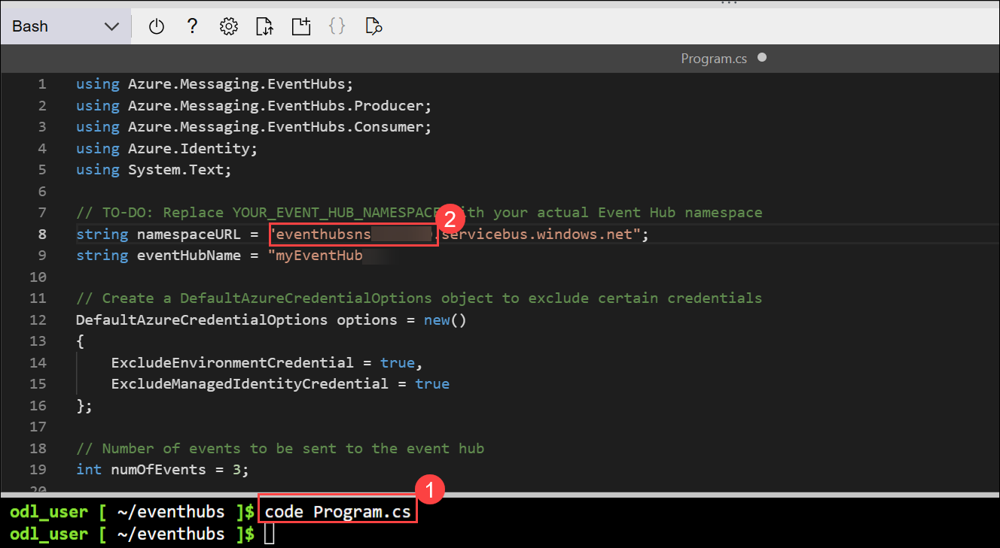

## Exercise 2: Send and retrieve events from Azure Event Hubs

## Lab Scenario

In this exercise, you create Azure Event Hubs resources and build a .NET console app to send and receive events using the **Azure.Messaging.EventHubs** SDK. You learn how to provision cloud resources, interact with Event Hubs, and clean up your environment when finished.

## Lab Objectives
In this lab, you will perform:

* Task 1: Create Azure Event Hubs resources
* Task 2: Create an Azure Event Hubs namespace and event hub
* Task 3: Assign a role to your Microsoft Entra user name
* Task 4: Send and retrieve events with a .NET console application
* Task 5: Add the starter code for the project
* Task 6: Add code to complete the application
* Task 7: Sign into Azure and run the app

## Estimated Timing: 30 Minutes

### Task 1: Create Azure Event Hubs resources

In this task, you initialize your Cloud Shell environment and define variables that will be used to create Azure Event Hubs resources throughout the lab.

1. In your browser navigate to the Azure portal 

1. On the Azure portal homepage, click the **\[>\_] Cloud Shell (1)** button located to the right of the **Copilot** tab at the top. This opens a new Cloud Shell session. In the **Welcome to Azure Cloud Shell** window, choose **Bash (2)**.

    

    

1. In the **Getting started** window, ensure **No storage account required (1)** is selected. From the **Subscription** drop-down, choose **Default subscription (2)**, then click **Apply (3)**.
   
    

    >**Note:** If your Cloud Shell environment is already configured, you can skip this step and proceed to the next.

1. In the cloud shell toolbar, in the **Settings** menu, select **Go to Classic version** (this is required to use the code editor).

     

1. Many of the commands require unique names and use the same parameters. Creating some variables will reduce the changes needed to the commands that create resources. Run the following commands to create the needed variables. 
    
    ```
    resourceGroup=PubSubEvents-<inject key="DeploymentID" enableCopy="false"/>
    location=<inject key="Region" enableCopy="false"/>
    namespaceName=eventhubsns<inject key="DeploymentID" enableCopy="false"/>
    ```
    >**Note:** Copy the namespaceName: **eventhubsns<inject key="DeploymentID" enableCopy="false"/>** value into a Notepad file. You will use it in a later task.

### Task 2: Create an Azure Event Hubs namespace and event hub

In this task, you create an Event Hubs namespace as the container for your messaging resources and deploy a new event hub inside it using the Azure CLI.

1. Run the following command to create an Event Hubs namespace.

    ```
    az eventhubs namespace create --name $namespaceName --resource-group $resourceGroup -l $location
    ```

     

1. Run the following command to create an event hub named **myEventHub** in the Event Hubs namespace. 

    ```
    az eventhubs eventhub create --name myEventHub<inject key="DeploymentID" enableCopy="false"/> --resource-group $resourceGroup \
      --namespace-name $namespaceName
    ```

    

<validation step="b16fc420-8882-4ba2-8cbb-ab3a31718604" />

### Task 3: Assign a role to your Microsoft Entra user name

In this task, you grant your user the required Azure Event Hubs Data Owner role so you can send and receive events from the Event Hubs namespace.

1. Run the following command to retrieve the **userPrincipalName** from your account. This represents who the role will be assigned to.

    ```
    userPrincipal=$(az rest --method GET --url https://graph.microsoft.com/v1.0/me \
        --headers 'Content-Type=application/json' \
        --query userPrincipalName --output tsv)
    ```

1. Run the following command to retrieve the resource ID of the Event Hubs namespace. The resource ID sets the scope for the role assignment to a specific namespace.

    ```
    resourceID=$(az eventhubs namespace show --resource-group $resourceGroup \
        --name $namespaceName --query id --output tsv)
    ```
1. Run the following command to create and assign the **Azure Event Hubs Data Owner** role, which gives you permission to send and retrieve events.

    ```
    az role assignment create --assignee $userPrincipal \
        --role "Azure Event Hubs Data Owner" \
        --scope $resourceID
    ```

     

### Task 4: Send and retrieve events with a .NET console application

In this task, you create a .NET console app and install the required SDK packages so you can send events to your Event Hub and read them back.

>**Tip:** Resize the cloud shell to display more information, and code, by dragging the top border. You can also use the minimize and maximize buttons to switch between the cloud shell and the main portal interface.

1. Run the following commands to create a directory to contain the project and change into the project directory.

    ```
    mkdir eventhubs
    cd eventhubs
    ```

1. Create the .NET console application.

    ```
    dotnet new console
    ```

    

1. Run the following commands to add the **Azure.Messaging.EventHubs** and **Azure.Identity** packages to the project.

    ```
    dotnet add package Azure.Messaging.EventHubs
    dotnet add package Azure.Identity
    ```

Now it's time to replace the template code in the **Program.cs** file using the editor in the cloud shell.

### Task 5: Add the starter code for the project

In this task, you open the project in the Cloud Shell editor and replace the default template with starter code that initializes your Event Hub connection.

1. Run the following command in the cloud shell to begin editing the application **(1)**.

    ```
    code Program.cs
    ```

1. Replace any existing contents with the following code. Be sure to review the comments in the code, and replace **YOUR_EVENT_HUB_NAMESPACE (2)** with your event hub namespace.

    ```csharp
    using Azure.Messaging.EventHubs;
    using Azure.Messaging.EventHubs.Producer;
    using Azure.Messaging.EventHubs.Consumer;
    using Azure.Identity;
    using System.Text;
    
    // TO-DO: Replace YOUR_EVENT_HUB_NAMESPACE with your actual Event Hub namespace
    string namespaceURL = "YOUR_EVENT_HUB_NAMESPACE.servicebus.windows.net";
    string eventHubName = "myEventHub<inject key="DeploymentID" enableCopy="false"/>"; 
    
    // Create a DefaultAzureCredentialOptions object to exclude certain credentials
    DefaultAzureCredentialOptions options = new()
    {
        ExcludeEnvironmentCredential = true,
        ExcludeManagedIdentityCredential = true
    };
    
    // Number of events to be sent to the event hub
    int numOfEvents = 3;
    
    // CREATE A PRODUCER CLIENT AND SEND EVENTS
    
    
    
    // CREATE A CONSUMER CLIENT AND RECEIVE EVENTS
    
    
    ```

    

1. Press **ctrl+s** to save your changes.

### Task 6: Add code to complete the application

In this task, you add the producer and consumer logic that sends events to the Event Hub and retrieves them for processing.

1. Locate the **// CREATE A PRODUCER CLIENT AND SEND EVENTS** comment and add the following code directly after the comment. Be sure to review the comments in the code.

    ```csharp
    // Create a producer client to send events to the event hub
    EventHubProducerClient producerClient = new EventHubProducerClient(
        namespaceURL,
        eventHubName,
        new DefaultAzureCredential(options));
    
    // Create a batch of events 
    using EventDataBatch eventBatch = await producerClient.CreateBatchAsync();
    
    
    // Adding a random number to the event body and sending the events. 
    var random = new Random();
    for (int i = 1; i <= numOfEvents; i++)
    {
        int randomNumber = random.Next(1, 101); // 1 to 100 inclusive
        string eventBody = $"Event {randomNumber}";
        if (!eventBatch.TryAdd(new EventData(Encoding.UTF8.GetBytes(eventBody))))
        {
            // if it is too large for the batch
            throw new Exception($"Event {i} is too large for the batch and cannot be sent.");
        }
    }
    
    try
    {
        // Use the producer client to send the batch of events to the event hub
        await producerClient.SendAsync(eventBatch);
    
        Console.WriteLine($"A batch of {numOfEvents} events has been published.");
        Console.WriteLine("Press Enter to retrieve and print the events...");
        Console.ReadLine();
    }
    finally
    {
        await producerClient.DisposeAsync();
    }
    ```

     

1. Press **ctrl+s** to save your changes.

1. Locate the **// CREATE A CONSUMER CLIENT AND RETRIEVE EVENTS** comment and add the following code directly after the comment. Be sure to review the comments in the code.

    ```csharp
    // Create an EventHubConsumerClient
    await using var consumerClient = new EventHubConsumerClient(
        EventHubConsumerClient.DefaultConsumerGroupName,
        namespaceURL,
        eventHubName,
        new DefaultAzureCredential(options));
    
    Console.Clear();
    Console.WriteLine("Retrieving all events from the hub...");
    
    // Get total number of events in the hub by summing (last - first + 1) for all partitions
    // This count is used to determine when to stop reading events
    long totalEventCount = 0;
    string[] partitionIds = await consumerClient.GetPartitionIdsAsync();
    foreach (var partitionId in partitionIds)
    {
        PartitionProperties properties = await consumerClient.GetPartitionPropertiesAsync(partitionId);
        if (!properties.IsEmpty && properties.LastEnqueuedSequenceNumber >= properties.BeginningSequenceNumber)
        {
            totalEventCount += (properties.LastEnqueuedSequenceNumber - properties.BeginningSequenceNumber + 1);
        }
    }
    
    // Start retrieving events from the event hub and print to the console
    int retrievedCount = 0;
    await foreach (PartitionEvent partitionEvent in consumerClient.ReadEventsAsync(startReadingAtEarliestEvent: true))
    {
        if (partitionEvent.Data != null)
        {
            string body = Encoding.UTF8.GetString(partitionEvent.Data.Body.ToArray());
            Console.WriteLine($"Retrieved event: {body}");
            retrievedCount++;
            if (retrievedCount >= totalEventCount)
            {
                Console.WriteLine("Done retrieving events. Press Enter to exit...");
                Console.ReadLine();
                return;
            }
        }
    }
    ```

    

1. Press **ctrl+s** to save the file, then **ctrl+q** to exit the editor.

### Task 7: Sign into Azure and run the app

In this task, you authenticate with Azure and execute your .NET console application to send and retrieve events from Event Hubs.

1. In the cloud shell command-line pane, enter the following command to sign into Azure.

    ```
    az login
    ```

    **<font color="red">You must sign into Azure - even though the cloud shell session is already authenticated.</font>**

    > **Note**: In most scenarios, just using *az login* will be sufficient. However, if you have subscriptions in multiple tenants, you may need to specify the tenant by using the *--tenant* parameter. See [Sign into Azure interactively using Azure CLI](https://learn.microsoft.com/cli/azure/authenticate-azure-cli-interactively) for details.

1. After running the az login command, select the **authentication link** shown in the Cloud Shell output and **copy the displayed code**.

1. On the **Enter code to allow access** page, paste the copied code into the field and select **Next** to complete authentication.

     

1. When prompted to **Pick an account**, select your ODL_User account to proceed

     

1. On the **Are you trying to sign in to Microsoft Azure CLI?** page, select **Continue** to authorize the sign-in request.

     

1. Back in Cloud Shell, when the subscription selection appears, type **1** and press **Enter** to continue.

     

1. Start the application by running the following command, when prompted, press Enter to retrieve and print the events

    ```
    dotnet run
    ```

     

 1. After a few seconds you should see output similar to the following example:
    
    ```
    A batch of 3 events has been published.
    Press Enter to retrieve and print the events...
    
    Retrieving all events from the hub...
    Retrieved event: Event 4
    Retrieved event: Event 96
    Retrieved event: Event 74
    Done retrieving events. Press Enter to exit...
    ```

     

## Summary

In this lab, you:

- Created Azure Event Hubs resources using the Azure CLI

- Provisioned an Event Hubs namespace and event hub

- Assigned yourself the Azure Event Hubs Data Owner role for RBAC-based access

- Built a .NET console application to send and receive events

- Added starter code and completed the producer/consumer logic

- Signed in to Azure and successfully ran the application to publish and read events

## You have successfully completed the lab.