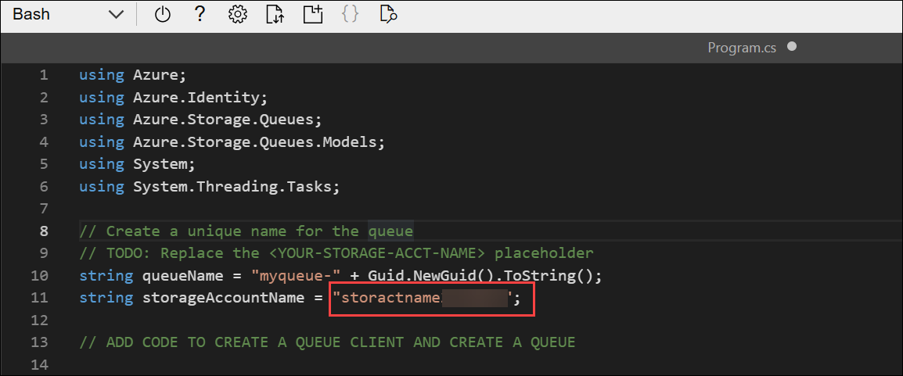
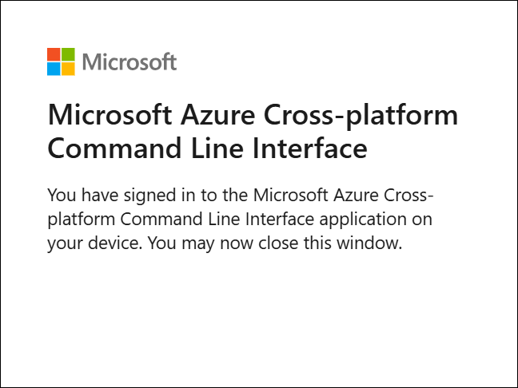

# Lab 07: Module 4: Send and receive messages from Azure Queue storage

## Lab Scenario

In this exercise, you create and configure Azure Queue Storage resources, then build a .NET app to send and receive messages using the **Azure.Storage.Queues** SDK. You learn how to provision storage resources, manage queue messages, and clean up your environment when finished. 

## Lab Objectives
In this lab, you will perform:

## Exercise 4: Azure Queue Storage Operations with .NET
* Task 1: Create Azure Queue storage resources
* Task 2: Assign a role to your Microsoft Entra user name
* Task 3: Create a .NET console app to send and receive messages
* Task 4: Add the starter code for the project
* Task 5: Add code to create a queue client and create a queue
* Task 6: Add code to send and list messages in a queue
* Task 7: Add code to update a message and list the results
* Task 8: Add code to delete messages and the queue
* Task 9: Sign into Azure and run the app

## Exercise 4: Azure Queue Storage Operations with .NET
### Task 1: Create Azure Queue storage resources

In this task, you will create the Azure storage resources required for Azure Queue Storage by provisioning a new storage account using the Azure CLI.

1. In your browser navigate to the Azure portal 

1. In the **Azure portal**, select the **Cloud Shell** icon in the top navigation bar to open a new Cloud Shell session.

    

1. In the Cloud Shell toolbar, open the **Settings (1)** menu and choose **Go to Classic version (2)** from the drop-down.

    

1. Many of the commands require unique names and use the same parameters. Creating some variables will reduce the changes needed to the commands that create resources. Run the following commands to create the needed variables. 

    ```
    resourceGroup=PubSubEvents-<inject key="DeploymentID" enableCopy="false"/>
    location=<inject key="Region" enableCopy="false"/>
    storAcctName=storactname<inject key="DeploymentID" enableCopy="false"/>
    ```

1. You will need the name assigned to the storage account later in this exercise. Run the following command and **record output**.

    ```
    echo $storAcctName
    ```

    

    >**Note:** Copy the storage account name: **storactname<inject key="DeploymentID" enableCopy="false"/>** value into a Notepad. You will use it in a later task.

1. Run the following command to create a storage account using the variable you created earlier. The operation takes a few minutes to complete.

    ```bash
    az storage account create --resource-group $resourceGroup \
        --name $storAcctName --location $location --sku Standard_LRS
    ```

     

> **Congratulations** on completing the task! Now, it's time to validate it. Here are the steps:
>
> - Hit the Validate button for the corresponding task. If you receive a success message, you can proceed to the next task.
> - If not, carefully read the error message and retry the step, following the instructions in the lab guide.
> - If you need any assistance, please contact us at cloudlabs-support@spektrasystems.com. We are available 24/7 to help.

<validation step="f0afc17f-041b-4887-a059-a53be0144fb1" />

### Task 2: Assign a role to your Microsoft Entra user name

In this task, you will assign Storage Queue Data Contributor role, to create queues and send or receive messages.

1. Run the following command to retrieve the **userPrincipalName** from your account. This represents who the role will be assigned to.

    ```
    userPrincipal=$(az rest --method GET --url https://graph.microsoft.com/v1.0/me \
        --headers 'Content-Type=application/json' \
        --query userPrincipalName --output tsv)
    ```

1. Run the following command to retrieve the resource ID of the storage account. The resource ID sets the scope for the role assignment to a specific namespace.

    ```
    resourceID=$(az storage account show --resource-group $resourceGroup \
        --name $storAcctName --query id --output tsv)
    ```

1. Run the following command to create and assign the **Storage Queue Data Contributor** role.

    ```
    az role assignment create --assignee $userPrincipal \
        --role "Storage Queue Data Contributor" \
        --scope $resourceID
    ```

     

### Task 3: Create a .NET console app to send and receive messages

In this task, you will create a new .NET console application that will be used to send, receive, update, and delete messages in Azure Queue Storage.

>**Tip:** Resize the cloud shell to display more information, and code, by dragging the top border. You can also use the minimize and maximize buttons to switch between the cloud shell and the main portal interface.

1. Run the following commands to create a directory to contain the project and change into the project directory.

    ```
    mkdir queuestor
    cd queuestor
    ```

1. Create the .NET console application.

    ```
    dotnet new console
    ```

     

1. Run the following commands to add the **Azure.Storage.Queues** and **Azure.Identity** packages to the project.

    ```
    dotnet add package Azure.Storage.Queues
    dotnet add package Azure.Identity
    ```

### Task 4: Add the starter code for the project

In this task, you will open the project in the Cloud Shell editor and add the starter code that sets up the structure of your queue-based application.

1. Run the following command in the cloud shell to begin editing the application.

    ```
    code Program.cs
    ```

1. Replace any existing contents with the following code. Be sure to review the comments in the code, and replace **YOUR-STORAGE-ACCT-NAME** with the storage account name you recorded earlier.

    ```csharp
    using Azure;
    using Azure.Identity;
    using Azure.Storage.Queues;
    using Azure.Storage.Queues.Models;
    using System;
    using System.Threading.Tasks;
    
    // Create a unique name for the queue
    // TODO: Replace the <YOUR-STORAGE-ACCT-NAME> placeholder 
    string queueName = "myqueue-" + Guid.NewGuid().ToString();
    string storageAccountName = "<YOUR-STORAGE-ACCT-NAME>";
    
    // ADD CODE TO CREATE A QUEUE CLIENT AND CREATE A QUEUE
    
    
    
    // ADD CODE TO SEND AND LIST MESSAGES
    
    
    
    // ADD CODE TO UPDATE A MESSAGE AND LIST MESSAGES
    
    
    
    // ADD CODE TO DELETE MESSAGES AND THE QUEUE
    
    
    ```

    

1. Press **ctrl+s** to save your changes.

### Task 5: Add code to create a queue client and create a queue

In this task, you will create the queue client and provision a new queue in your storage account, establishing the core resource your application will interact with.

1. Locate the **// ADD CODE TO CREATE A QUEUE CLIENT AND CREATE A QUEUE** comment and add the following code directly after the comment. Be sure to review the code and comments.

    ```csharp
    // Create a DefaultAzureCredentialOptions object to exclude certain credentials
    DefaultAzureCredentialOptions options = new()
    {
        ExcludeEnvironmentCredential = true,
        ExcludeManagedIdentityCredential = true
    };
    
    // Instantiate a QueueClient to create and interact with the queue
    QueueClient queueClient = new QueueClient(
        new Uri($"https://{storageAccountName}.queue.core.windows.net/{queueName}"),
        new DefaultAzureCredential(options));
    
    Console.WriteLine($"Creating queue: {queueName}");
    
    // Create the queue
    await queueClient.CreateAsync();
    
    Console.WriteLine("Queue created, press Enter to add messages to the queue...");
    Console.ReadLine();
    ```

     

1. Press **ctrl+s** to save the file, then continue with the exercise.

### Task 6: Add code to send and list messages in a queue

In this task, you send messages to the Azure Queue and list them using peek operations, allowing you to verify that messages were successfully added without removing them.

1. Locate the **// ADD CODE TO SEND AND LIST MESSAGES** comment and add the following code directly after the comment. Be sure to review the code and comments.

    ```csharp
    // Send several messages to the queue with the SendMessageAsync method.
    await queueClient.SendMessageAsync("Message 1");
    await queueClient.SendMessageAsync("Message 2");
    
    // Send a message and save the receipt for later use
    SendReceipt receipt = await queueClient.SendMessageAsync("Message 3");
    
    Console.WriteLine("Messages added to the queue. Press Enter to peek at the messages...");
    Console.ReadLine();
    
    // Peeking messages lets you view the messages without removing them from the queue.
    
    foreach (var message in (await queueClient.PeekMessagesAsync(maxMessages: 10)).Value)
    {
        Console.WriteLine($"Message: {message.MessageText}");
    }
    
    Console.WriteLine("\nPress Enter to update a message in the queue...");
    Console.ReadLine();
    ```

    

1. Press **ctrl+s** to save the file, then continue with the exercise.

### Task 7: Add code to update a message and list the results

In this task, you update an existing queue message and then list all messages again to confirm the change, helping you understand how message modification works in Azure Queue Storage.

1. Locate the **// ADD CODE TO UPDATE A MESSAGE AND LIST MESSAGES** comment and add the following code directly after the comment. Be sure to review the code and comments.

    ```csharp
    // Update a message with the UpdateMessageAsync method and the saved receipt
    await queueClient.UpdateMessageAsync(receipt.MessageId, receipt.PopReceipt, "Message 3 has been updated");
    
    Console.WriteLine("Message three updated. Press Enter to peek at the messages again...");
    Console.ReadLine();
    
    
    // Peek messages from the queue to compare updated content
    foreach (var message in (await queueClient.PeekMessagesAsync(maxMessages: 10)).Value)
    {
        Console.WriteLine($"Message: {message.MessageText}");
    }
    
    Console.WriteLine("\nPress Enter to delete messages from the queue...");
    Console.ReadLine();
    ```

    

1. Press **ctrl+s** to save the file, then continue with the exercise.

### Task 8: Add code to delete messages and the queue

In this task, you delete the messages from the queue and then remove the entire queue itself, ensuring all resources created by the app are properly cleaned up.

1. Locate the **// ADD CODE TO DELETE MESSAGES AND THE QUEUE** comment and add the following code directly after the comment. Be sure to review the code and comments.

    ```csharp
    // Delete messages from the queue with the DeleteMessagesAsync method.
    foreach (var message in (await queueClient.ReceiveMessagesAsync(maxMessages: 10)).Value)
    {
        // "Process" the message
        Console.WriteLine($"Deleting message: {message.MessageText}");
    
        // Let the service know we're finished with the message and it can be safely deleted.
        await queueClient.DeleteMessageAsync(message.MessageId, message.PopReceipt);
    }
    Console.WriteLine("Messages deleted from the queue.");
    Console.WriteLine("\nPress Enter key to delete the queue...");
    Console.ReadLine();
    
    // Delete the queue with the DeleteAsync method.
    Console.WriteLine($"Deleting queue: {queueClient.Name}");
    await queueClient.DeleteAsync();
    
    Console.WriteLine("Done");
    ```

    

1. Press **ctrl+s** to save the file, then **ctrl+q** to exit the editor.

### Task 9: Sign into Azure and run the app

In this task, you authenticate with Azure and run the console application, allowing you to observe message creation, updates, and deletion directly in the Azure portal as the app executes.

1. In the cloud shell command-line pane, enter the following command to sign into Azure.

    ```
    az login
    ```

1. After running the az login command, select the **authentication link** shown in the Cloud Shell output and **copy the displayed code**.

1. On the **Enter code to allow access** page, paste the copied code into the field and select **Next** to complete authentication.

     

1. When prompted to **Pick an account**, select your ODL_User account to proceed

     

1. On the **Are you trying to sign in to Microsoft Azure CLI?** page, select **Continue** to authorize the sign-in request.

     

1. When the **Microsoft Azure Cross-platform Command Line Interface** window pops up, return to the browser tab with Cloud Shell open. 

    

1. In the Cloud Shell console, when the subscription selection appears, type **1** and press **Enter** to continue.

     

1. Run the following command to start the console app. The app will pause many times during execution waiting for you to press any key to continue. This gives you an opportunity to view the messages in the Azure portal.

    ```
    dotnet run
    ```

     

     

1. In the Azure portal, navigate to **PubSubEvents-<inject key="DeploymentID" enableCopy="false"/>** resource group and select the **storactname<inject key="DeploymentID" enableCopy="false"/>**.

     

1. On **storactname<inject key="DeploymentID" enableCopy="false"/>** page, expand **> Data storage (1)** in the left navigation and select **Queues (2)**.

     

1. Select the queue the application creates **(3)** and you can view the sent messages and monitor what the application is doing.

     

1. Return to the Cloud Shell window, press Enter to continue running the application and switch back to the Azure portal, open the queue again, and observe the updated message content.

## Summary

In this lab, you:

- Created the required Azure Queue Storage resources using the Azure CLI
- Assigned yourself the Storage Queue Data Contributor role to enable queue operations
- Built and configured a .NET console application to interact with Azure Queue Storage
- Sent and listed messages using the Azure.Storage.Queues SDK
- Updated an existing message and verified the changes
- Deleted messages and removed the queue to clean up your environment

## You have successfully completed the lab.
