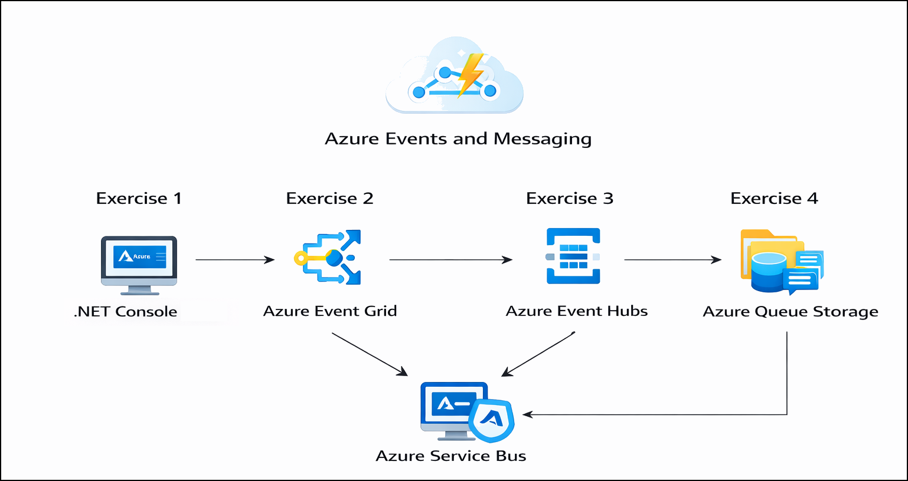

# Getting Started with Lab 7: Azure Events and Messaging

### Estimated Duration: 2 Hours

## Overview

Welcome to **Lab 7: Azure Events and Messaging**.  
In this lab, you will explore multiple Azure messaging and eventing services to build scalable, event-driven applications. You will create and configure Event Grid, Event Hubs, Service Bus, and Azure Queue Storage, and use .NET applications to send and process messages.

This Getting Started page provides environment setup steps, navigation instructions, and support details before you begin the exercises.

---

## Lab Objectives

By completing this lab, you will learn to:

- Create Event Grid custom topics and configure endpoints  
- Build a .NET console application to publish events  
- Create Event Hubs namespaces and send/receive events  
- Configure Azure Service Bus queues and process messages  
- Use Azure Queue Storage to manage queue-based messaging  

---

## Pre-requisites

Participants should have:

- **Basic .NET Knowledge:** Ability to run and modify console applications.  
- **Azure Portal Experience:** Familiarity with navigating Azure services.  
- **Messaging Concepts:** Understanding of events, messages, publishers, and subscribers.  
- **Azure SDK Awareness:** Basic understanding of using SDKs with Azure services.  
- **Browser Access:** A modern browser to work in CloudLabs and Azure Portal.  

---

## Architecture

**Architecture Flow:**

In this lab, applications publish events and messages to Azure messaging services such as Event Grid, Event Hubs, Service Bus, and Azure Queue Storage. These services route, store, and deliver messages to consumers for processing. The user validates message flow and processing through .NET applications and Azure Portal monitoring tools.

---

## Explanation of Components

1. **Azure Event Grid**  
   Enables event-based communication using publishers, topics, and subscribers.

2. **Azure Event Hubs**  
   A high-throughput event ingestion service for streaming large volumes of events.

3. **Azure Service Bus**  
   A reliable message broker used for queue-based and topic-based messaging.

4. **Azure Queue Storage**  
   A simple queue service for storing and retrieving messages asynchronously.

5. **.NET Console Applications**  
   Used to publish events and send/receive messages across Azure services.

---

## Accessing Your Lab Environment

Your virtual machine and lab guide are available directly in your browser.

### Virtual Machine Access  
You will see your VM loading on the left side of the screen:

### Lab Guide Access  
The lab guide appears on the right panel and will be your reference throughout the exercises.

---

## Exploring Lab Resources

Navigate to the **Environment** tab to view credentials and resource details:

---

## Split-Window Feature

To open the lab guide in a separate window, click **Split Window**:

---

## Managing Your Virtual Machine

You can Start, Stop, or Restart your virtual machine at any time via the **Resources** tab:

---

## Adjusting Zoom

To zoom in or out of the environment view, use the **A↕ 100%** button near the timer:

---

## Accessing Azure Portal

Follow these steps to begin working in Azure:

1. On your VM desktop, click the **Azure Portal** icon:

   

2. Enter your credentials:

   - **Email/Username:** <inject key="AzureAdUserEmail"></inject>

     

3. Enter your password:

   - **Password:** <inject key="AzureAdUserPassword"></inject>

     

4. If prompted to **Stay signed in**, select **No**.

   

---

## Support

CloudLabs offers **24/7 support** for all learners.

**Learner Support Contacts:**  
- Email: cloudlabs-support@spektrasystems.com  
- Live Chat: https://cloudlabs.ai/labs-support  

If you face login, VM, or Azure issues, reach out anytime.

Now, click on **Next** from the lower right corner to move on to the next page.

---

## Happy Learning!