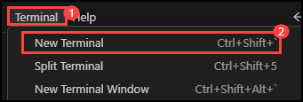
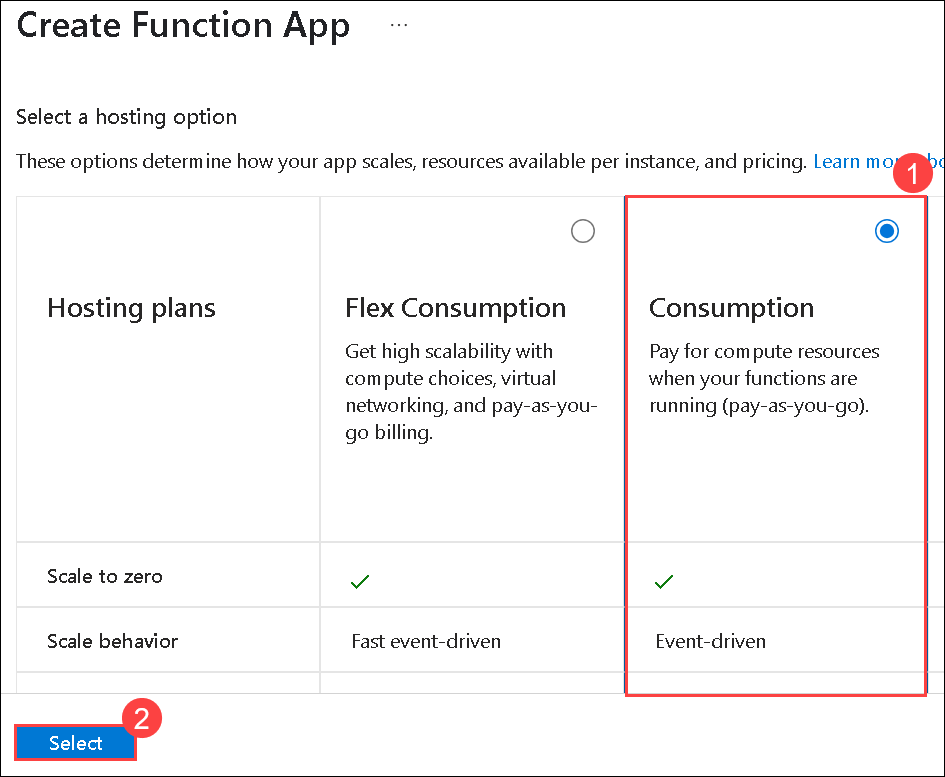
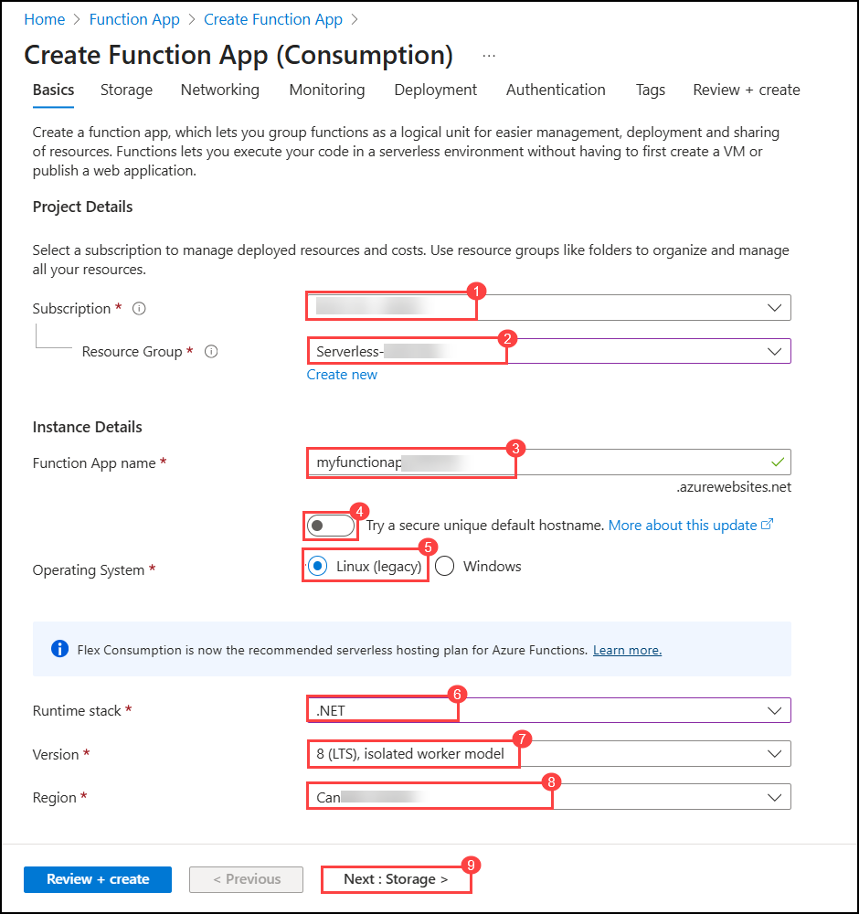
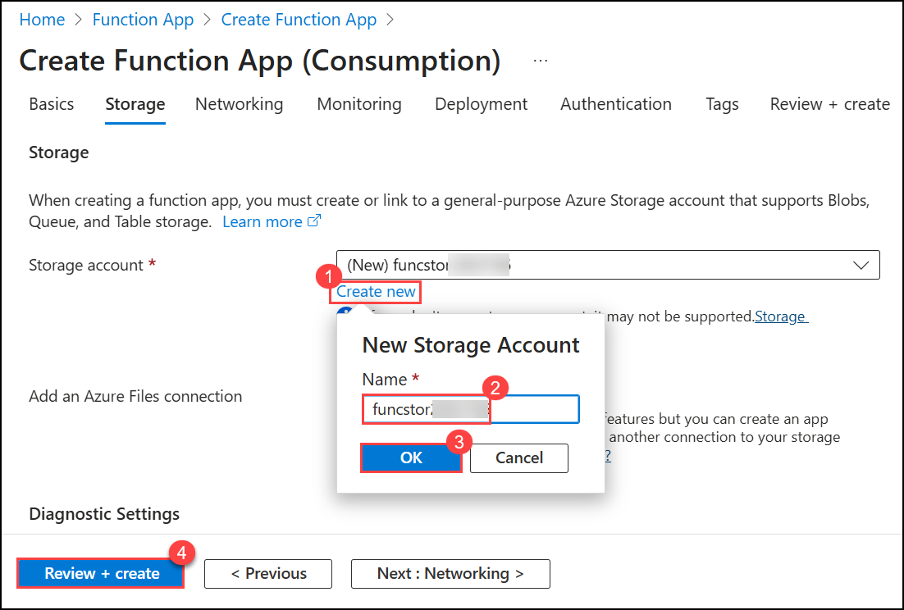
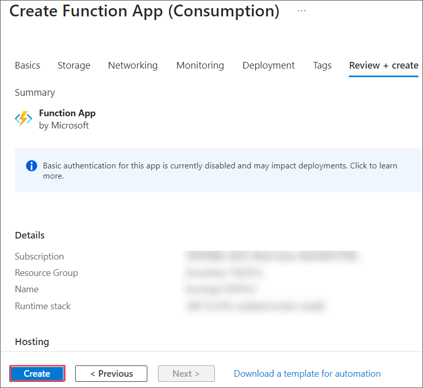
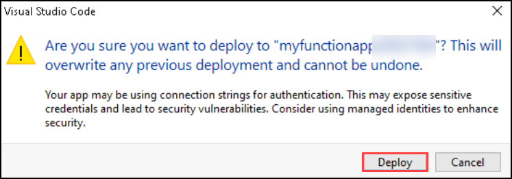
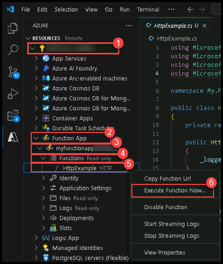
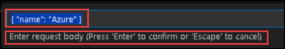

# Lab 08: Create an Azure Function with Visual Studio Code

## Lab Scenario
In this lab, you will create and monitor a C# Azure Function by first building and testing it locally in Visual Studio Code and then deploying it to Azure. You will provision Azure resources using Azure Cloud Shell, deploy your function code from Visual Studio Code, execute the function in the cloud, and finally clean up deployed resources. This hands‑on experience demonstrates the end‑to‑end workflow for serverless application development.

## Lab Objectives
In this lab, you will perform:

- **Exercise 1:** Create your local Azure Functions project  
- **Exercise 2:** Run the function locally  
- **Exercise 3:** Deploy and create resources using Azure
- **Exercise 4:** Execute the function in Azure

# Exercise 1: Create your local function project

## Task 1: Create a new Function App project

1. Open **Visual Studio Code**.  
2. Install **C# Dev Kit** and **Azure Functions** extensions in the Visual Studio Code as show below.

    
   
    

4. Open the **Terminal (1)** and select **New Terminal (2)** and run the below command :

    

    ```
    choco upgrade azure-functions-core-tools
    ```
    > **Note:** The upgrade process might take 5–10 minutes to complete, depending on your system and network speed.

5. Once command is executed successfully ,Press **fn key and F1**, Run **Azure Functions: Create New Project...**  

    

6. When pop-up comes to select folder navigate to **This PC (1)** and select Local Disk(C) Create an empty folder and name it as Lab-08-<inject key="DeploymentID" enableCopy="false"/> under C:\ as show below .

    

7. Provide the following values during setup:

    | Prompt | Action |
    |--|--|
    | Select language | **C#** |
    | Select .NET runtime | **.NET 8.0 Isolated** |
    | Select template | **HTTP Trigger** |
    | Function name | `HttpExample` |
    | Namespace | `My.Function` |
    | Authorization level | **Anonymous** |

8. Choose **Open in current window**.  
9. If prompted with *"Do you trust the authors?"* → Select **Yes**.

---

# Exercise 2: Run the function locally

## Task 1: Start the function runtime

Visual Studio Code integrates with Azure Functions Core tools to let you run this project on your local development computer before you publish to Azure.

1. Make sure the terminal is open in Visual Studio Code. You can open the terminal by selecting **Terminal** and then **New Terminal** in the menu bar. 

1. Press **F5** to start the function app project in the debugger. If you are prompted to choose a storage account select **Skip for now**.

    

1. Output from Core Tools is displayed in the **Terminal** panel. You can see the URL endpoint of your HTTP-triggered function running locally.

    

1. With Core Tools running, open the **Azure** extension. In the **Workspace** section of the extension, expand **Local Project** > **Functions**. Right-click the **HttpExample** function and select **Execute Function Now...**.

    

1. In **Enter request body** you see the request message body value of `{ "name": "Azure" }`. Press **Enter** to send this request message to your function. When the function executes locally and returns a response, a notification is raised in Visual Studio Code.

    

1. Select the notification bell icon to view the notification. Information about the function execution is shown in **Terminal** panel.

6. Press **Shift + F5** to stop Core Tools and disconnect the debugger.

8. After verifying that the function runs correctly on your local computer, it's time to use Visual Studio Code to publish the project directly to Azure.

---

# Exercise 3: Deploy and create resources using Azure 

## Task 1: Create a function app

In this task, you will create an Azure Function App, select the necessary configurations for its operating system, runtime stack, and storage account, and then deploy it for use with serverless computing tasks.

1. In the Azure portal, use the **Search resources, services, and docs** text box to search for **Function App (1)**, and then, in the list of results, select **Function App (2)**.

    

1. On the **Function App** blade, select **+ Create**.

1. On the **Create Function App** blade, select **Consumption (1)** and click on **Select (2)**.

    

1. On the **Create Function App** blade, on the **Basics** tab, perform the following actions, and then select **Next: Storage (9)**:

    | Setting | Action |
    | -- | -- |
    | **Subscription**  | Retain the default value **(1)** |
    | **Resource group** drop-down list       | Select **Serverless-<inject key="DeploymentID" enableCopy="false"/> (2)**|
    | **Function App name** text box   | Enter **myfunctionapp<inject key="DeploymentID" enableCopy="false"/> (3)** |
    | **Secure unique default hostname** | **Disabled (4)** |
    | **Operating System** | Select **Linux (5)** |    
    | **Runtime stack** drop-down list | Select **.NET (6)** |
    | **Version** drop-down list | Select **8 (LTS),  isolated worker model (7)** |
    | **Region** drop-down list | Select the **West US (8)** region |

    > **Note :** If deployment fails due to Rigion issue kinding return back to Basic Tab and change the Region to Central US / West US / North Central US / East US and perform all the steps of Task 1 again.

      

1. On the **Storage** tab, select **Create new (1)**, enter the name **funcstor<inject key="DeploymentID" enableCopy="false"/> (2)**, and click **OK (3)**. Then select **Review + create (4)**.

    

1. On the **Review + create** tab, review the options that you selected during the previous steps.

1. Select **Create** to create the function app by using your specified configuration.

   

   > **Note**: Wait for the creation task to complete before you move forward with this lab.

> **Congratulations** on completing the task! Now, it's time to validate it.
<validaation step="7870d4b0-9860-425e-9838-1a9025c8e736" />

# Exercise 4: Deploy the function to Azure

## Task 1: Deploy from Visual Studio Code

> **! Important:** Publishing to an existing function overwrites any previous deployments.

1. In the command palette, search for and run the command **Azure Functions: Deploy to Function App...**.

1. Select the subscription you used when creating the resources.

1. Select the function app you created. When prompted about overwriting previous deployments, select **Deploy** to deploy your function code to the new function app resource.

    

1. After deployment completes, select **View Output** to view the details of the deployment results. If you miss the notification, select the notification bell icon in the lower right corner to see it again.

    

---

# Exercise 5: Execute the function in Azure

1. Back in the **Resources** area in the side bar, expand your subscription, your new function app, and **Functions**. **Right-click** the **HttpExample** function and choose **Execute Function Now...**.

    

1. In **Enter request body** you see the request message body value of `{ "name": "Azure" }`. Press **Enter** to send this request message to your function.

    

1. When the function executes in Azure and returns a response, a notification is raised in Visual Studio Code. select the notification bell icon to view the notification.

3. Confirm the success notification as shown in the below screenshot.

    
---


# Summary

In this lab, you successfully completed the end‑to‑end process of building and deploying an Azure Function:

- You created and configured a local Azure Function project using Visual Studio Code.  
- You ran and validated the function locally using Azure Functions Core Tools.  
- You provisioned all required Azure resources through Azure Cloud Shell.  
- You deployed your function code to Azure and verified execution in the cloud.  
- You cleaned up deployed resources to avoid unnecessary usage.

## You have successfully completed the lab.
