# Lab 08: Create an Azure Function with Visual Studio Code

## Lab Scenario

In this lab, you will create and monitor a C# Azure Function by first building and testing it locally in Visual Studio Code and then deploying it to Azure. You will provision Azure resources using Azure Cloud Shell, deploy your function code from Visual Studio Code, execute the function in the cloud, and finally clean up deployed resources. This hands‑on experience demonstrates the end‑to‑end workflow for serverless application development.

## Lab Objectives
In this lab, you will perform:

- **Exercise 1:** Create your local Azure Functions project  
- **Exercise 2:** Run the function locally  
- **Exercise 3:** Deploy and create resources using Azure
- **Exercise 4:** Execute the function in Azure

# Exercise 1: Create your local function project

## Task 1: Create a new Function App project

In this task, you will create a new Azure Functions project in Visual Studio Code using the HTTP trigger template.

1. Open the **Visual Studio Code** from the desktop.  

1. In **Visual Studio Code**, select the **Extensions (1)** icon, search for **C# Dev Kit (2)**, and then select **Install (3)**.

    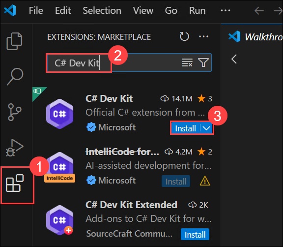

1. In **Visual Studio Code**, search for **Azure Functions (1)** in the **Extensions** pane, select **Azure Functions (2)** by Microsoft, and then select **Install (3)**.

    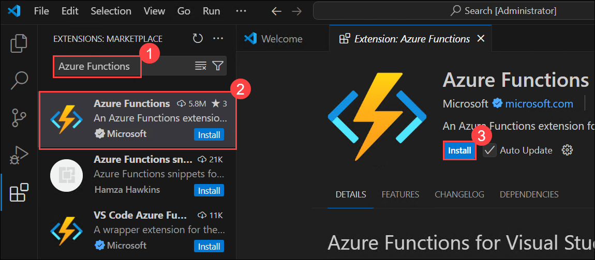

1. In **Visual Studio Code**, select the **... (1)** menu, expand **Terminal (2)**, and then select **New Terminal (3)**.

     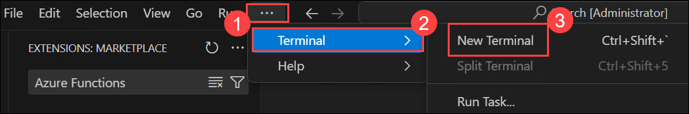

    ```
    choco upgrade azure-functions-core-tools
    ```
    > **Note:** The upgrade process might take 5–10 minutes to complete, depending on your system and network speed.

1. Once command is executed successfully, Press **Fn + F1**, search for **Azure Functions: Create New Project (1)**, and then select **Azure Functions: Create New Project... (2)**.

    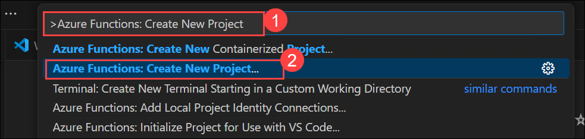

1. In the **Select Folder** dialog, navigate to **C:\ (1)**, create a new folder named **Lab-08-<inject key="DeploymentID" enableCopy="false"/>**, select the folder **(2)**, and then select **Select (3)**.

    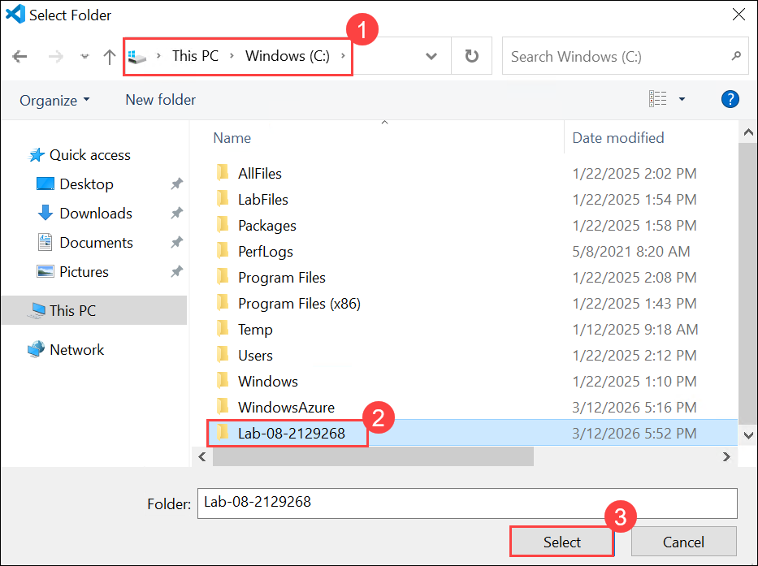

1. Provide the following values during setup:

    | Prompt | Action |
    |--|--|
    | Select language | **C#** |
    | Select .NET runtime | **.NET 8.0 Isolated** |
    | Select template | **HTTP Trigger** |
    | Function name | `HttpExample` |
    | Namespace | `My.Function` |
    | Authorization level | **Anonymous** |

1. When prompted to Select how you would like to open your project select **Open in current window**.  

    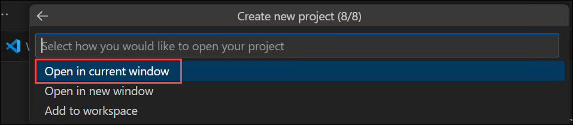

1. In the **Do you trust the authors of the files in this folder?** prompt, select **Yes, I trust the authors**.

    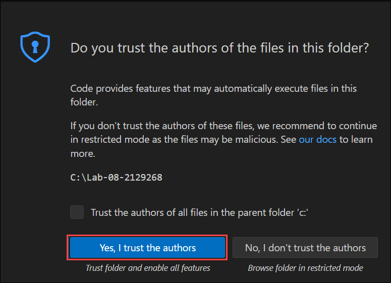

1. Visual Studio Code uses the provided information and generates an Azure Functions project with an HTTP trigger. You can view the local project files in the Explorer.

# Exercise 2: Run the function locally

## Task 1: Start the function runtime

In this task, you will run and test the Azure Function locally using Azure Functions Core Tools in Visual Studio Code.

1. Make sure the terminal is open in Visual Studio Code. You can open the terminal by selecting the **... (1)** menu, expand **Terminal (2)**, and then select **New Terminal (3)**.

    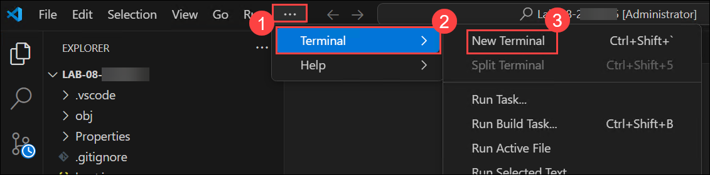

1. Press **F5** to start the function app project in the debugger. If you are prompted to choose a storage account select **Skip for now**.

    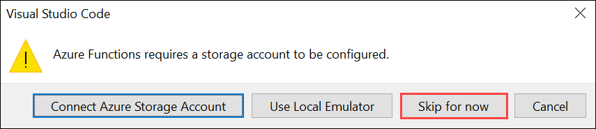

1. Output from Core Tools is displayed in the **Terminal** panel. You can see the URL endpoint of your HTTP-triggered function running locally.

    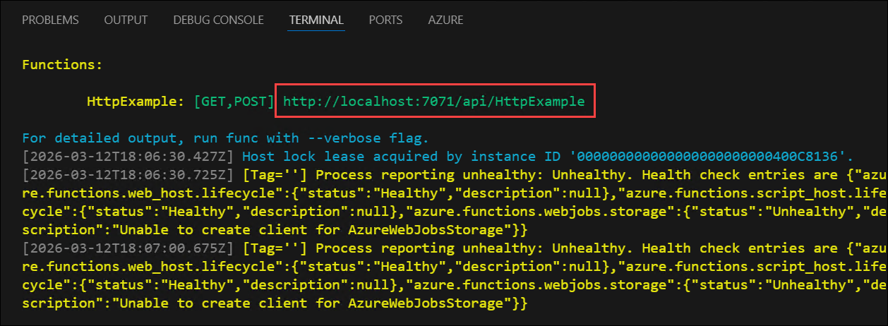

1. With Core Tools running, select the **Azure (1)** extension, expand **Local Project (2)** and **Functions (3)** under **Workspace**, right-click **HttpExample (4)**, and then select **Execute Function Now... (5)**.

    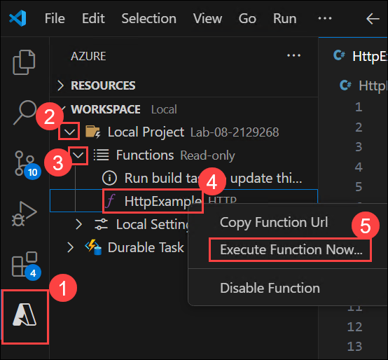

1. In **Enter request body** you see the request message body value of `{ "name": "Azure" }`. Press **Enter** to send this request message to your function. When the function executes locally and returns a response, a notification is raised in Visual Studio Code.

    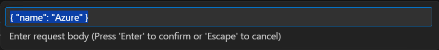

1. Select the notification bell icon to view the notification. Information about the function execution is shown in **Terminal** panel.

    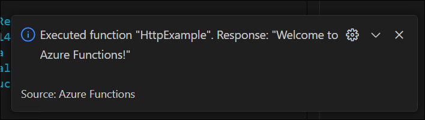

1. Press **Shift + F5** to stop Core Tools and disconnect the debugger.

1. After verifying that the function runs correctly on your local computer, it's time to use Visual Studio Code to publish the project directly to Azure.

# Exercise 3: Deploy and create resources using Azure 

## Task 1: Create a function app

In this task, you will create an Azure Function App, select the necessary configurations for its operating system, runtime stack, and storage account, and then deploy it for use with serverless computing tasks.

1. In the Azure portal, use the **Search resources, services, and docs** text box to search for **Function App (1)**, and then, in the list of results, select **Function App (2)**.

    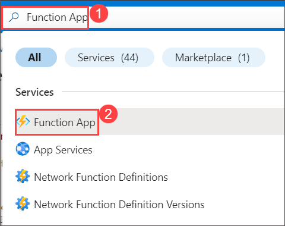

1. On the **Function App** blade, select **+ Create**.

1. On the **Create Function App** blade, select **Consumption (Windows) (1)** and then select **Confirm (2)** in the confirmation prompt.

    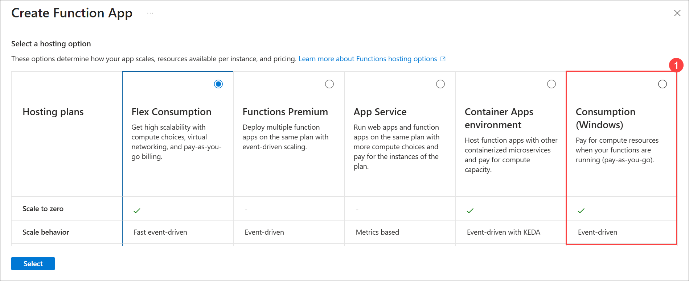

    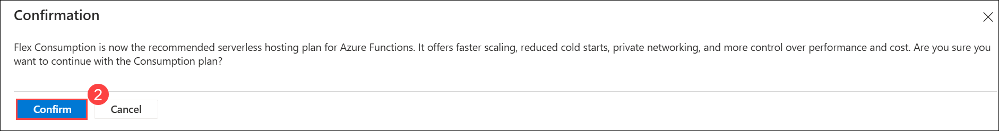

1. On the **Create Function App** blade, on the **Basics** tab, perform the following actions, and then select **Next: Storage (9)**:

    | Setting | Action |
    | -- | -- |
    | **Subscription**  | Retain the default value **(1)** |
    | **Resource group** drop-down list       | Select **Serverless-<inject key="DeploymentID" enableCopy="false"/> (2)**|
    | **Function App name** text box   | Enter **myfunctionapp<inject key="DeploymentID" enableCopy="false"/> (3)** |
    | **Secure unique default hostname** | **Disabled (4)** |  
    | **Runtime stack** drop-down list | Select **.NET (5)** |
    | **Version** drop-down list | Select **8 (LTS),  isolated worker model (6)** |
    | **Region** drop-down list | Select the **South Central US (7)** region |

    > **Note:** If deployment fails due to Rigion issue kinding return back to Basic Tab and change the Region to West US / North Central US / East US and perform all the steps of Task 1 again.

      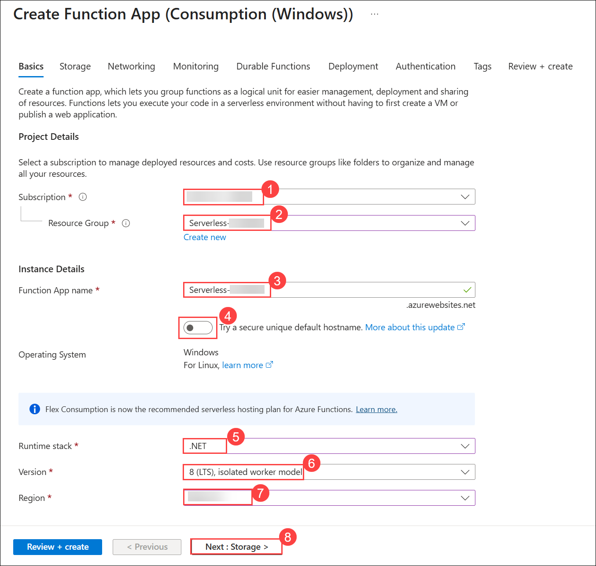

1. On the **Storage** tab, select **Create new (1)**, enter the name **funcstor<inject key="DeploymentID" enableCopy="false"/> (2)**, and click **OK (3)**. Then select **Review + create (4)**.

    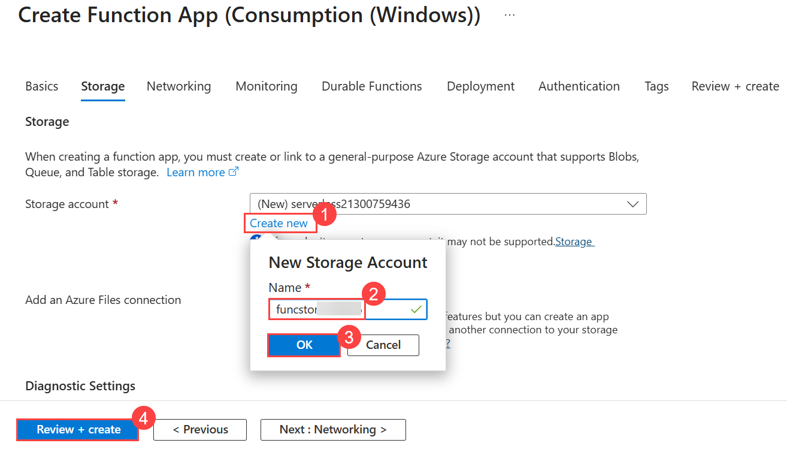

1. On the **Review + create** tab, review the options and select **Create** to create the function app.

   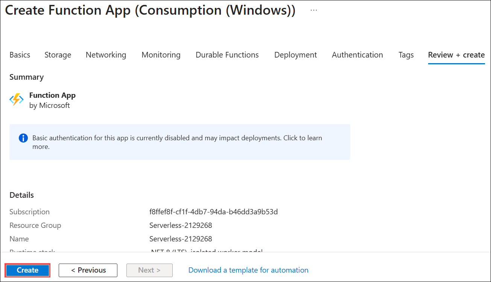

   > **Note**: Wait for the creation task to complete before you move forward with this lab.

> **Congratulations** on completing the task! Now, it's time to validate it. Here are the steps:
>
> - Hit the Validate button for the corresponding task. If you receive a success message, you can proceed to the next task.
> - If not, carefully read the error message and retry the step, following the instructions in the lab guide.
> - If you need any assistance, please contact us at cloudlabs-support@spektrasystems.com. We are available 24/7 to help.

<validation step="7870d4b0-9860-425e-9838-1a9025c8e736" />

# Exercise 4: Deploy the function to Azure

## Task 1: Deploy from Visual Studio Code

In this task, you will deploy the Azure Functions project from Visual Studio Code to the Azure Function App.

> **! Important:** Publishing to an existing function overwrites any previous deployments.

1. Navigate to **Visual Studio Code**, open the **Azure** extension and select **Sign in to Azure...**.

    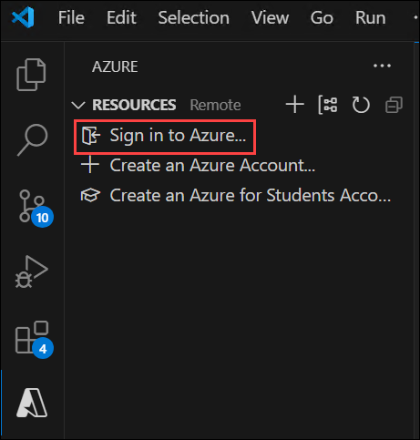

     - On the **Sign in to Microsoft Azure** browser tab, you will see the login screen. Enter your credentials:

        * **Email/Username:** <inject key="AzureAdUserEmail"></inject>

     - Next, provide your password:

        * **Temporary Access Pass:** <inject key="AzureAdUserPassword"></inject>

1. After signing in successfully, close the browser tab and return to **Visual Studio Code**.

1. Press **Fn + F1**, search for **Azure Functions: Deploy to Function App (1)**, and then select **Azure Functions: Deploy to Function App... (2)**.

    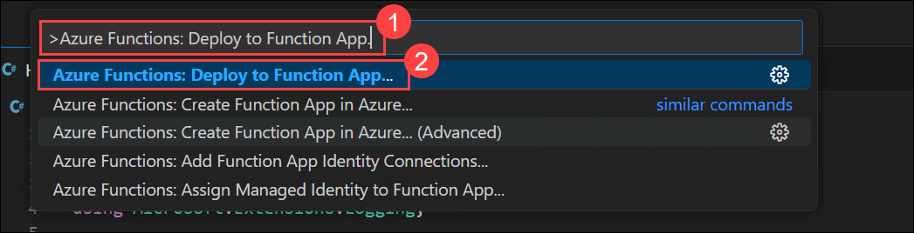

1. In the **Select a function app** prompt, select **myfunctionapp-<inject key="DeploymentID" enableCopy="false"/>**.

    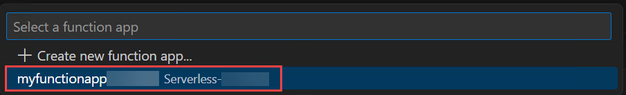

1. When prompted **Are you sure you want to deploy to myfunctionapp-<inject key="DeploymentID" enableCopy="false"/>? This will overwrite any previous deployment and cannot be undone.**, select **Deploy** to deploy your function code to the new function app resource.

    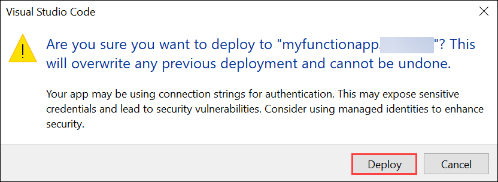

1. After deployment completes, select **View Output** to view the details of the deployment results. If you miss the notification, select the notification bell icon in the lower right corner to see it again.

    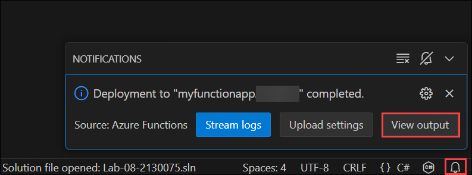

    > **Note:** If the deployment fails, try deploying the function again. Deployment may fail due to temporary network issues or incomplete build processes.

# Exercise 5: Execute the function in Azure

In this task, you execute the deployed Azure Function in Azure and verify the response.

1. Back in the **Resources** area in the side bar, expand  **Subscription (1)** → **Function App (3)** → **myfunctionapp-<inject key="DeploymentID" enableCopy="false"/>** → **Functions (4)**, then **right-click HttpExample (5)** and select **Execute Function Now... (6)**.

    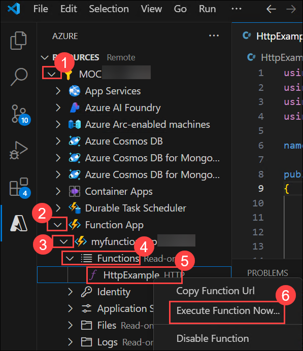

1. In **Enter request body** you see the request message body value of `{ "name": "Azure" }`. Press **Enter** to send this request message to your function.

    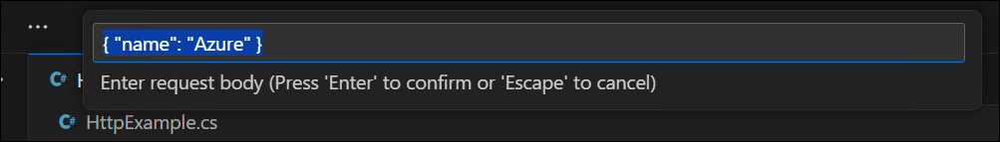

1. When the function executes in Azure and returns a response, a notification is raised in Visual Studio Code. select the notification bell icon to view the notification.

    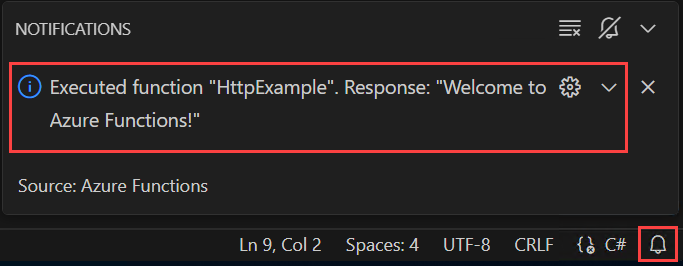

# Summary

In this lab, you successfully completed the end‑to‑end process of building and deploying an Azure Function:

- You created and configured a local Azure Function project using Visual Studio Code.  
- You ran and validated the function locally using Azure Functions Core Tools.  
- You provisioned all required Azure resources through Azure Cloud Shell.  
- You deployed your function code to Azure and verified execution in the cloud.  
- You cleaned up deployed resources to avoid unnecessary usage.

## You have successfully completed the lab.
