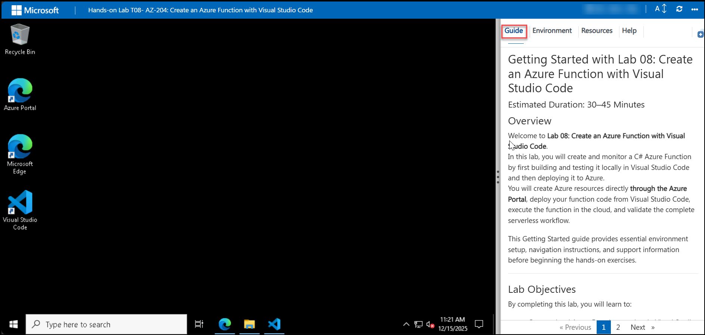

# Getting Started with Lab 08: Create an Azure Function with Visual Studio Code

### Estimated Duration: 30–45 Minutes

## Overview

Welcome to **Lab 08: Create an Azure Function with Visual Studio Code**.  
In this lab, you will create and monitor a C# Azure Function by first building and testing it locally in Visual Studio Code and then deploying it to Azure.  
You will create Azure resources directly **through the Azure Portal**, deploy your function code from Visual Studio Code, execute the function in the cloud, and validate the complete serverless workflow.

This Getting Started guide provides essential environment setup, navigation instructions, and support information before beginning the hands-on exercises.

---

## Lab Objectives

By completing this lab, you will learn to:

- Create a local Azure Functions project in Visual Studio Code  
- Run and debug the function locally using Azure Functions Core Tools  
- Create Azure resources directly in the Azure Portal 
- Deploy your Azure Function to the cloud from Visual Studio Code  
- Execute and validate the function in Azure  

---

## Pre-requisites

Participants should have:

- **Basic C# and .NET knowledge**  
- **Experience using Visual Studio Code**  
- **Basic understanding of Azure Functions (serverless computing)**  
- **Ability to use Azure Portal**  
- **Understanding of HTTP-triggered functions**  

---

## Architecture

This lab demonstrates the complete lifecycle of serverless development using Azure Functions and Visual Studio Code.

**Architecture Flow:**

1. A new Azure Function project is created locally in Visual Studio Code.  
2. The function is executed and tested locally using the built-in debugger and Azure Functions Core Tools.  
3. Required Azure resources (**Function App & Storage Account**) are **created in the Azure Portal**.  
4. The function project is deployed to Azure directly from Visual Studio Code.  
5. The deployed function is executed and monitored in Azure.

**Key Components in Flow:**  
Developer → Visual Studio Code → Azure Functions Core Tools → **Azure Portal** → Azure Function App → Function Execution

---

## Explanation of Components

1. **Azure Functions**  
   A serverless compute service that runs event-driven code without provisioning servers.

2. **Visual Studio Code**  
   The development environment used to build, debug, and deploy the Azure Function.

3. **Azure Functions Core Tools**  
   Enables local debugging, testing, and running of Azure Functions before deploying.

4. **Azure Portal**  
   Used to create and configure the Function App, Storage Account, and other required Azure resources.

5. **Azure Function App**  
   The fully managed hosting platform where your deployed serverless functions run.

---

## Accessing Your Lab Environment

Your virtual machine and lab guide are available directly in your browser.

### Virtual Machine Access  
You will see your VM loading on the left side of the screen:

### Lab Guide Access  
The lab guide appears on the right panel and will be your reference throughout the exercises.

---

## Exploring Lab Resources

Navigate to the **Environment** tab to view credentials and resources:

---

## Split-Window Feature

To open the lab guide in a separate window, click **Split Window**:

---

## Managing Your Virtual Machine

You can Start, Stop, or Restart your virtual machine at any time via the **Resources** tab:

---

## Adjusting Zoom

To zoom in/out of the environment view, use the **A↕ 100%** button near the timer:

---

## Accessing Azure Portal

Follow these steps to begin working in Azure:

1. On your VM desktop, click the **Azure Portal** icon:  
   

2. Enter your credentials:  
   - **Email/Username:** `<inject key="AzureAdUserEmail"></inject>`  
     

3. Enter your password:  
   - **Password:** `<inject key="AzureAdUserPassword"></inject>`  
     

4. If prompted to **Stay signed in**, select **No**.  
     

---

## Support

CloudLabs provides **24/7 dedicated support**.

**Learner Support:**  
- Email: cloudlabs-support@spektrasystems.com  
- Live Chat: https://cloudlabs.ai/labs-support  

If you face login, VM, VS Code, or Azure issues, reach out anytime.

---

## Move to the Next Page

Click **Next** at the bottom-right corner to begin **Exercise 1: Create your local Azure Functions project**.

---

## Happy Learning!