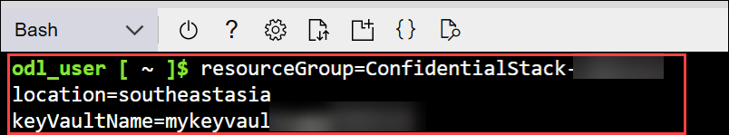
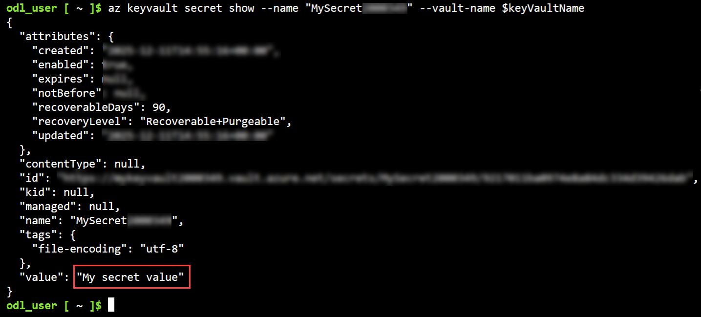

# Lab 09: Module 1: Create and Retrieve Secrets from Azure Key Vault

## Lab Scenario
In this exercise, you create an Azure Key Vault, store secrets using the Azure CLI, and build a .NET console application that can create and retrieve secrets from the key vault. You will learn how to configure authentication, manage secrets programmatically, and clean up resources when finished.

## Lab Objectives
In this lab, you will perform:

- Task 1: Create Azure Key Vault resources and add a secret
- Task 2: Assign a role to your Microsoft Entra user name
- Task 3: Add and retrieve a secret with Azure CLI
- Task 4: Create a .NET console app to store and retrieve secrets
- Task 5: Sign into Azure and run the app to create a new secret

## Exercise 1: Implement Secure Secret Management with Azure Key Vault and .NET
## Task 1: Create Azure Key Vault resources and add a secret

In this task you will create a Key Vault to store secrets in Azure using Azure CLI.

1. On the Azure portal homepage, click the **\[>\_] Cloud Shell (1)** button located to the right of the **Copilot** tab at the top. This opens a new Cloud Shell session. In the **Welcome to Azure Cloud Shell** window, choose **Bash**.

     

     

1. In the **Getting started** window, ensure **No storage account required (1)** is selected. From the **Subscription** drop-down, choose **Default subscription (2)**, then click **Apply (3)**.

    

    > **Note:** If you have previously created a cloud shell that uses a *PowerShell* environment, switch it to ***Bash***.

1. In the cloud shell toolbar, in the **Settings (1)** menu, select **Go to Classic version (2)** (this is required to use the code editor).

    

1. Run the following commands to create the needed variables to create an Azure key Vault. 

    ```
    resourceGroup=ConfidentialStack-<inject key="DeploymentID" enableCopy="false"/>
    location=<inject key="Region" enableCopy="false"/>
    keyVaultName=mykeyvault<inject key="DeploymentID" enableCopy="false"/>
 
    ```

    

1. Run the following command to create an Azure Key Vault resource. This can take a few minutes to run.

    ```
    az keyvault create --name $keyVaultName \
        --resource-group $resourceGroup --location $location
    ```

    

    >**Note:** Note down the name of Key Vault you created. You need it later in the exercise.

> **Congratulations** on completing the task! Now, it's time to validate it. Here are the steps:
>
> - Hit the Validate button for the corresponding task. If you receive a success message, you can proceed to the next task.
> - If not, carefully read the error message and retry the step, following the instructions in the lab guide.
> - If you need any assistance, please contact us at cloudlabs-support@spektrasystems.com. We are available 24/7 to help.

<validation step="f9c5f427-4ea7-4d62-91b7-7cc85096f2a3" />

## Task 2: Assign a role to your Microsoft Entra user name

In this task, you will assign your Microsoft Entra user the Key Vault Secrets Officer role to enable creating, deleting, and listing secrets.

1. Run the following command to retrieve the **userPrincipalName** from your account. This represents who the role will be assigned to.

    ```
    userPrincipal=$(az rest --method GET --url https://graph.microsoft.com/v1.0/me \
        --headers 'Content-Type=application/json' \
        --query userPrincipalName --output tsv)
    ```

1. Run the following command to retrieve the resource ID of the key vault. The resource ID sets the scope for the role assignment to a specific key vault.

    ```
    resourceID=$(az keyvault show --resource-group $resourceGroup \
        --name $keyVaultName --query id --output tsv)
    ```

1. Run the following command to create and assign the **Key Vault Secrets Officer** role.

    ```
    az role assignment create --assignee $userPrincipal \
        --role "Key Vault Secrets Officer" \
        --scope $resourceID
    ```

    

## Task 3: Add and retrieve a secret with Azure CLI

In this task, you will create a new secret in your Key Vault using Azure CLI and then retrieve it to verify that it was successfully stored.

1. Run the following command to create a secret. 

    ```
    az keyvault secret set --vault-name $keyVaultName \
        --name "MySecret<inject key="DeploymentID" enableCopy="false"/>" --value "My secret value"
    ```

    

1. Run the following command to retrieve the secret to verify it was set.

    ```
    az keyvault secret show --name "MySecret<inject key="DeploymentID" enableCopy="false"/>" --vault-name $keyVaultName
    ```

    This command returns some JSON. The last line contains the password in plain text. 

    ```json
    "value": "My secret value"
    ```

    

## Task 4: Create a .NET console app to store and retrieve secrets

In this task, you will create a .NET console application in Azure Cloud Shell that will be used to store and retrieve secrets from your Key Vault.

Now that the needed resources are deployed to Azure the next step is to set up the console application. The following steps are performed in the cloud shell.

>**Note**: Resize the cloud shell to display more information, and code, by dragging the top border. You can also use the minimize and maximize buttons to switch between the cloud shell and the main portal interface.

1. Run the following commands to create a directory to contain the project and change into the project directory.

    ```
    mkdir keyvault
    cd keyvault
    ```

    

1. Create the .NET console application.

    ```
    dotnet new console
    ```

    

1. Run the following commands to add the **Azure.Identity** and **Azure.Security.KeyVault.Secrets** packages to the project.

    ```
    dotnet add package Azure.Identity
    dotnet add package Azure.Security.KeyVault.Secrets
    ```

    

### Task 4.1 Add the starter code for the project

1. Run the following command in the cloud shell to begin editing the application **(1)**.

    ```
    code Program.cs
    ```

1. Replace any existing contents with the following code. Be sure to replace **YOUR-KEYVAULT-NAME (2)** with your actual key vault name you created in Exercise 1.

    ```csharp
    using Azure.Identity;
    using Azure.Security.KeyVault.Secrets;
    
    // Replace YOUR-KEYVAULT-NAME with your actual Key Vault name
    string KeyVaultUrl = "https://YOUR-KEYVAULT-NAME.vault.azure.net/";
    
    
    // ADD CODE TO CREATE A CLIENT
    
    
    
    // ADD CODE TO CREATE A MENU SYSTEM
    
    
    
    // ADD CODE TO CREATE A SECRET
    
    
    
    // ADD CODE TO LIST SECRETS
    
    
    ```

    

1. Press **ctrl+s** to save your changes.

### Task 4.2: Add code to complete the application

Now it's time to add code to complete the application.

1. Locate the **// ADD CODE TO CREATE A CLIENT** comment and add the following code directly after the comment. Be sure to review the code and comments.

    ```csharp
    // Configure authentication options for connecting to Azure Key Vault
    DefaultAzureCredentialOptions options = new()
    {
        ExcludeEnvironmentCredential = true,
        ExcludeManagedIdentityCredential = true
    };
    
    // Create the Key Vault client using the URL and authentication credentials
    var client = new SecretClient(new Uri(KeyVaultUrl), new DefaultAzureCredential(options));
    ```

    

1. Locate the **// ADD CODE TO CREATE A MENU SYSTEM** comment and add the following code directly after the comment. Be sure to review the code and comments.

    ```csharp
    // Main application loop - continues until user types 'quit'
    while (true)
    {
        // Display menu options to the user
        Console.Clear();
        Console.WriteLine("\nPlease select an option:");
        Console.WriteLine("1. Create a new secret");
        Console.WriteLine("2. List all secrets");
        Console.WriteLine("Type 'quit' to exit");
        Console.Write("Enter your choice: ");
    
        // Read user input and convert to lowercase for easier comparison
        string? input = Console.ReadLine()?.Trim().ToLower();
        
        // Check if user wants to exit the application
        if (input == "quit")
        {
            Console.WriteLine("Goodbye!");
            break;
        }
    
        // Process the user's menu selection
        switch (input)
        {
            case "1":
                // Call the method to create a new secret
                await CreateSecretAsync(client);
                break;
            case "2":
                // Call the method to list all existing secrets
                await ListSecretsAsync(client);
                break;
            default:
                // Handle invalid input
                Console.WriteLine("Invalid option. Please enter 1, 2, or 'quit'.");
                break;
        }
    }
    ```

    

1. Locate the **// ADD CODE TO CREATE A SECRET** comment and add the following code directly after the comment. Be sure to review the code and comments.

    ```csharp
    async Task CreateSecretAsync(SecretClient client)
    {
        try
        {
            Console.Clear();
            Console.WriteLine("\nCreating a new secret...");
            
            // Get the secret name from user input
            Console.Write("Enter secret name: ");
            string? secretName = Console.ReadLine()?.Trim();
    
            // Validate that the secret name is not empty
            if (string.IsNullOrEmpty(secretName))
            {
                Console.WriteLine("Secret name cannot be empty.");
                return;
            }
            
            // Get the secret value from user input
            Console.Write("Enter secret value: ");
            string? secretValue = Console.ReadLine()?.Trim();
    
            // Validate that the secret value is not empty
            if (string.IsNullOrEmpty(secretValue))
            {
                Console.WriteLine("Secret value cannot be empty.");
                return;
            }
    
            // Create a new KeyVaultSecret object with the provided name and value
            var secret = new KeyVaultSecret(secretName, secretValue);
            
            // Store the secret in Azure Key Vault
            await client.SetSecretAsync(secret);
    
            Console.WriteLine($"Secret '{secretName}' created successfully!");
            Console.WriteLine("Press Enter to continue...");
            Console.ReadLine();
        }
        catch (Exception ex)
        {
            // Handle any errors that occur during secret creation
            Console.WriteLine($"Error creating secret: {ex.Message}");
        }
    }
    ```

    

1. Locate the **// ADD CODE TO LIST SECRETS** comment and add the following code directly after the comment. Be sure to review the code and comments.

    ```csharp
    async Task ListSecretsAsync(SecretClient client)
    {
        try
        {
            Console.Clear();
            Console.WriteLine("Listing all secrets in the Key Vault...");
            Console.WriteLine("----------------------------------------");
    
            // Get an async enumerable of all secret properties in the Key Vault
            var secretProperties = client.GetPropertiesOfSecretsAsync();
            bool hasSecrets = false;
    
            // Iterate through each secret property to retrieve full secret details
            await foreach (var secretProperty in secretProperties)
            {
                hasSecrets = true;
                try
                {
                    // Retrieve the actual secret value and metadata using the secret name
                    var secret = await client.GetSecretAsync(secretProperty.Name);
                    
                    // Display the secret information to the console
                    Console.WriteLine($"Name: {secret.Value.Name}");
                    Console.WriteLine($"Value: {secret.Value.Value}");
                    Console.WriteLine($"Created: {secret.Value.Properties.CreatedOn}");
                    Console.WriteLine("----------------------------------------");
                }
                catch (Exception ex)
                {
                    // Handle errors for individual secrets (e.g., access denied, secret not found)
                    Console.WriteLine($"Error retrieving secret '{secretProperty.Name}': {ex.Message}");
                    Console.WriteLine("----------------------------------------");
                }
            }
    
            // Inform user if no secrets were found in the Key Vault
            if (!hasSecrets)
            {
                Console.WriteLine("No secrets found in the Key Vault.");
            }
        }
        catch (Exception ex)
        {
            // Handle general errors that occur during the listing operation
            Console.WriteLine($"Error listing secrets: {ex.Message}");
        
        }
        Console.WriteLine("Press Enter to continue...");
        Console.ReadLine();
    }
    ```

    

1. Press **ctrl+s** to save the file, then **ctrl+q** to exit the editor.

## Task 5: Sign into Azure and run the app to create a new secret

In this task, you will sign into Azure from Cloud Shell and authenticate your session so you can run the console app to create a new Key Vault secret.

1. In the cloud shell, enter the following command to sign into Azure.

    ```
    az login
    ```

1. After running the az login command, select the **authentication link (1)** shown in the Cloud Shell output and **copy the displayed code (2)**.

    

1. On the **Enter code to allow access** page, paste the copied code into the field and select **Next** to complete authentication.

     

1. When prompted to **Pick an account**, select your ODL_User account to proceed

     

1. On the **Are you trying to sign in to Microsoft Azure CLI?** page, select **Continue** to authorize the sign-in request.

     

1. When the **Microsoft Azure Cross-platform Command Line Interface** window pops up, return to the browser tab with Cloud Shell open. 

    

1. In the Cloud Shell console, when the subscription selection appears, type **1** and press **Enter** to continue.

     

1. Run the following command to start the console app. The app will display the menu system for the application. 

    ```
    dotnet run
    ```

1. You created a secret at the beginning of this exercise, enter **2** to retrieve and display it.

    

    

1. Enter **1** and enter a secret name and value to create a new secret.

    

1. Enter secret name as **newsecret<inject key="DeploymentID" enableCopy="false"/> (1)** and secret value as **mysecretvalue (2)** and press enter.

    

1. List the secrets again by providing  2 as option value to view your new addition.

    

1. Enter **quit** when you are finished with the application.

1. In the Cloud Shell window, select the **Close (X)** icon to exit Cloud Shell before proceeding to the next lab.

## Summary

In this lab, you:

- Created a Key Vault and added a secret using Azure CLI.
- Assigned the Key Vault Secrets Officer role to enable secret management.
- Verified access by retrieving the stored secret.
- You built a console application using DefaultAzureCredential to programmatically create and list secrets.
- You authenticated using Azure CLI and successfully tested secret creation and retrieval through the app’s interactive menu.

## You have successfully completed the lab. Click on Next >>


