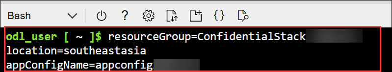
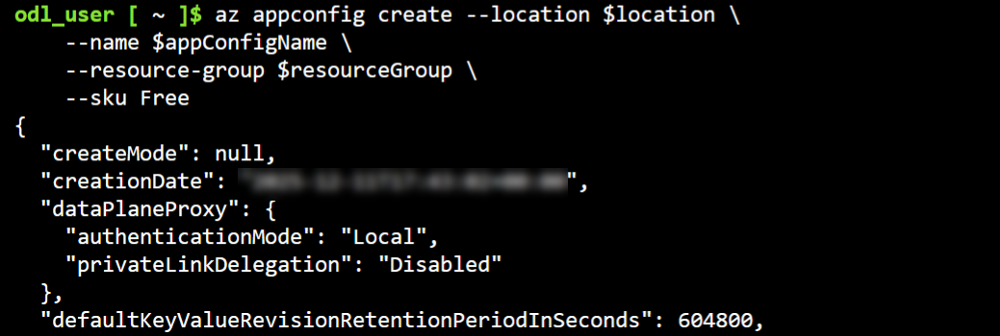
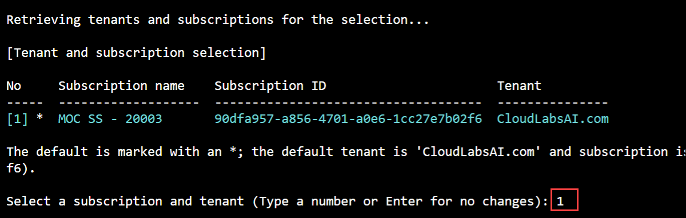

# Lab 09: Module 2: Retrieve Configuration Settings from Azure App Configuration

## Lab Scenario
In this exercise, you create an Azure App Configuration resource, store configuration settings using the Azure CLI, and build a .NET console application that uses the ConfigurationBuilder to retrieve configuration values. You learn how to organize settings with hierarchical keys and authenticate your application to access cloud-based configuration data.

## Lab Objectives
In this lab, you will perform:

- Create an Azure App Configuration resource and add configuration information  
- Assign a role to your Microsoft Entra user name  
- Add configuration information with Azure CLI 
- Create a .NET console app to retrieve configuration information
- Sign into Azure and run the app  

# Exercise 2: Application Configuration Management with Azure App Configuration
## Task: 1 Create an Azure App Configuration resource and add configuration information

In this task, you will create an Azure App Configuration resource using the Azure CLI and add the initial configuration settings needed for your application.

1. Use the **[>_] (1)** button to the right of the search bar at the top of the page to create a new Cloud Shell in the Azure portal, selecting a **Bash (2)** environment.

     

     

2.  If you are prompted to select a storage account to persist your files, select **No storage account required (1)**, select the default **subscription (2)**, and then select **Apply (3)**.

    

    > **Note:** If you have previously created a cloud shell that uses a *PowerShell* environment, switch it to ***Bash***.

1. In the cloud shell toolbar, in the **Settings (1)** menu, select **Go to Classic version (2)** (this is required to use the code editor).

    

1. Run the following commands to create the needed variables.

    ```
    resourceGroup=ConfidentialStack-<inject key="DeploymentID" enableCopy="false"/>
    location=<inject key="Region" enableCopy="false"/>
    appConfigName=appconfig<inject key="DeploymentID" enableCopy="false"/>
    ```

     

     >**Note:** Note down the App configuration name you have created. You need it later in the exercise. 

1. Run the following command to create an Azure App Configuration resource. This can take a few minutes to run.

    ```
    az appconfig create --location $location \
        --name $appConfigName \
        --resource-group $resourceGroup \
        --sku Free
    ```

    

    >**NOTE:** If there is an issue creating the AppConfig Resource due to quota restrictions using the **Free** SKU value, please use **Developer** instead.
    
> **Congratulations** on completing the task! Now, it's time to validate it.
<validation step="a8e4aaff-e268-4b39-9026-1f5e043dbed5" />

## Task: 2 Assign a role to your Microsoft Entra user name

In this task, you will assign your Microsoft Entra user the App Configuration Data Reader role so you can retrieve configuration data from the App Configuration resource.

1. Run the following command to retrieve the **userPrincipalName** from your account. This represents who the role will be assigned to.

    ```
    userPrincipal=$(az rest --method GET --url https://graph.microsoft.com/v1.0/me \
        --headers 'Content-Type=application/json' \
        --query userPrincipalName --output tsv)
    ```

1. Run the following command to retrieve the resource ID of your App Configuration service. The resource ID sets the scope for the role assignment.

    ```
    resourceID=$(az appconfig show --resource-group $resourceGroup \
        --name $appConfigName --query id --output tsv)
    ```

1. Run the following command to create and assign the **App Configuration Data Reader** role.

    ```
    az role assignment create --assignee $userPrincipal \
        --role "App Configuration Data Reader" \
        --scope $resourceID
    ```

    

## Task: 3 Add configuration information with Azure CLI

In this task, you will add a namespaced configuration key to your App Configuration resource using the Azure CLI.

In Azure App Configuration, a key like **Dev:conStr** is a hierarchical, or namespaced key. The colon (:) acts as a delimiter that creates a logical hierarchy, where:

* **Dev** represents the namespace or environment prefix (indicating this configuration is for the Development environment)
* **conStr** represents the configuration name

This hierarchical structure allows you to organize configuration settings by environment, feature, or application component, making it easier to manage and retrieve related settings.

1. Run the following command to store the placeholder connection string. 

    ```
    az appconfig kv set --name $appConfigName \
        --key Dev:conStr \
        --value connectionString<inject key="DeploymentID" enableCopy="false"/> \
        --yes
    ```

1. This command returns some JSON. The last line contains the value in plain text. 

    ```json
    "value": "connectionString<inject key="DeploymentID"  enableCopy="false"/>"
    ```

    

## Task: 4 Create a .NET console app to retrieve configuration information

In this task, you will create a .NET console application in Cloud Shell that will later be used to retrieve configuration data from Azure App Configuration.

>**Tip:** Resize the cloud shell to display more information, and code, by dragging the top border. You can also use the minimize and maximize buttons to switch between the cloud shell and the main portal interface.

1. Run the following commands to create a directory to contain the project and change into the project directory.

    ```
    mkdir appconfig
    cd appconfig
    ```

    

1. Create the .NET console application.

    ```
    dotnet new console
    ```

    

1. Run the following commands to add the **Azure.Identity** and **Microsoft.Extensions.Configuration.AzureAppConfiguration** packages to the project.

    ```
    dotnet add package Azure.Identity
    dotnet add package Microsoft.Extensions.Configuration.AzureAppConfiguration
    ```

    

### Add the code for the project

1. Run the following command in the cloud shell to begin editing the application.

    ```
    code Program.cs
    ```

1. Replace any existing contents with the following code. Be sure to replace **YOUR_APP_CONFIGURATION_NAME** with the name you recorded earlier, and read through the comments in the code.

    ```csharp
    using Microsoft.Extensions.Configuration;
    using Microsoft.Extensions.Configuration.AzureAppConfiguration;
    using Azure.Identity;
    
    // Set the Azure App Configuration endpoint, replace YOUR_APP_CONFIGURATION_NAME
    // with the name of your actual App Configuration service
    
    string endpoint = "https://YOUR_APP_CONFIGURATION_NAME.azconfig.io"; 
    
    // Configure which authentication methods to use
    // DefaultAzureCredential tries multiple auth methods automatically
    DefaultAzureCredentialOptions credentialOptions = new()
    {
        ExcludeEnvironmentCredential = true,
        ExcludeManagedIdentityCredential = true
    };
    
    // Create a configuration builder to combine multiple config sources
    var builder = new ConfigurationBuilder();
    
    // Add Azure App Configuration as a source
    // This connects to Azure and loads configuration values
    builder.AddAzureAppConfiguration(options =>
    {
        
        options.Connect(new Uri(endpoint), new DefaultAzureCredential(credentialOptions));
    });
    
    // Build the final configuration object
    try
    {
        var config = builder.Build();
        
        // Retrieve a configuration value by key name
        Console.WriteLine(config["Dev:conStr"]);
    }
    catch (Exception ex)
    {
        Console.WriteLine($"Error connecting to Azure App Configuration: {ex.Message}");
    }
    ```

    

1. Press **ctrl+s** to save the file, then **ctrl+q** to exit the editor.

## Task: 5 Sign into Azure and run the app

In this task, you will sign into Azure from Cloud Shell and authenticate your session so you can run the console app to retrieve configuration values.

1. In the cloud shell, enter the following command to sign into Azure.

    ```
    az login
    ```

    **<font color="red">You must sign into Azure - even though the cloud shell session is already authenticated.</font>**

1. After running the az login command, select the **authentication link (1)** shown in the Cloud Shell output and **copy the displayed code (2)**.

    

1. On the **Enter code to allow access** page, paste the copied code into the field and select **Next** to complete authentication.

     

1. When prompted to **Pick an account**, select your ODL_User account to proceed

     

1. On the **Are you trying to sign in to Microsoft Azure CLI?** page, select **Continue** to authorize the sign-in request.

     

1. Back in Cloud Shell, when the subscription selection appears, type **1** and press **Enter** to continue.

     

1. Run the following command to start the console app. The app will display the **connectionString** value you assigned to the **Dev:conStr** setting earlier in the exercise.

    ```
    dotnet run
    ```

    The app will display the **connectionString** value you assigned to the **Dev:conStr** setting earlier in the exercise.

    

## Summary

In this lab, you:

- Created an App Configuration resource and added initial configuration settings.

- Assigned the App Configuration Data Reader role so your user can access configuration data.

- Stored a namespaced configuration key using Azure CLI.

- Built a console application that connects to Azure App Configuration to read configuration values.

- Authenticated with Azure CLI and successfully ran the app to retrieve configuration data.

## You have successfully completed the lab.