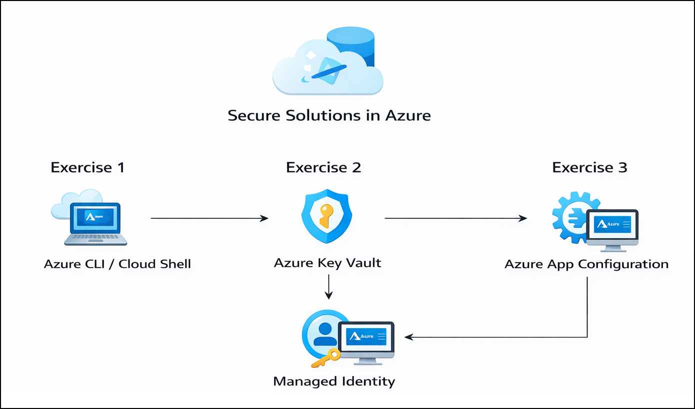

# Getting Started with Lab 09: Secure Solutions in Azure

### Estimated Duration: 45–60 Minutes

## Overview

Welcome to **Lab 09: Secure Solutions in Azure**.  
In this lab, you will secure applications using Azure Key Vault and Azure App Configuration. You will store and retrieve secrets securely, manage application configuration centrally, and access these values programmatically from a .NET application.

This Getting Started page provides essential environment setup steps, navigation instructions, and support details before beginning the exercises.

---

## Lab Objectives

By completing this lab, you will learn to:

- Create and manage secrets in Azure Key Vault  
- Retrieve secrets securely using a .NET application  
- Create and manage Azure App Configuration resources  
- Store and retrieve application configuration values  
- Use secure access patterns for secrets and configuration data  

---

## Pre-requisites

Participants should have:

- **Basic C# / .NET Skills:** Ability to build console applications and install NuGet packages.  
- **Azure Portal Familiarity:** Ability to navigate Key Vault, App Configuration, and Resource Groups.  
- **Security Concepts:** Understanding of secrets, configuration management, and secure storage.  
- **CLI Knowledge:** Ability to run Azure CLI commands.  
- **Browser Access:** A modern browser to interact with CloudLabs and Azure Portal.  

---

## Architecture

This architecture demonstrates how secrets are securely stored in Azure Key Vault and application configuration values are stored in Azure App Configuration. A .NET console application accesses these services at runtime using secure authentication mechanisms. Azure services manage access control and secure retrieval, allowing the application to read secrets and configuration values without embedding sensitive data in code.

---

## Explanation of Components

The architecture for this lab involves the following key components:

1. **Azure Key Vault**  
   Securely stores secrets, keys, and certificates with controlled access.

2. **Azure App Configuration**  
   Centralized service for storing application configuration settings.

3. **Managed Identity**  
   Provides a secure identity for applications to access Azure resources without credentials.

4. **Azure CLI**  
   Used to create resources and manage secrets and configuration data.

5. **.NET Console Application**  
   Demonstrates secure retrieval of secrets and configuration values programmatically.

---

## Accessing Your Lab Environment

Your virtual machine and lab guide are available directly in your browser.

### Virtual Machine Access  
You will see your VM loading on the left side of the screen:

### Lab Guide Access  
The lab guide appears on the right panel and will be your reference throughout the exercises.

---

## Exploring Lab Resources

Navigate to the **Environment** tab to view credentials and resources:

---

## Split-Window Feature

To open the lab guide in a separate window, click **Split Window**:

---

## Managing Your Virtual Machine

You can Start, Stop, or Restart your virtual machine at any time via the **Resources** tab:

---

## Adjusting Zoom

To zoom in or out of the environment view, use the **A↕ 100%** button near the timer:

---

## Accessing Azure Portal

Follow these steps to begin working in Azure:

1. On your VM desktop, click the **Azure Portal** icon:

   

2. Enter your credentials:

   - **Email/Username:** <inject key="AzureAdUserEmail"></inject>

     

3. Enter your password:

   - **Password:** <inject key="AzureAdUserPassword"></inject>

     

4. If prompted to **Stay signed in**, select **No**.

   

---

## Support

CloudLabs offers **24/7 support** for all learners.

**Learner Support Contacts:**  
- Email: cloudlabs-support@spektrasystems.com  
- Live Chat: https://cloudlabs.ai/labs-support  

If you face login, VM, or Azure issues, reach out anytime.

Now, click on **Next** from the lower right corner to move on to the next page.

---

## Happy Learning!