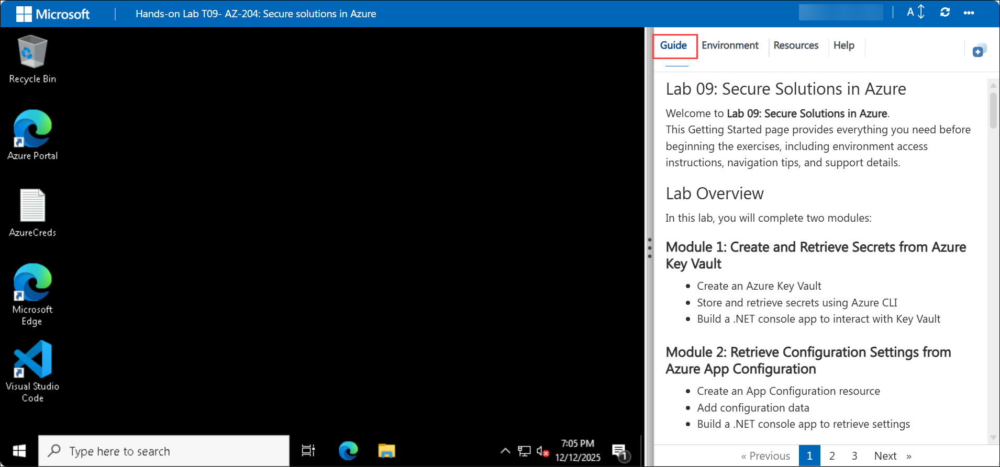

## Lab 09: Secure Solutions in Azure

Welcome to **Lab 09: Secure Solutions in Azure**.  
This Getting Started page provides everything you need before beginning the exercises, including environment access instructions, navigation tips, and support details.

## Lab Overview

In this lab, you will complete two modules:

### **Module 1: Create and Retrieve Secrets from Azure Key Vault**
- Create an Azure Key Vault  
- Store and retrieve secrets using Azure CLI  
- Build a .NET console app to interact with Key Vault  

### **Module 2: Retrieve Configuration Settings from Azure App Configuration**
- Create an App Configuration resource  
- Add configuration data  
- Build a .NET console app to retrieve settings  

**Estimated Duration:** 45–60 Minutes  

---

## Accessing Your Lab Environment

Your virtual machine and lab guide are available directly in your browser.

### Virtual Machine Access  

You will see your VM loading on the left side of the screen:

### Lab Guide Access  
The lab guide appears on the right panel and will be your reference throughout the exercises.

---

## Exploring Lab Resources

Navigate to the **Environment** tab to view credentials and resources:

---

## Split-Window Feature

To open the lab guide in a separate window, click **Split Window**:

---

## Managing Your Virtual Machine

You can Start, Stop, or Restart your virtual machine at any time via the **Resources** tab:

---

## Adjusting Zoom

To zoom in/out of the environment view, use the **A↕ 100%** button near the timer:

---

## Accessing Azure Portal

Follow these steps to begin working in Azure:

1. On your VM desktop, click the **Azure Portal** icon:

   

2. Enter your credentials:

   - **Email/Username:** `<inject key="AzureAdUserEmail"></inject>`

     

3. Enter your password:

   - **Password:** `<inject key="AzureAdUserPassword"></inject>`

     

4. If prompted to **Stay signed in**, select **No**.

   

---

## Support

CloudLabs offers **24/7 support** for all learners.

**Learner Support:**
- Email: cloudlabs-support@spektrasystems.com  
- Live Chat: https://cloudlabs.ai/labs-support  

If you face login, VM, or Azure issues, reach out anytime.

---

## Begin the Lab

Click **Next** at the bottom-right corner to begin **Module 1: Create and Retrieve Secrets from Azure Key Vault**.

   

## Happy Learning!