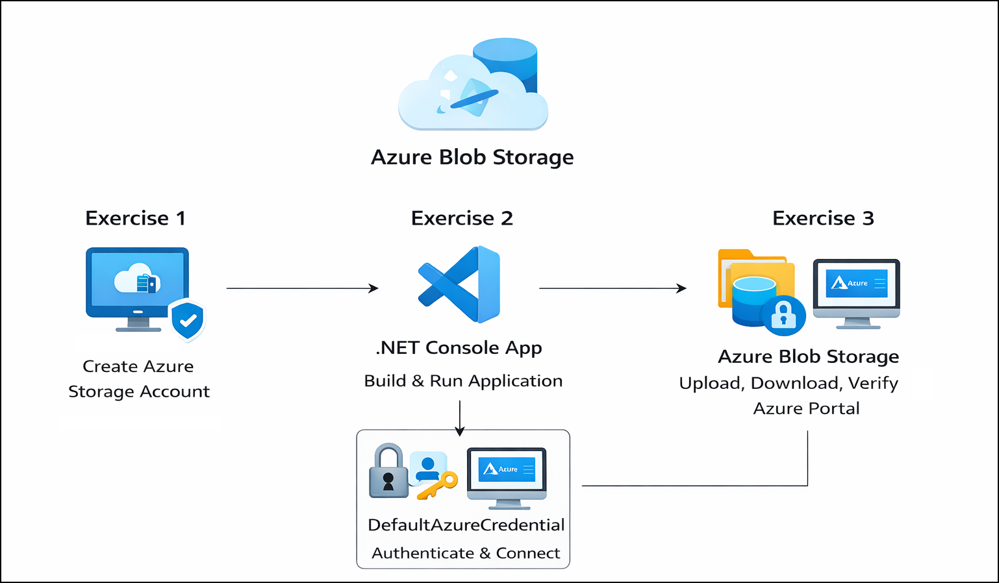
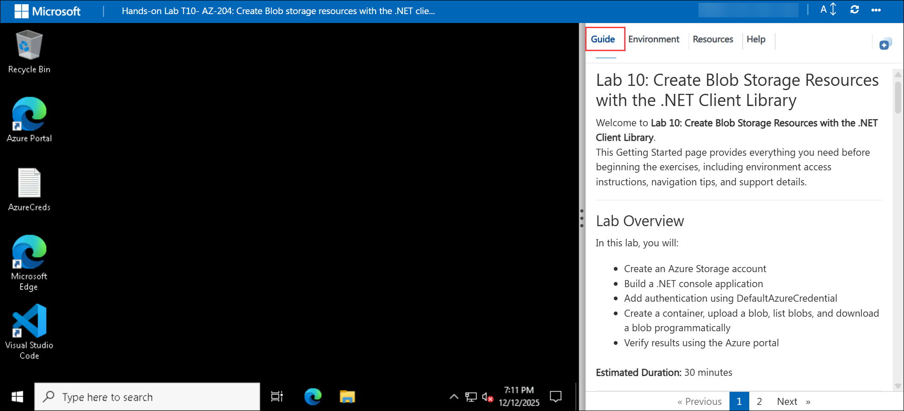
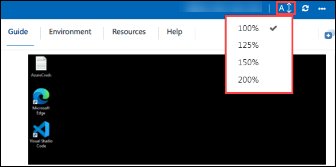

# Getting Started with Lab 10: Create Blob Storage Resources with the .NET Client Library

### Estimated Duration: 40 Minutes

## Overview

Welcome to **Lab 10: Create Blob Storage Resources with the .NET Client Library**.  
In this lab, you will build a .NET console application that interacts with Azure Blob Storage. You will create a storage account, authenticate using DefaultAzureCredential, create containers, upload and download blobs programmatically, and verify the results using the Azure Portal.

This Getting Started page provides essential environment setup, navigation instructions, and support details before beginning the exercises.

---

## Lab Objectives

By completing this lab, you will learn to:

- Create an Azure Storage account  
- Build a .NET console application  
- Authenticate using DefaultAzureCredential  
- Create a blob container programmatically  
- Upload, list, and download blobs using the .NET client library  
- Verify storage resources in the Azure Portal  

---

## Pre-requisites

Participants should have:

- **Basic C# / .NET Knowledge:** Ability to build console applications and manage NuGet packages.  
- **Azure Portal Experience:** Familiarity with navigating Azure Storage resources.  
- **Storage Concepts:** Understanding of containers, blobs, and object storage.  
- **Authentication Basics:** Awareness of managed identity and DefaultAzureCredential.  
- **Browser Access:** A modern browser to work in CloudLabs and Azure Portal.  

---

## Architecture

This architecture demonstrates how a .NET console application authenticates to Azure using DefaultAzureCredential and connects to an Azure Storage account. The application creates a blob container, uploads files as blobs, lists stored blobs, and downloads content programmatically. Azure Blob Storage securely stores the data, which is later validated through the Azure Portal.

---

## Explanation of Components

The architecture for this lab involves the following key components:

1. **Azure Blob Storage**  
   Object storage service used to store unstructured data such as files and media.

2. **Azure Storage Account**  
   The top-level resource that hosts Blob Storage and other storage services.

3. **Blob Container**  
   A logical grouping of blobs within a storage account.

4. **Azure.Storage.Blobs (.NET SDK)**  
   Client library used to interact with Azure Blob Storage programmatically.

5. **DefaultAzureCredential**  
   Handles authentication securely without hardcoding credentials.

---

## Accessing Your Lab Environment

Your virtual machine and lab guide are available directly in your browser.

### Virtual Machine Access  
You will see your VM loading on the left side of the screen:

### Lab Guide Access  
The lab guide appears on the right panel and will be your reference throughout the exercises.

---

## Exploring Lab Resources

Navigate to the **Environment** tab to view credentials and resources:

---

## Split-Window Feature

To open the lab guide in a separate window, click **Split Window**:

---

## Managing Your Virtual Machine

You can Start, Stop, or Restart your virtual machine at any time via the **Resources** tab:

---

## Adjusting Zoom

To zoom in or out of the environment view, use the **A↕ 100%** button near the timer:

---

## Accessing Azure Portal

Follow these steps to begin working in Azure:

1. On your VM desktop, click the **Azure Portal** icon:  
   
   

2. Enter your credentials:  
   
   - **Email/Username:** <inject key="AzureAdUserEmail"></inject>  

     

3. Enter your password:  
   
   - **Password:** <inject key="AzureAdUserPassword"></inject>  

     

4. If prompted to **Stay signed in**, select **No**.  

   

---

## Support

CloudLabs offers **24/7 support** for all learners.

**Learner Support Contacts:**  
- Email: cloudlabs-support@spektrasystems.com  
- Live Chat: https://cloudlabs.ai/labs-support  

If you face login, VM, or Azure issues, reach out anytime.

Now, click on **Next** from the lower right corner to move on to the next page.

---

## Happy Learning!